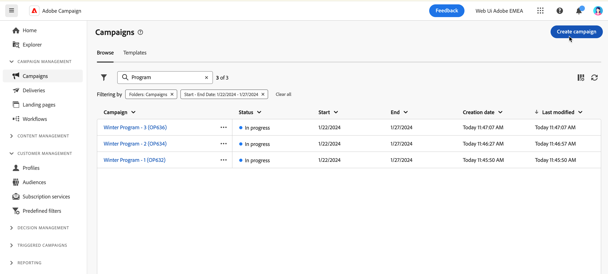

# Creare la prima campagna {#create-first-campaigns}

>[!CONTEXTUALHELP]
>id="acw_campaign_creation_properties"
>title="Proprietà di creazione della campagna"
>abstract="In questa schermata, definisci le impostazioni della campagna: seleziona un modello e immetti un’etichetta per la campagna. Passa alle impostazioni aggiuntive per modificare il nome interno predefinito, la cartella, aggiungere una descrizione e selezionare l’assegnatario."

>[!CONTEXTUALHELP]
>id="acw_campaign_properties"
>title="Proprietà campagna"
>abstract="In questa schermata, puoi verificare e e aggiornare le impostazioni della campagna: l’etichetta, il nome interno, la cartella e la descrizione. Puoi anche visualizzare a quale utente è assegnata."

Per creare una nuova campagna, devi definirne le impostazioni, pianificarne e includere flussi di lavoro e consegne.

## Crea la campagna {#campaign-create}

Per creare una nuova campagna, segui questi passaggi:

1. Fai clic sul menu **[!UICONTROL Campagne]** e sul pulsante **[!UICONTROL Crea campagna]**.

   

1. Seleziona il **Modello** da utilizzare e specifica un’etichetta per la campagna. [Ulteriori informazioni](manage-campaigns.md#manage-campaign-templates).
1. Se necessario, è possibile modificare le seguenti **Opzioni aggiuntive**: nome interno, cartella, assegnatario, descrizione e natura.
1. Definisci la **Pianificazione** della campagna. Scopri come impostare la pianificazione della campagna in [questa sezione](#campaign-schedule)
1. Fai clic su **Crea**.

   

1. Aggiungi flussi di lavoro e consegne alla campagna:

   * Dalla scheda **Flussi di lavoro**, fai clic su **Crea flusso di lavoro**. Quando crei la campagna, viene aggiunto automaticamente un flusso di lavoro predefinito. Scopri come [creare un flusso di lavoro](../workflows/create-workflow.md).

   * Dalla scheda **Consegne**, fai clic su **Crea consegna**. [Ulteriori informazioni](../msg/gs-messages.md)

## Monitorare e tenere traccia della campagna{#campaign-monitoring}

Il monitoraggio delle campagne è un passaggio chiave per analizzare l’efficacia delle campagne. Apri la campagna e fai clic sul pulsante **Registri**.

Puoi anche visualizzare i rapporti dedicati facendo clic sul pulsante **Rapporti**. Consulta questa [sezione](../reporting/campaign-reports.md).

## Definire la pianificazione della campagna {#campaign-schedule}

>[!CONTEXTUALHELP]
>id="acw_campaign_creation_schedule"
>title="Pianificazione della campagna"
>abstract="Seleziona la pianificazione della campagna. Puoi creare la campagna che viene avviata quando viene raggiunta la data di inizio. Per impostazione predefinita, la data di inizio della campagna è la data di creazione e ha una durata di 5 giorni. Le date di inizio e di fine vengono visualizzate nell’elenco delle campagne e possono essere utilizzate come filtro."

La campagna viene avviata quando viene raggiunta la data di inizio. Fino a quando la data di inizio non viene raggiunta, la campagna ha lo stato di **[!UICONTROL Bozza]**. Quindi, quando viene raggiunta la data di inizio, lo stato passa a **[!UICONTROL In corso]**. Una volta raggiunta la data di fine, la campagna viene impostata su **[!UICONTROL Completata]**.

Le date di inizio e di fine vengono visualizzate nell’elenco delle campagne e possono essere utilizzate come filtro. Consulta questa [sezione](manage-campaigns.md#access-campaigns).

>[!NOTE]
>
>Puoi sempre modificare queste proprietà in un secondo momento, dall’icona **Configura le impostazioni della campagna** accanto all’etichetta della campagna. Consulta questa [sezione](gs-campaigns.md#campaign-dashboard).

Una volta raggiunta la data, le consegne create in tale campagna nel contesto di un flusso di lavoro che sono pronte per essere inviate vengono effettivamente inviate. A questo scopo, il flusso di lavoro deve essere stato avviato.

<!--
    +++WORKF
++screen
## Create a cross-channel campaign {#cross-channel-campaign}

In a cross-channel campaign, a single marketing communication uses different channels. Data is passed between the channels. The customer receives communication through multiple channels based on, for example, their interaction with the previous communication.

-->
<!--
existing campaign: settings button -> properties like when creation
schedule in header

About plans, programs and campaigns
Adobe Campaign allows you to plan marketing campaigns in which you can create and manage different types of activities: emails, SMS messages, push notifications, workflows, landing pages. These campaigns and their contents can be gathered into programs.

The programs and campaigns allow you to regroup and view the different marketing activities that are linked to them.

A program may contain other programs as well as campaigns, workflows, and landing pages. It appears in the timeline and help you organize your marketing activities: you can separate them by country, by brand, by unit, etc.
A campaign enables you to gather all the marketing activities of your choice under a single entity. A campaign may contain emails, SMS, push notifications, direct mails, workflows, and landing pages.
To better organize your marketing plans, Adobe recommends the following hierarchy: Program > Sub-programs > Campaigns > Workflows > Deliveries.

Reports on programs and campaigns allow you to analyze their impact. For example, you can build reports at the campaign level to aggregate data on all deliveries contained in that campaign.

Related topics:

Timeline
About dynamic reports
Creating a campaign
In programs and sub-programs, you can add campaigns. Campaigns can contain marketing activities such as emails, SMS, push notifications, workflows, and landing pages.

From the Adobe Campaign home page, select the Programs & Campaigns card and access a program or sub-program.

Click on the Create button and select Campaign.

In the Creation mode screen, select a campaign type.

The campaign types available are based on templates defined in Resources > Templates > Campaign templates. For more on this, refer to the Managing templates section.

In the Properties screen, enter the name and ID of the campaign.

Select a start and end date to your campaign. These dates only apply to the campaign itself.

Click on Create to confirm the creation of the campaign.

The campaign is created and displayed. Use the Create button to add marketing activities to your campaign.

NOTE
Depending on your license agreement, you may access only some of these activities.

You can also create a campaign from the marketing activity list. You can choose to link the marketing activity to a parent program or sub-program via the properties window of the campaign.

Programs and campaigns icons and statuses
Each program and each campaign in the list has a visual symbol and an icon whose color indicates the execution status. This status depends on the validity period of the program or the campaign.

Gray: the program/campaign has not yet started - Editing status.
Blue: the program/campaign is in progress - In progress status.
Green: the program/campaign has finished - Finished status. By default, the current date is automatically shown as the validity start date and the end date is calculated according to the start date (D+186 days). You can change these dates in the program or campaign properties.

Business.Adobe.com resources
-->
