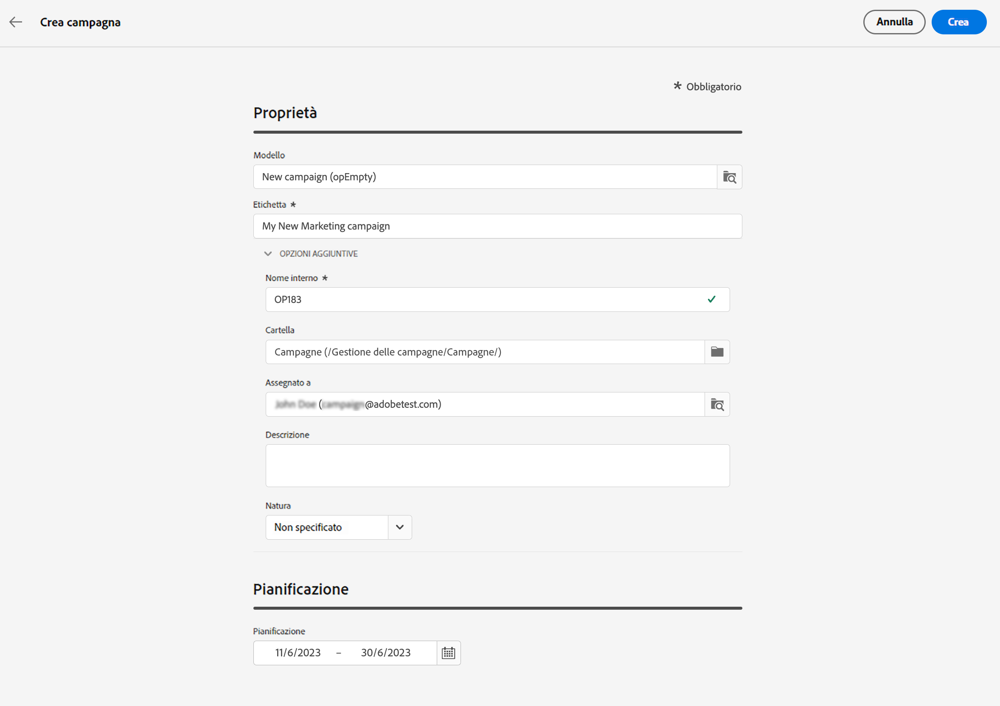

# Introduzione alle campagne {#campaigns}

>[!CONTEXTUALHELP]
>id="acw_homepage_card5"
>title="Progettare e inviare campagne cross-channel"
>abstract="Con le sue funzionalità di orchestrazione delle campagne di marketing, puoi gestire e centralizzare i dati dei clienti, progettare comunicazioni e campagne per i clienti e creare esperienze personalizzate su diversi canali. Sono disponibili canali e-mail, push e SMS."

Utilizza Adobe Campaign per creare campagne cross-channel. Con le sue funzionalità di orchestrazione delle campagne di marketing, puoi gestire e centralizzare i dati dei clienti, progettare comunicazioni e campagne per i clienti e creare esperienze personalizzate su diversi canali. Sono disponibili canali e-mail, push e SMS.

Progetta ed esegui campagne e-mail dal volume elevato per distribuire messaggi personalizzati, per tutte le piattaforme e le dimensioni dello schermo.
<!--Measure the effectiveness of your deliveries with detailed reports including thecounts of opens, clicks, forwards, and more.--> Con le funzionalità di segmentazione di Adobe Campaign, puoi eseguire query su un database di volumi elevati e definire facilmente segmenti di marketing dinamico destinati in modo ottimale alle campagne.

## Creare una campagna cross-channel {#cross-channel-campaign}

>[!CONTEXTUALHELP]
>id="acw_campaign_creation_workflow"
>title="Elenco flussi di lavoro"
>abstract="Elenco dei flussi di lavoro disponibili per la campagna. Utilizza il pulsante &quot;Crea flusso di lavoro&quot; per aggiungere un flusso di lavoro alla campagna."

In una campagna cross-channel, una singola comunicazione di marketing utilizza canali diversi. I dati vengono trasmessi tra i canali. Il cliente riceve la comunicazione attraverso più canali in base, ad esempio, alla sua interazione con la comunicazione precedente.

## Definire le proprietà della campagna {#campaign-properties}

>[!CONTEXTUALHELP]
>id="acw_campaign_creation_properties"
>title="Proprietà di creazione della campagna"
>abstract="Definisci proprietà e metadati per la campagna."

>[!CONTEXTUALHELP]
>id="acw_campaign_properties"
>title="Proprietà campagna"
>abstract="Definisci le impostazioni e i metadati della campagna."

Le proprietà della campagna vengono visualizzate con la creazione di una nuova campagna.

Puoi anche accedere alle proprietà della campagna da **Configurare le impostazioni della campagna** accanto all’etichetta della campagna.

In questa schermata puoi modificare:

## Definire la pianificazione della campagna {#campaign-schedule}

>[!CONTEXTUALHELP]
>id="acw_campaign_creation_schedule"
>title="Pianificazione della creazione della campagna"
>abstract="Utilizza la sezione Pianificazione delle proprietà della campagna per selezionarne l’intervallo temporale. La campagna inizia quando viene raggiunta la data di inizio."

Utilizza il **Pianificazione** nelle proprietà della campagna per selezionarne l’intervallo di tempo. La campagna inizia quando viene raggiunta la data di inizio.

Le date di inizio e fine vengono visualizzate nell’elenco delle campagne e possono essere utilizzate come filtro.

Per filtrare in base alla pianificazione della campagna, apri i filtri e utilizza **Data Inizio - Fine** sezione:

