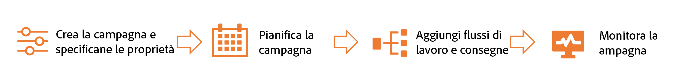

# Introduzione alle campagne {#campaigns}

>[!CONTEXTUALHELP]
>id="acw_campaigns_list"
>title="Campagne"
>abstract="Sfoglia l’elenco delle campagne. Seleziona una campagna per visualizzarne il contenuto, le consegne e i dettagli. Puoi filtrare per stato, date di inizio e di fine o con regole personalizzate. Puoi anche visualizzare rapporti delle campagne completate. Fai clic sul pulsante **Crea campagna** per aggiungere una nuova campagna. Passa alla scheda **Modelli** per visualizzare e creare modelli."

Adobe Campaign consente di orchestrare facilmente le iniziative di marketing mirate, utilizzando le funzionalità incorporate per la gestione delle campagne. Grazie alla possibilità di definire una pianificazione, puoi pianificare la durata e la tempistica delle campagne in modo da allinearle agli obiettivi strategici e ottimizzare il coinvolgimento del pubblico.

Aggiungendo più flussi di lavoro e consegne specifici per la campagna, puoi creare esperienze personalizzate su vari canali, assicurandoti che ogni punto di contatto riscontri l’interesse del pubblico a cui è destinata.

Le campagne forniscono metriche di reporting dedicate per ottenere informazioni complete sulle prestazioni dell’intera campagna. Queste metriche consentono di valutare l’efficacia, identificare le tendenze e prendere decisioni basate sui dati per ottimizzare le attività future. Scopri come accedere e comprendere i rapporti delle campagne in [questa sezione](../reporting/campaign-reports.md).

Scopri come creare, gestire e monitorare le campagne nelle sezioni seguenti:

* [Accedere alle campagne e gestirle](manage-campaigns.md)
* [Creare la prima campagna](create-campaigns.md)
* [Configurare e gestire il processo di approvazione](campaign-approvals.md)
* [Sfogliare i rapporti delle campagne](../reporting/campaign-reports.md).