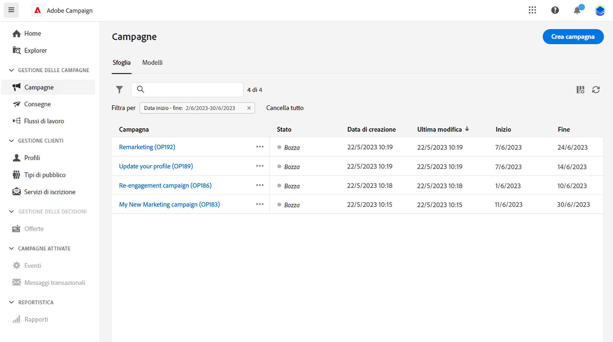
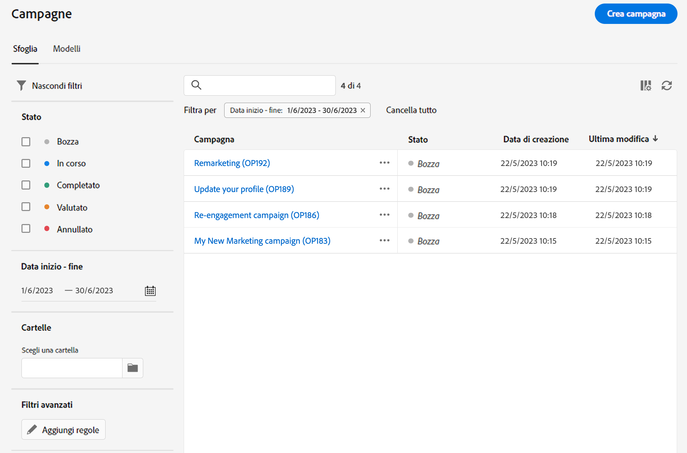
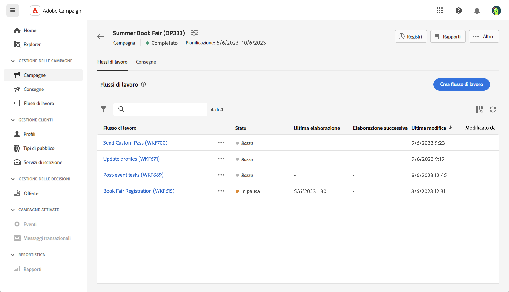

# Accedere alle campagne e gestirle{#manage-campaigns}

>[!CONTEXTUALHELP]
>id="acw_campaign_schedule"
>title="Pianificazione della campagna"
>abstract="Impostare o modificare la pianificazione della campagna."

Per accedere alle campagne e gestirle, fai clic sul menu **[!UICONTROL Campagne]** nell&#39;area di navigazione a sinistra.

## Elenco delle campagne {#access-campaigns}

Nell’elenco delle campagne sono disponibili due schede:

* Nella scheda **Sfoglia** sono elencate tutte le campagne esistenti. Puoi fare clic su una campagna per aprirne la dashboard, o crearne una nuova facendo clic sul pulsante **Crea campagna**. Consulta questa [sezione](create-campaigns.md#create-campaigns).

* Nella scheda **Modelli** sono elencati tutti i modelli di campagna disponibili. Puoi visualizzare un modello esistente o crearne uno nuovo. [Ulteriori informazioni](#manage-campaign-templates).

Per impostazione predefinita, ogni campagna nell’elenco visualizza informazioni sul suo stato corrente, sulle date di inizio e di fine, sulla data di creazione, sull’ultima modifica e così via.

Puoi personalizzare le colonne visualizzate facendo clic sull’icona **Configura le colonne per un layout personalizzato**, nell’angolo superiore a destra dell’elenco. Ciò ti consente di aggiungere o rimuovere colonne e di riordinare le informazioni nell’elenco delle campagne.

Inoltre, sono disponibili una barra di ricerca e dei filtri per facilitare la ricerca all’interno dell’elenco. [Ulteriori informazioni](../get-started/user-interface.md#list-screens).

Ad esempio, puoi filtrare in base alla pianificazione della campagna. Apri il pannello dei filtri e utilizza la sezione **Data inizio - fine**:

## Dashboard delle campagne {#campaign-dashboard}

>[!CONTEXTUALHELP]
>id="acw_campaign_delivery_list"
>title="Elenco delle consegne nella campagna"
>abstract="Nella scheda **Consegne** sono elencate tutte le consegne collegate alla campagna corrente. Fai clic sul nome di una consegna per modificarla. Utilizza il pulsante Crea consegna per aggiungere una nuova consegna per questa campagna."

>[!CONTEXTUALHELP]
>id="acw_campaign_workflow_list"
>title="Elenco dei flussi di lavoro in una campagna"
>abstract="Nella scheda **Flusso di lavoro** sono elencati tutti i flussi di lavoro collegati alla campagna corrente."

Nella scheda **Sfoglia** dell&#39;elenco delle campagne, fai clic sul nome di una campagna per visualizzarne i dettagli.

Lo stato e la pianificazione della campagna sono visualizzati nella parte superiore della schermata. Puoi utilizzare il pulsante **Impostazioni** per aggiornare le proprietà della campagna, ad esempio l&#39;etichetta, la cartella e la descrizione. Puoi anche modificare la pianificazione della campagna dalla schermata delle impostazioni. Ulteriori informazioni sulla pianificazione delle campagne in [questa sezione](create-campaigns.md#campaign-schedule).

Dal dashboard della campagna, utilizza i pulsanti **Registri** e **Rapporti** per monitorare la campagna. Ulteriori informazioni in questa [sezione](create-campaigns.md#create-campaigns)

Per ogni campagna, il dashboard mostra due schede principali: Flussi di lavoro e Consegne.

* Nella scheda **Flussi di lavoro** sono elencati tutti i flussi di lavoro associati alla campagna. Questa scheda consente anche di creare un nuovo flusso di lavoro all’interno della campagna. Consulta questa [sezione](create-campaigns.md#create-campaigns).

* Nella scheda **Consegne** sono elencate tutte le consegne create nella campagna corrente. Puoi anche creare una nuova consegna all’interno della campagna. Consulta questa [sezione](create-campaigns.md#create-campaigns).

>[!NOTE]
>
>La scheda **Consegne** mostra tutte le consegne collegate alla campagna. Tuttavia, le consegne create in un flusso di lavoro non possono essere eliminate da tale percorso. Per eliminare una consegna creata nel contesto di un flusso di lavoro, è necessario eliminare l’attività di consegna dal flusso di lavoro stesso. [Ulteriori informazioni](../msg/gs-messages.md#delivery-delete).

## Eliminare una campagna {#campaign-delete}

Sono disponibili due modi per eliminare una campagna:

* dall&#39;elenco delle campagne, fai clic sul pulsante con i puntini di sospensione, quindi seleziona **Elimina**

  

* dalla campagna stessa, fai clic sul pulsante **Altro**, quindi seleziona **Elimina**

  

## Duplicare una campagna {#campaign-duplicate}

Sono disponibili due modi per duplicare una campagna:

* dall&#39;elenco delle campagne, fai clic sul pulsante con i puntini di sospensione, quindi seleziona **Duplica**

* dalla campagna stessa, fai clic sul pulsante **Altro**, quindi seleziona **Duplica**

In entrambi i casi, conferma la duplicazione per creare la nuova campagna. Etichetta della campagna **Copia di`<label of the initial campaign`**. Passa alle impostazioni della campagna per aggiornare questa etichetta.

## Utilizzare i modelli per campagne{#manage-campaign-templates}

I modelli per campagne contengono impostazioni preconfigurate che possono essere riutilizzate per creare nuove campagne. Per iniziare, è disponibile un set di modelli incorporati. Puoi creare e configurare i modelli per campagne e quindi creare campagne a partire da questi modelli.

In un modello per campagne è possibile memorizzare le seguenti informazioni:

* la campagna **Impostazioni**
* la campagna **Pianificazione**
* Modelli di flusso di lavoro
* Modelli di consegna

Per creare un modello per campagne, segui la procedura seguente:

1. Fai clic sul menu **[!UICONTROL Campagne]** , passa alla scheda **Modelli**, quindi fai clic sul pulsante **[!UICONTROL Crea modello]**.
1. Seleziona il **Modello** da utilizzare. Questo consente di basare il nuovo modello su un modello creato in precedenza.
1. Fornisci un’etichetta per il modello.
1. Se necessario, è possibile modificare le seguenti **Opzioni aggiuntive**: nome interno, cartella, assegnatario, descrizione e natura.
1. Definisci la **Pianificazione** della campagna. Scopri come impostare la pianificazione della campagna in [questa sezione](create-campaigns.md#campaign-schedule)
1. Fai clic su **Crea**.
1. Aggiungi flussi di lavoro e modelli di consegna alla campagna.
