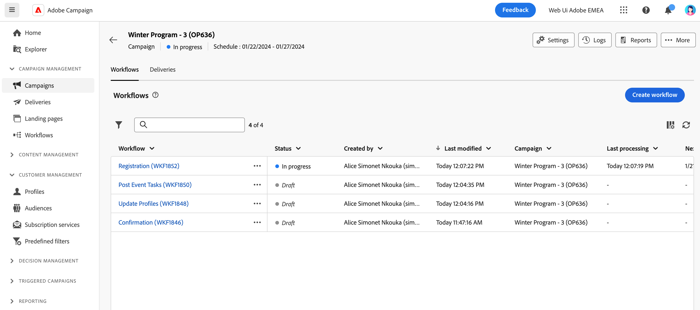

# Accedere alle campagne e gestirle{#manage-campaigns}

>[!CONTEXTUALHELP]
>id="acw_campaign_schedule"
>title="Pianificazione della campagna"
>abstract="Impostare o modificare la pianificazione della campagna."

Per creare una nuova campagna o gestire quelle esistenti, fai clic sul menu **[!UICONTROL Campagne]** nella barra di navigazione a sinistra.

## Elenco delle campagne {#access-campaigns}

Nell’elenco delle campagne sono disponibili due schede:

* Nella scheda **Sfoglia** sono elencate tutte le campagne esistenti. Puoi fare clic su una campagna per aprirne la dashboard, o crearne una nuova facendo clic sul pulsante **Crea campagna**. Consulta questa [sezione](create-campaigns.md#create-campaigns).

* Nella scheda **Modelli** sono elencati tutti i modelli di campagna disponibili. Puoi visualizzare un modello esistente o crearne uno nuovo. [Ulteriori informazioni](#manage-campaign-templates).

Per impostazione predefinita, ogni campagna nell’elenco mostra varie informazioni, ad esempio il suo stato corrente, la data di creazione e dell’ultima modifica e così via.

Puoi personalizzare le colonne visualizzate facendo clic sull’icona **Configura le colonne per un layout personalizzato**, in alto a destra dell’elenco. Questo consente di aggiungere ulteriori informazioni all’elenco. Inoltre, sono disponibili una barra di ricerca e dei filtri per facilitare la ricerca all’interno dell’elenco. [Ulteriori informazioni](../get-started/user-interface.md#list-screens).

Ad esempio, puoi filtrare in base alla pianificazione della campagna. Apri il pannello dei filtri e utilizza la sezione **Data inizio - fine**:

## Dashboard delle campagne{#campaign-dashboard}

>[!CONTEXTUALHELP]
>id="acw_campaign_delivery_list"
>title="Elenco delle consegne nella campagna"
>abstract="Nella scheda **Consegne** sono elencate tutte le consegne collegate alla campagna corrente. Fai clic sul nome di una consegna per modificarla. Utilizza il pulsante Crea consegna per aggiungere una nuova consegna per questa campagna."

Nella scheda **Sfoglia** dell’elenco delle campagne, fai clic su una campagna per visualizzarne i dettagli.

Lo stato e la pianificazione della campagna sono visualizzati nella parte superiore della schermata. È possibile utilizzare l’icona **Configura le impostazioni della campagna** per modificare le proprietà della campagna definite durante la sua creazione. Tre pulsanti consentono di visualizzare i registri, generare rapporti, duplicare o eliminare la campagna. Consulta questa [sezione](create-campaigns.md#create-campaigns)

Sono disponibili due schede:

* Nella scheda **Flussi di lavoro** sono elencati tutti i flussi di lavoro collegati alla campagna. Questa scheda consente anche di creare un nuovo flusso di lavoro all’interno della campagna. Consulta questa [sezione](create-campaigns.md#create-campaigns).

* Nella scheda **Consegne** sono elencate tutte le consegne collegate alla campagna corrente. Puoi anche creare una nuova consegna all’interno della campagna. Consulta questa [sezione](create-campaigns.md#create-campaigns).

## Duplicare ed eliminare una campagna

Puoi duplicare o eliminare una campagna:

* dall’elenco delle campagne, fai clic sul pulsante con i puntini di sospensione, quindi seleziona **Duplica** o **Elimina**.
* dalla campagna stessa, fai clic sul pulsante **Altro** quindi seleziona **Duplica** o **Elimina**.

>[!NOTE]
>
>La scheda **Consegne** mostra tutte le consegne collegate alla campagna. Tuttavia, le consegne create in un flusso di lavoro non possono essere eliminate da tale percorso. Per eliminare una consegna creata nel contesto di un flusso di lavoro, è necessario eliminare l’attività di consegna dal flusso di lavoro stesso. [Ulteriori informazioni](../msg/gs-messages.md#delivery-delete).

## Utilizzare i modelli di campagna{#manage-campaign-templates}

I modelli di campagna contengono impostazioni preconfigurate che possono essere riutilizzate per creare nuovi flussi di lavoro. Per iniziare, è disponibile un set di modelli incorporati. Puoi creare e configurare i modelli della campagna e quindi creare campagne a partire da questi modelli.

Un modello di campagna può memorizzare le seguenti informazioni:

* della campagna **Proprietà** e **Pianificazione** impostazioni
* modelli di workflow
* modelli di consegna

Per creare un modello di campagna, effettua le seguenti operazioni:

1. Fai clic su **[!UICONTROL Campagne]** , passare al menu **Modelli** , quindi fare clic sulla scheda **[!UICONTROL Crea modello]** pulsante.
1. Seleziona il **Modello** da utilizzare e specifica un’etichetta per la campagna. Questo consente di basare il nuovo modello su un modello già creato.
1. Se necessario, è possibile modificare le seguenti **Opzioni aggiuntive**: nome interno, cartella, assegnatario, descrizione e natura.
1. Definisci la **Pianificazione** della campagna. Scopri come impostare la pianificazione della campagna in [questa sezione](create-campaigns.md#campaign-schedule)
1. Fai clic su **Crea**.
1. Aggiungi flussi di lavoro e modelli di consegna alla campagna.
