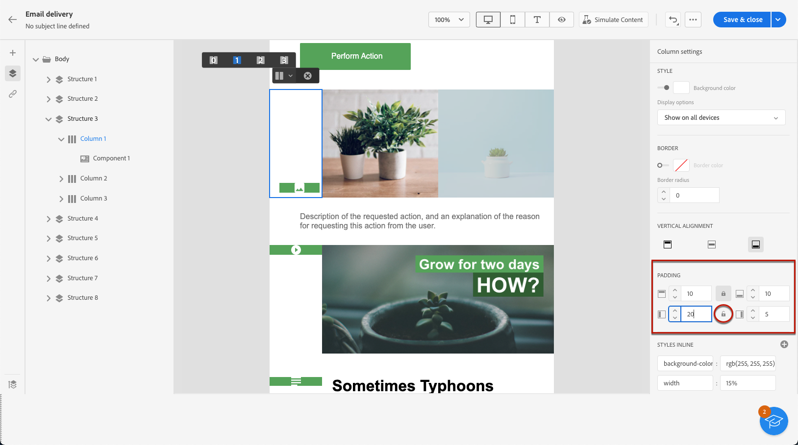

# Regolare l’allineamento verticale e la spaziatura {#alignment-and-padding}

>[!NOTE]
>
>Questa documentazione è in fase di costruzione e viene aggiornata frequentemente. La versione finale di questo contenuto sarà pronta a gennaio 2023.

In questo esempio, regoleremo la spaziatura e l’allineamento verticale all’interno di un componente struttura composto da tre colonne.

1. Seleziona il componente struttura direttamente nel messaggio e-mail o utilizza il **[!UICONTROL Struttura di navigazione]** disponibile nel riquadro a sinistra.

   

1. Dalla barra degli strumenti contestuale, fai clic su **[!UICONTROL Selezionare una colonna]** e scegli quello da modificare. È inoltre possibile selezionarlo dalla struttura ad albero a sinistra.

   

1. I parametri modificabili per quella colonna vengono visualizzati nella **[!UICONTROL Impostazioni colonna]** a destra. Regolare la **[!UICONTROL Allineamento verticale]** utilizzando la sezione dedicata.

   

   Ad esempio, seleziona **[!UICONTROL In basso]**. Il componente contenuto si sposta nella parte inferiore della colonna.

1. Sotto **[!UICONTROL Spaziatura]**, definisci la spaziatura superiore all’interno della colonna e imposta la spaziatura sinistra e destra per tale colonna.

   >[!NOTE]
   >
   >Fai clic sull’icona Blocca per interrompere la sincronizzazione tra la spaziatura superiore/inferiore o sinistra/destra.

   

1. Procedi in modo simile per regolare l’allineamento e la spaziatura delle altre colonne.

1. Salva le modifiche.
