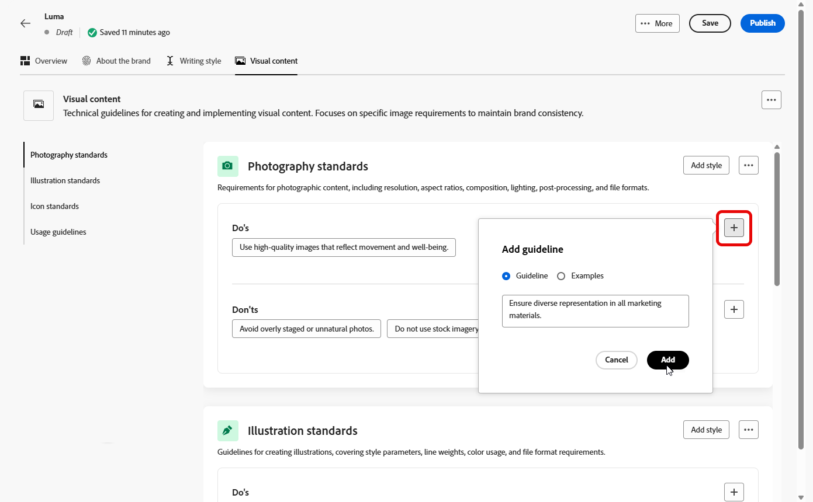

# Personalizzare il brand {#brands-personalize}

Per creare un kit completo per il brand che garantisca la coerenza tra tutti i contenuti e i canali, configura le quattro schede seguenti, ciascuna incentrata su un aspetto diverso dell’identità del brand:

* **[!UICONTROL Informazioni sul brand]** stabilisce l&#39;identità e i valori di base del tuo brand.
* **[!UICONTROL Lo stile di scrittura]** definisce gli standard del linguaggio e del contenuto.
* **[!UICONTROL Il contenuto visivo]** imposta le immagini e le linee guida per la progettazione.
* **[!UICONTROL Colori]** gestisce il sistema di colori e l&#39;utilizzo del tuo marchio.

Una volta configurate, puoi utilizzare le linee guida del brand per convalidare la qualità dei contenuti e l’allineamento del brand. [Ulteriori informazioni sulla convalida della qualità dei contenuti](brands-score.md#validate-quality)

## Informazioni sul brand {#about-brand}

Utilizza la scheda **[!UICONTROL Informazioni sul brand]** per stabilire l&#39;identità principale del brand, delineandone lo scopo, la personalità, la tagline e altri attributi di definizione.

1. Inizia compilando le informazioni fondamentali per il tuo marchio nella categoria **[!UICONTROL Dettagli chiave]**:

   * **[!UICONTROL Nome kit marchio]**: immettere il nome del kit marchio.

   * **[!UICONTROL Quando utilizzare]**: specificare scenari o contesti in cui applicare il kit del marchio.

   * **[!UICONTROL Nome marchio]**: immettere il nome ufficiale del marchio.

   * **[!UICONTROL Descrizione del marchio]**: fornisci una panoramica di ciò che questo marchio rappresenta.

   * **[!UICONTROL Tagline predefinita]**: aggiungi la tagline principale associata al brand.

     

1. Nella categoria **[!UICONTROL Principi guida]**, chiarisci la direzione e la filosofia di base del tuo marchio:

   * **[!UICONTROL Missione]**: descrive in dettaglio lo scopo del tuo marchio.

   * **[!UICONTROL Visione]**: descrive l&#39;obiettivo a lungo termine o lo stato futuro desiderato.

   * **[!UICONTROL Posizionamento sul mercato]**: spiega in che modo il tuo marchio è posizionato sul mercato.

   

1. Dalla categoria **[!UICONTROL Valori del brand]**, fai clic su  per aggiungere i valori del brand e compilare i dettagli:

   * **[!UICONTROL Valore]**: assegna un nome a un valore del brand di base.

   * **[!UICONTROL Descrizione]**: spiega cosa significa questo valore per il tuo marchio.

   * **[!UICONTROL Comportamenti]**: delinea le azioni o gli atteggiamenti che riflettono questo valore nella pratica.

   * **[!UICONTROL Manifestazioni]**: fornisci esempi di come questo valore è espresso nel branding reale.

     

1. Se necessario, fai clic sull&#39;icona per aggiornare o eliminare uno dei valori del tuo marchio principale.

   

Ora puoi personalizzare ulteriormente il tuo marchio o [pubblicare il tuo marchio](#create-brand-kit).

## Stile di scrittura {#writing-style}

La sezione **[!UICONTROL Stile di scrittura]** descrive gli standard per la scrittura dei contenuti e descrive in dettaglio come utilizzare linguaggio, formattazione e struttura per mantenere chiarezza, coerenza e coerenza in tutti i materiali.

+++ Categoria ed esempi disponibili

<table>
  <thead>
    <tr>
      <th>Categoria</th>
      <th>Sottocategoria</th>
      <th>Esempio di linee guida</th>
      <th>Esempio di esclusioni</th>
    </tr>
  </thead>
  <tbody>
    <tr>
      <td rowspan="4">Standard per la creazione di contenuti</td>
      <td>Standard di messaggistica del marchio</td>
      <td>Innovazione e messaggistica personalizzata.</td>
      <td>Non esagerare con le funzionalità dei prodotti.</td>
    </tr>
    <tr>
      <td>Utilizzo tag</td>
      <td>Posiziona la tagline sotto il logo su tutte le risorse di marketing digitale.</td>
      <td>Non modificare o tradurre la tagline.</td>
    </tr>
    <tr>
      <td>Messaggistica di base</td>
      <td>Enfatizzare la dichiarazione dei principali vantaggi, ad esempio una maggiore produttività.</td>
      <td>Non utilizzare proposte di valore non correlate.</td>
    </tr>
    <tr>
      <td>Standard di denominazione</td>
      <td>Utilizza nomi semplici e descrittivi come "ProScheduler".</td>
      <td>Non utilizzare termini complessi o caratteri speciali.</td>
    </tr>
    <tr>
      <td rowspan="5">Stile di comunicazione del marchio</td>
      <td>Caratteristiche di brand personality</td>
      <td>Amichevole e accessibile.</td>
      <td>Non essere disfattista.</td>
    </tr>
    <tr>
      <td>Meccanica di scrittura</td>
      <td>Mantieni le frasi brevi e di impatto.</td>
      <td>Non usare un gergo eccessivo.</td>
    </tr>
    <tr>
      <td>Tono situazionale</td>
      <td>Mantenere un tono professionale nelle comunicazioni di crisi.</td>
      <td>Non essere sprezzante nelle comunicazioni di supporto.</td>
    </tr>
    <tr>
      <td>Linee guida per la scelta di Word</td>
      <td>Usa parole come "innovativo" e "intelligente".</td>
      <td>Evita parole come "economico" o "hack".</td>
    </tr>
    <tr>
      <td>Standard linguistici</td>
      <td>Segui le convenzioni inglesi americane.</td>
      <td>Non mescolare ortografia britannica con quella americana.</td>
    </tr>
    <tr>
      <td rowspan="3">Standard di conformità legale</td>
      <td>Norme sui marchi</td>
      <td>Utilizza sempre il simbolo ™ o ®.</td>
      <td>Non omettere i simboli legali quando necessario.</td>
    </tr>
    <tr>
      <td>Standard di copyright</td>
      <td>Includi avvisi di copyright sul materiale di marketing.</td>
      <td>Non utilizzare contenuti di terze parti senza autorizzazione.</td>
    </tr>
    <tr>
      <td>Standard disclaimer</td>
      <td>Visualizzare le liberatorie in modo leggibile sulle risorse digitali.</td>
      <td>Non nascondere le liberatoria in aree non visibili.</td>
    </tr>
</table>

+++

 

Per personalizzare lo **[!UICONTROL stile di scrittura]**:

1. Dalla scheda **[!UICONTROL Stile scrittura]**, fare clic su  per aggiungere una linea guida, un&#39;eccezione o un&#39;esclusione.

1. Immettere la linea guida, l&#39;eccezione o l&#39;esclusione. Puoi anche includere **[!UICONTROL Esempi]** per illustrare meglio come deve essere applicato.

   

1. Specifica il **[!UICONTROL contesto di utilizzo]** per la linea guida, l&#39;eccezione o l&#39;esclusione:

   * **[!UICONTROL Tipo di canale]**: scegli dove applicare questa linea guida, eccezione o esclusione. Ad esempio, potrebbe essere necessario visualizzare uno stile di scrittura specifico solo nei canali di posta elettronica, mobile, stampa o altri canali di comunicazione.

   * **[!UICONTROL Tipo di elemento]**: specifica a quale elemento di contenuto si applica la regola. Può includere elementi come Intestazioni, Pulsanti, Collegamenti o altri componenti all’interno del contenuto.

   

1. Dopo aver impostato la linea guida, l&#39;eccezione o l&#39;esclusione, fai clic su **[!UICONTROL Aggiungi]**.
1. Se necessario, seleziona una linea guida o un’esclusione da aggiornare o eliminare.

1. Fai clic sul  per modificare l&#39;esempio o sull&#39;icona  per eliminarlo.

   

Ora puoi personalizzare ulteriormente il tuo marchio o [pubblicare il tuo marchio](#create-brand-kit).

## Contenuto visivo {#visual-content}

La sezione **[!UICONTROL Contenuto visivo]** definisce gli standard per le immagini e la progettazione, specificando le specifiche necessarie per mantenere un aspetto del marchio unificato e coerente.

+++ Categorie ed esempi disponibili

<table>
  <thead>
    <tr>
      <th>Categoria</th>
      <th>Esempio di linee guida</th>
      <th>Esempio di esclusioni</th>
    </tr>
  </thead>
  <tbody>
    <tr>
      <td>Standard per la fotografia</td>
      <td>Utilizza l'illuminazione naturale per le riprese in esterni.</td>
      <td>Evita le immagini eccessivamente modificate o con pixel.</td>
    </tr>
    <tr>
      <td>Standard illustrazione</td>
      <td>Utilizza stili puliti e minimalisti.</td>
      <td>Evita di essere troppo complessi.</td>
    </tr>
    <tr>
      <td>Icona standard</td>
      <td>Utilizza un sistema di griglia a 24 px coerente.</td>
      <td>Non combinare le dimensioni delle icone, non utilizzare pesi di traccia incoerenti o non discostarsi dalle regole della griglia.</td>
    </tr>
    <tr>
      <td>Linee guida sull’utilizzo</td>
      <td>Scegliete uno stile di vita che rifletta i clienti reali che usano il prodotto in ambienti professionali.</td>
      <td>Non utilizzare immagini che contraddicono il tono del marchio o che appaiono fuori contesto.</td>
    </tr>
</table>

+++

 

Per personalizzare il **[!UICONTROL contenuto visivo]**:

1. Dalla scheda **[!UICONTROL Contenuto visivo]**, fai clic su  per aggiungere una linea guida, un&#39;esclusione o un esempio.

1. Inserisci la linea guida, l’esclusione o l’esempio.

   

1. Specifica il **[!UICONTROL contesto di utilizzo]** per la linea guida o l&#39;esclusione:

   * **[!UICONTROL Tipo di canale]**: scegli dove applicare questa linea guida, eccezione o esclusione. Ad esempio, potrebbe essere necessario visualizzare uno stile di scrittura specifico solo nei canali di posta elettronica, mobile, stampa o altri canali di comunicazione.

   * **[!UICONTROL Tipo di elemento]**: specifica a quale elemento di contenuto si applica la regola. Può includere elementi come Intestazioni, Pulsanti, Collegamenti o altri componenti all’interno del contenuto.

     

1. Dopo aver impostato la linea guida, l&#39;eccezione o l&#39;esclusione, fai clic su **[!UICONTROL Aggiungi]**.

1. Per aggiungere un&#39;immagine che mostra l&#39;utilizzo corretto, selezionare **[!UICONTROL Esempio]** e fare clic su **[!UICONTROL Seleziona immagine]**. È inoltre possibile aggiungere un’immagine che mostra un utilizzo errato come esempio di esclusione.

   

1. Seleziona una linea guida o un’esclusione da aggiornare o eliminare.

1. Seleziona una linea guida o un’esclusione per aggiornarla. Fai clic sull&#39;icona per eliminarlo.

   

Ora puoi personalizzare ulteriormente il tuo marchio o [pubblicare il tuo marchio](#create-brand-kit).

## Colori {#colors}

La sezione **[!UICONTROL Colori]** descrive gli standard per il sistema di colori del tuo marchio, delineando il modo in cui i colori vengono selezionati, organizzati e applicati tra le esperienze. Garantisce un uso coerente dei colori primari, secondari, di accento e neutri per mantenere un&#39;identità del marchio coesa, accessibile e riconoscibile.

+++ Categorie ed esempi disponibili

<table>
  <thead>
    <tr>
      <th>Categoria</th>
      <th>Esempio di linee guida</th>
      <th>Esempio di esclusioni</th>
    </tr>
  </thead>
  <tbody>
    <tr>
      <td>Colori primari</td>
      <td>Utilizza i colori del marchio principale per logo, intestazioni ed elementi principali di call-to-action.</td>
      <td>Non sostituire o modificare i colori primari del marchio.</td>
    </tr>
    <tr>
      <td>Colori secondario</td>
      <td>Utilizza colori secondari per supportare layout, illustrazioni e componenti dell’interfaccia utente.</td>
      <td>Non lasciare che i colori secondari sovrastino i colori primari del marchio.</td>
    </tr>
    <tr>
      <td>Colori accento</td>
      <td>Utilizza i colori accentati con moderazione per pulsanti, collegamenti e avvisi.</td>
      <td>Non utilizzare i colori per evidenziare aree di sfondo di grandi dimensioni.</td>
    </tr>
    <tr>
      <td>Colori neutri</td>
      <td>Utilizza colori neutri per testo, divisori, bordi ed elementi sottili dell’interfaccia utente.</td>
      <td>Evitare di usare neutrali con contrasto scarso o colori pesanti.</td>
    </tr>
    <tr>
      <td>Colori di sfondo</td>
      <td>Utilizza sfondi chiari o neutri per garantire leggibilità e chiarezza visiva.</td>
      <td>Non posizionare testo o logo su sfondi a basso contrasto.</td>
    </tr>
    <tr>
      <td>Colori aggiuntivi</td>
      <td>Utilizza colori aggiuntivi solo per la visualizzazione dati o per le campagne approvate.</td>
      <td>Non introdurre colori non approvati o di marche diverse.</td>
    </tr>
    <tr>
      <td>Scala colori</td>
      <td>Utilizza tinte e sfumature approvate per gli stati dell’interfaccia utente, ad esempio al passaggio del mouse, attivo e disabilitato.</td>
      <td>Non creare sfumature o sfumature non ufficiali.</td>
    </tr>
    <tr>
      <td>Linee guida sull’utilizzo</td>
      <td>Mantenere un utilizzo dei colori coerente e un contrasto accessibile in tutte le risorse.</td>
      <td>Non combinare palette in conflitto e non applicare i colori in modo incoerente.</td>
    </tr>
</table>

+++

 

Per personalizzare **[!UICONTROL Colori]**:

1. Dalla scheda **[!UICONTROL Colori]**, fare clic su  per aggiungere un colore, una linea guida o un&#39;esclusione.

1. Immettere le informazioni sul colore per definirle con precisione:

   * **Nome colore**: fornisci un nome chiaro e descrittivo per identificare il colore nel sistema del tuo marchio.

   * **Valore colore**: scegli il colore utilizzando il selettore tonalità o immetti valori precisi utilizzando il nome/codice RGB, HEX o Pantone per garantire la coerenza tra le risorse digitali e di stampa.

   

1. Rivedi la selezione per confermare l&#39;accuratezza e la coerenza visiva e fai clic su **[!UICONTROL Aggiungi]** per salvare il colore.

1. Quindi, inserisci la linea guida o l’esclusione.

1. Specifica il contesto di utilizzo per la linea guida o l’esclusione:

   * **[!UICONTROL Tipo di canale]**: scegli dove applicare questa linea guida, eccezione o esclusione. Ad esempio, potrebbe essere necessario visualizzare uno stile di scrittura specifico solo nei canali di posta elettronica, mobile, stampa o altri canali di comunicazione.

   * **[!UICONTROL Tipo di elemento]**: specifica a quale elemento di contenuto si applica la regola. Può includere elementi come Intestazioni, Pulsanti, Collegamenti o altri componenti all’interno del contenuto.

     

1. Dopo aver impostato la linea guida, l&#39;eccezione o l&#39;esclusione, fai clic su **[!UICONTROL Aggiungi]**.

1. Se necessario, seleziona una linea guida o un’esclusione da aggiornare o eliminare.

1. Seleziona una linea guida o un’esclusione per aggiornarla. Fai clic sull&#39;icona per eliminarlo.

   

1. Fai clic su **[!UICONTROL Aggiungi gruppo]** per definire colori aggiuntivi per il tuo marchio o per aggiungere un gruppo di scale di colori.

Ora puoi personalizzare ulteriormente il tuo marchio o [pubblicare il tuo marchio](brands.md#create-brand-kit).

