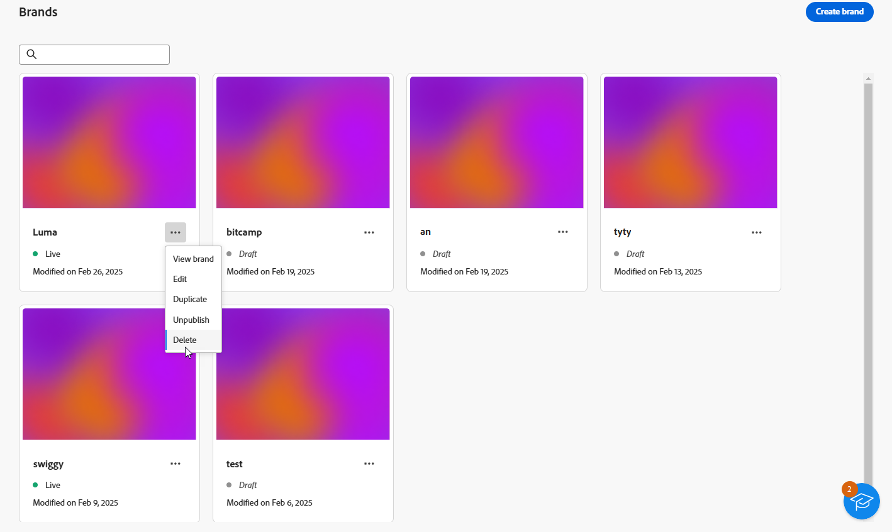

# Creare e gestire i brand {#brands}

>[!AVAILABILITY]
>
>Questa funzionalità viene rilasciata come versione beta privata. Sarà disponibile progressivamente per tutti i clienti nelle prossime versioni.

Le linee guida per il brand sono un set completo di regole e standard che definiscono l’identità visiva e verbale di un brand. Servono come riferimento per garantire una rappresentazione coerente del marchio in tutti i canali di marketing e comunicazione.

In [!DNL Adobe Campaign Web], gli utenti possono immettere e organizzare manualmente informazioni sul brand o caricare documenti di linee guida per il brand per l&#39;estrazione automatica dei dati.

## Accedere ai brand {#generative-access}

Per accedere al menu **[!UICONTROL Marchi]** in [!DNL Adobe Campaign Web], è necessario assegnare agli utenti i profili di prodotto **[!UICONTROL Amministratore (amministratore)]** e **[!UICONTROL Brand kit]** per creare e gestire i marchi. Per l&#39;accesso in sola lettura, gli utenti hanno bisogno del profilo di prodotto [!UICONTROL Assistente IA].

[Ulteriori informazioni](https://experienceleague.adobe.com/en/docs/campaign/campaign-v8/admin/permissions/manage-permissions)

+++ Scopri come assegnare le autorizzazioni relative al brand

1. Nella home page di [Admin Console](https://adminconsole.adobe.com/enterprise), accedi al tuo prodotto Campaign.

   

1. Selezionare **[!DNL Product profile]** in base al livello di autorizzazioni che si desidera concedere all&#39;utente.

   

1. Fare clic su **[!DNL Add users]** per assegnare il profilo di prodotto selezionato.

   

1. Digita il nome dell’utente, il gruppo di utenti o l’indirizzo e-mail.

1. Fai clic su **Salva** per applicare le modifiche.

Gli utenti già assegnati a questo ruolo dispongono di autorizzazioni aggiornate automaticamente.

+++

## Crea il tuo marchio {#create-brand-kit}

Per creare e gestire le linee guida per il tuo marchio, segui i passaggi indicati di seguito.

Gli utenti possono immettere i dettagli manualmente o caricare un documento sulle linee guida del brand per estrarre automaticamente le informazioni:

1. Dal menu **[!UICONTROL Gestione contenuto]**, seleziona **[!UICONTROL Marchi]**.

1. Nel menu **[!UICONTROL Marchi]**, fai clic su **[!UICONTROL Crea marchio]**.

   

1. Immetti un **[!UICONTROL Nome]** per il tuo marchio.

1. Trascina e rilascia o seleziona il file per caricare le linee guida per il brand ed estrarre automaticamente le informazioni rilevanti per il brand. Fai clic su **[!UICONTROL Crea marchio]**.

   Viene avviato il processo di estrazione delle informazioni. Il completamento potrebbe richiedere alcuni minuti.

   

1. I contenuti e gli standard di creazione visiva vengono compilati automaticamente. Sfoglia le diverse schede per adattare le informazioni in base alle esigenze.

1. Dalla scheda **[!UICONTROL Stile scrittura]**, fai clic su  per aggiungere una linea guida o un&#39;esclusione, inclusi esempi.

   

1. Dalla scheda **[!UICONTROL Contenuto visivo]**, fai clic su  per aggiungere un&#39;altra linea guida o esclusione.

1. Per aggiungere un&#39;immagine che mostra l&#39;utilizzo corretto, selezionare **[!UICONTROL Esempi]** e fare clic su **[!UICONTROL Seleziona immagine]**. È inoltre possibile aggiungere un’immagine che mostra un utilizzo errato come esempio di esclusione.

   

1. Una volta configurata, fai clic su **[!UICONTROL Salva]**, quindi su **[!UICONTROL Pubblica]** per rendere disponibili le linee guida del brand nell&#39;assistente AI.

1. Per modificare il tuo marchio pubblicato, fai clic su **[!UICONTROL Modifica marchio]**.

   >[!NOTE]
   >
   >In questo modo viene creata una copia temporanea in modalità di modifica, che sostituisce la versione live pubblicata.

   

1. Dalla dashboard di **[!UICONTROL Brands]**, apri il menu avanzato facendo clic sull&#39;icona  per:

   * Visualizza marchio
   * Modifica
   * Duplica
   * Pubblicazione
   * Annulla pubblicazione
   * Elimina

   

Le linee guida del brand sono ora accessibili dal menu a discesa **[!UICONTROL Brand]** nel menu dell’assistente AI. In questo modo l’assistente AI può generare contenuti e risorse in linea con le tue specifiche. [Ulteriori informazioni sull&#39;assistente di IA](../email/generative-gs.md)

