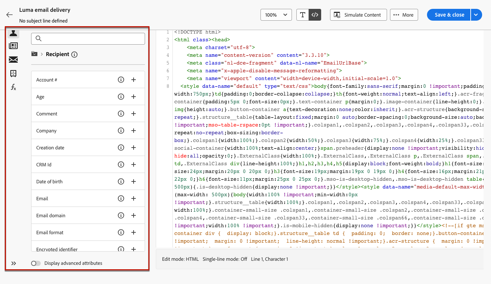

# Creare il codice del contenuto e-mail {#code-content}

Utilizza la modalità **[!UICONTROL Crea il codice]** per importare o creare il codice HTML non elaborato da usare come contenuto dell’e-mail.

>[!CAUTION]
>
>Questo metodo richiede competenze HTML.

1. Il giorno [E-mail Designer](get-started-email-designer.md) home page, seleziona **[!UICONTROL Crea il codice]**.

   

1. Inserisci o incolla il codice HTML non elaborato nell’area di lavoro principale.

1. Utilizza il riquadro a sinistra per sfruttare le funzionalità di personalizzazione. [Ulteriori informazioni](../personalization/gs-personalization.md)

   

1. Fai clic sul pulsante **[!UICONTROL Simula contenuto]** per verificare l’aspetto e la personalizzazione del messaggio utilizzando i profili di test. [Ulteriori informazioni](../preview-test/preview-test.md)

1. Quando il codice è pronto, fai clic su **[!UICONTROL Salva e chiudi]** per tornare alla schermata di creazione del messaggio e finalizzare il messaggio.
