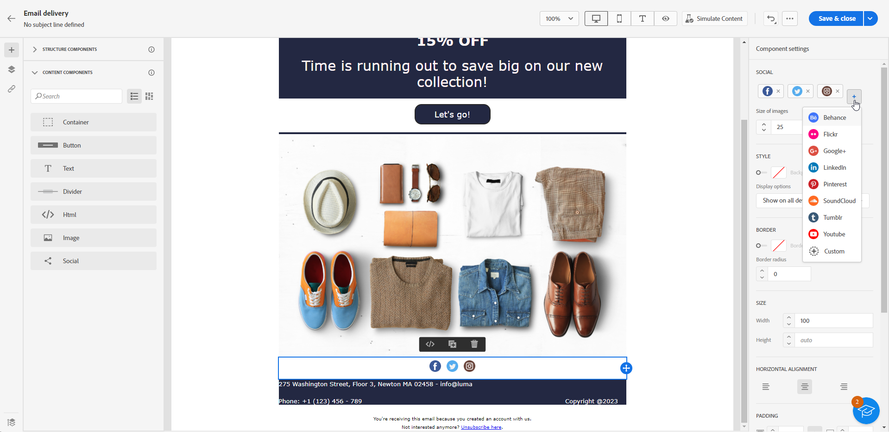
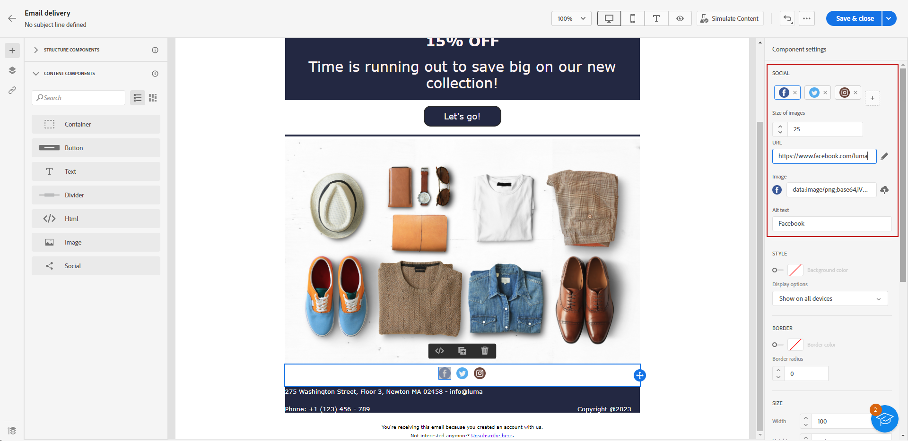

# Utilizzare il contenuto di E-mail designer {#content-components}

>[!CONTEXTUALHELP]
>id="ac_content_components_email"
>title="Informazioni sul contenuto"
>abstract="I componenti contenuto sono segnaposto di contenuto vuoti che puoi utilizzare per creare il layout di un’e-mail."

>[!CONTEXTUALHELP]
>id="ac_content_components_landing_page"
>title="Informazioni sul contenuto"
>abstract="I componenti per contenuti sono dei segnaposto di contenuto vuoti che possono essere utilizzati per creare il layout di una pagina di destinazione."

>[!CONTEXTUALHELP]
>id="ac_content_components_fragment"
>title="Informazioni sul contenuto"
>abstract="I componenti per contenuti sono dei segnaposto di contenuto vuoti che possono essere utilizzati per creare il layout di un frammento."

>[!CONTEXTUALHELP]
>id="ac_content_components_template"
>title="Informazioni sul contenuto"
>abstract="I componenti per contenuti sono dei segnaposto di contenuto vuoti che possono essere utilizzati per creare il layout di un modello."

Durante la creazione di contenuti e-mail, **[!UICONTROL Contenuto]** componenti consente di personalizzare ulteriormente l’e-mail con componenti vuoti e non elaborati che possono essere utilizzati una volta inseriti in un messaggio e-mail.

Puoi aggiungerne altrettanti **[!UICONTROL Sommario]** come è necessario all&#39;interno di un **[!UICONTROL Struttura]**, che definisce il layout dell’e-mail.

## Aggiungi componenti contenuto {#add-content-components}

Per aggiungere componenti per contenuti all’e-mail e modificarli in base alle tue esigenze, segui la procedura seguente.

1. In E-mail Designer, utilizza un [contenuto esistente](existing-content.md) oppure trascina e rilascia **[!UICONTROL Struttura]** per definire il layout dell’e-mail. [Scopri come](create-email-content.md)

1. Trascina la **[!UICONTROL Contenuto]** di vostra scelta all&#39;interno delle strutture pertinenti.

   

   >[!NOTE]
   >
   >Puoi aggiungere più componenti in una singola struttura e in ogni colonna di una struttura.

1. Regola le opzioni per ciascun componente utilizzando la proprietà contestuale **[!UICONTROL Impostazioni]** scheda. Ad esempio, puoi scegliere di visualizzarlo solo su dispositivi desktop o mobili, oppure su entrambi. Da questa scheda puoi anche gestire le opzioni di collegamento. [Ulteriori informazioni sulla gestione dei collegamenti](message-tracking.md)

1. Regola gli attributi di stile per ciascun componente utilizzando **[!UICONTROL Stile]** scheda. Ad esempio, puoi modificare lo stile del testo, la spaziatura o il margine di ciascun componente. [Ulteriori informazioni su allineamento e spaziatura](alignment-and-padding.md)

   

1. Dal menu avanzato del **[!UICONTROL Contenuto]** nel riquadro a destra è possibile eliminare o duplicare facilmente qualsiasi componente di contenuto in base alle esigenze.

## Contenitore {#container}

Puoi aggiungere un contenitore semplice all’interno del quale aggiungere un altro componente di contenuto. In tal modo è possibile applicare uno stile specifico al contenitore, diverso dal componente utilizzato al suo interno.

Ad esempio, aggiungi un componente **[!UICONTROL Contenitore]** e quindi un componente [Pulsante](#button) all’interno del contenitore. Puoi utilizzare uno sfondo specifico per il contenitore e un altro per il pulsante.

## Pulsante {#buttons}

Utilizza il componente **[!UICONTROL Pulsante]** per inserire uno o più pulsanti nell’e-mail e reindirizzare il pubblico dell’e-mail a un’altra pagina.

1. Dall’elenco **[!UICONTROL Contenuti]**, trascina il componente **[!UICONTROL Pulsante]** in un componente **[!UICONTROL Struttura]**.

   

1. Fai clic sul pulsante appena aggiunto per personalizzare il testo e accedere alle schede **[!UICONTROL Impostazioni]** e **[!UICONTROL Stili]**.

   

1. Dalle schede **[!UICONTROL Impostazioni]**, nel campo **[!UICONTROL URL]**, aggiungi l’URL a cui desideri reindirizzare l’utente quando farà clic sul pulsante.

1. Con l’elenco a discesa **[!UICONTROL Target]** puoi scegliere in che modo viene visualizzato il contenuto:

   * **[!UICONTROL Nessuno]**: il collegamento viene aperto nello stesso frame in cui è stato fatto clic (impostazione predefinita).
   * **[!UICONTROL Vuoto]**: il collegamento viene aperto in una nuova finestra o scheda.
   * **[!UICONTROL Stesso]**: il collegamento viene aperto nello stesso frame in cui è stato fatto clic.
   * **[!UICONTROL Principale]**: il collegamento viene aperto nel frame principale.
   * **[!UICONTROL Superiore]**: il collegamento viene aperto nel corpo completo della finestra.

   

1. Puoi personalizzare ulteriormente il pulsante modificando gli attributi di stile, ad esempio **[!UICONTROL Bordo]**, **[!UICONTROL Dimensione]**, **[!UICONTROL Margine]**, ecc. dal **[!UICONTROL Stili]** scheda.

## Testo {#text}

Utilizza il componente **[!UICONTROL Testo]** per inserire testo nell’e-mail e regolarne lo stile (bordo, dimensione, spaziatura, ecc.) utilizzando le schede **[!UICONTROL Impostazioni]** e **[!UICONTROL Stili]**.

1. Dalla sezione **[!UICONTROL Sommario]** menu, trascina **[!UICONTROL Testo]** in un **[!UICONTROL Struttura]** componente.

   

1. Fai clic sul componente appena aggiunto per personalizzare il testo e accedere alle schede **[!UICONTROL Impostazioni]** e **[!UICONTROL Stili]**.

1. Modifica il testo con le seguenti opzioni disponibili nella barra degli strumenti contestuale:

   

   * **[!UICONTROL Modifica stile di testo]**: applica al testo lo stile grassetto, corsivo, sottolineato o barrato.
   * **Modifica l’allineamento**: applica al testo l’allineamento a sinistra, a destra, centrato o giustificato.
   * **[!UICONTROL Crea elenco]**: aggiungi al testo un elenco puntato o numerato.
   * **[!UICONTROL Imposta il titolo]**: aggiungi al testo fino a sei livelli di titolo.
   * **Dimensione font**: seleziona la dimensione del font in pixel.
   * **[!UICONTROL Modifica immagine]**: aggiungi un’immagine o una risorsa al componente testo.
   * **[!UICONTROL Mostra il codice sorgente]**: visualizza il codice sorgente del testo. Non può essere modificato.
   * **[!UICONTROL Duplica]**: aggiungi una copia del componente di testo.
   * **[!UICONTROL Elimina]**: elimina dal messaggio e-mail il componente di testo selezionato.
   * **[!UICONTROL Aggiungi personalizzazione]**: aggiungi campi di personalizzazione per personalizzare il contenuto in base ai dati dei profili.
   * **[!UICONTROL Abilita contenuto condizionale]**: aggiungi contenuto condizionale per adattare il contenuto del componente ai profili target.

1. Regola gli altri attributi di stile quali colore del testo, famiglia di font, bordo, spaziatura, margine, ecc. dal **[!UICONTROL Stili]** scheda.

   

## Divisore {#divider}

Utilizza il componente **[!UICONTROL Divisore]** per inserire una linea di divisione utile per organizzare il layout e il contenuto dell’e-mail.

È possibile regolare gli attributi di stile, ad esempio il colore, lo stile e l&#39;altezza della linea, dal **[!UICONTROL Stili]** scheda.

## HTML {#HTML}

Utilizza il componente **[!UICONTROL HTML]** per copiare e incollare le diverse parti di un codice HTML esistente. Questo consente di creare componenti modulari HTML a forma libera in modo da riutilizzare dei contenuti esterni.

1. Da **[!UICONTROL Componenti]**, trascina e rilascia il componente **[!UICONTROL HTML]** in un componente **[!UICONTROL struttura]**.

   

1. Fai clic sul componente appena aggiunto, quindi seleziona **[!UICONTROL Mostra il codice sorgente]** dalla barra degli strumenti contestuale per aggiungere il codice HTML.

   

>[!NOTE]
>
>Per rendere semplicemente un contenuto esterno conforme a E-mail Designer, l’Adobe consiglia di [creazione di un messaggio da zero](create-email-content.md) e copia il contenuto dell’e-mail esistente nei componenti.

## Immagine {#image}

Utilizza il componente **[!UICONTROL Immagine]** per inserire nell’e-mail un file di immagine presente nel computer.

1. Dal menu **[!UICONTROL Contenuto]**, trascina e rilascia l’**[!UICONTROL Immagine]** in un componente **[!UICONTROL Struttura]**.

   

1. Fai clic su **[!UICONTROL Sfoglia]** per scegliere un file di immagine dalle risorse.

1. Fai clic sul componente appena aggiunto e imposta le proprietà dell’immagine utilizzando **[!UICONTROL Impostazioni]** scheda:

   * **[!UICONTROL Titolo immagine]** consente di definire il titolo da assegnare all’immagine.
   * **[!UICONTROL Testo Alt]** consente di definire la didascalia collegata all’immagine. Questo corrisponde all’attributo HTML “alt”.

   

1. Puoi aggiungere un collegamento per reindirizzare il pubblico a un altro contenuto. [Ulteriori informazioni](message-tracking.md)

1. Regola gli altri attributi di stile quali margine, bordo, ecc. utilizzando **[!UICONTROL Stili]** scheda.

## Social {#social}

Utilizza il componente **[!UICONTROL Social]** per inserire nel contenuto dell’e-mail dei collegamenti a pagine social media.

1. Dal menu **[!UICONTROL Componenti]**, trascina il componente **[!UICONTROL Social]** in un componente **[!UICONTROL Struttura]**.

1. Fai clic sul componente appena aggiunto.

1. Nel campo **[!UICONTROL Social]** della scheda **[!UICONTROL Impostazioni]**, scegli i social media da aggiungere o rimuovere.

   

1. Scegli la dimensione delle icone nel campo **[!UICONTROL Dimensioni delle immagini]**.

1. Fai clic su ciascuna delle icone di social media per configurare l’**[!UICONTROL URL]** a cui il pubblico viene reindirizzato.

   

1. Se necessario, puoi anche modificare le icone di ciascuno dei social media nel **[!UICONTROL Sorgente]** campo.

1. Regola gli altri attributi quali stile, margine, bordo, ecc. dal **[!UICONTROL Stili]** scheda.
