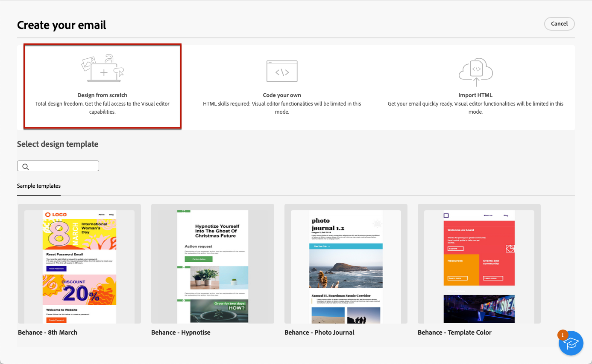
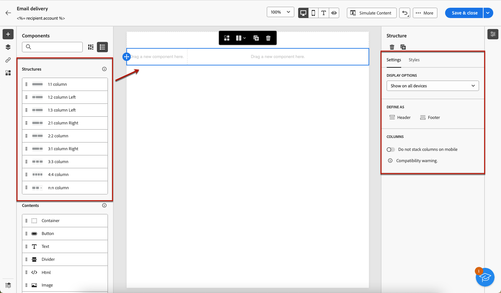

# Creare il contenuto dell’e-mail da zero {#create-email-content}

>[!CONTEXTUALHELP]
>id="ac_structure_components_email"
>title="Aggiungere strutture"
>abstract="Le strutture definiscono il layout dell’e-mail. Per iniziare a progettare il contenuto delle e-mail, trascina un componente **Struttura** nell’area di lavoro."

>[!CONTEXTUALHELP]
>id="ac_structure_components_landing_page"
>title="Aggiungere strutture"
>abstract="Le strutture definiscono il layout della pagina di destinazione. Trascina una **Struttura** nell’area di lavoro per iniziare a progettare la pagina di destinazione."

>[!CONTEXTUALHELP]
>id="ac_structure_components_fragment"
>title="Aggiungere strutture"
>abstract="Le strutture definiscono il layout del frammento. Trascina una **Struttura** nell’area di lavoro per iniziare a progettare il contenuto del frammento."

>[!CONTEXTUALHELP]
>id="ac_structure_components_template"
>title="Aggiungere strutture"
>abstract="Le strutture definiscono il layout del modello. Trascina una **Struttura** nell’area di lavoro per iniziare a progettare il contenuto del modello."

>[!CONTEXTUALHELP]
>id="ac_edition_columns_email"
>title="Definizione delle colonne nell’e-mail"
>abstract="E-mail Designer consente di definire facilmente il layout dell’e-mail definendone la struttura a colonne."

>[!CONTEXTUALHELP]
>id="ac_edition_columns_landing_page"
>title="Definizione delle colonne nella pagina di destinazione"
>abstract="E-mail Designer consente di definire facilmente il layout della pagina di destinazione definendone la struttura a colonne."

>[!CONTEXTUALHELP]
>id="ac_edition_columns_fragment"
>title="Definizione delle colonne in un frammento"
>abstract="E-mail Designer consente di definire facilmente il layout del frammento definendone la struttura a colonne."

>[!CONTEXTUALHELP]
>id="ac_edition_columns_template"
>title="Definizione delle colonne nei modelli"
>abstract="E-mail Designer consente di definire facilmente il layout del modello definendone la struttura a colonne."

E-mail Designer consente di definire facilmente la struttura delle e-mail. Aggiungendo e spostando elementi strutturali con semplici azioni di trascinamento, puoi progettare il corpo dell’e-mail in pochi secondi.

Per iniziare a creare il contenuto delle e-mail, segui i passaggi seguenti.

1. Dalla sezione [E-mail Designer](get-started-email-designer.md#start-authoring) home page, selezionare la **[!UICONTROL Progettare da zero]** opzione.

   

1. Inizia a progettare il contenuto delle e-mail tramite trascinamento **[!UICONTROL Strutture]** nell’area di lavoro per definire il layout dell’e-mail.

   >[!NOTE]
   >
   >L’utilizzo di colonne sovrapposte non è compatibile con tutti i programmi e-mail. Se non è supportato, le colonne non vengono sovrapposte.

1. Aggiungi tanti **[!UICONTROL Strutture]** in base alle esigenze e modificarne le impostazioni nel riquadro dedicato a destra.

   

1. È possibile selezionare **[!UICONTROL Colonna n:n]** per definire il numero di colonne desiderato (tra 3 e 10). Per definire la larghezza di ogni colonna, sposta le frecce nella parte inferiore di ciascuna colonna.

   >[!NOTE]
   >
   >Le dimensioni di ogni colonna non possono essere inferiori al 10% della larghezza totale del componente struttura. Non è possibile rimuovere una colonna non vuota.

1. Dalla sezione **[!UICONTROL Componenti]** , trascinare tutti gli elementi necessari in una o più strutture. [Ulteriori informazioni sui componenti contenuto](content-components.md)

1. Ogni componente può essere ulteriormente personalizzato utilizzando **[!UICONTROL Impostazioni]** o **[!UICONTROL Stile]** schede a destra. Ad esempio, puoi modificare lo stile del testo, la spaziatura o il margine di ciascun componente. [Ulteriori informazioni su allineamento e spaziatura](alignment-and-padding.md)

   

1. Inserisci campi di personalizzazione per personalizzare il contenuto delle e-mail in base ai dati dei profili. [Ulteriori informazioni sulla personalizzazione dei contenuti](../personalization/personalize.md)

1. Aggiungi collegamenti al contenuto.

   Fai clic su **[!UICONTROL Collegamenti]** dal riquadro a sinistra per visualizzare tutti gli URL del contenuto che verranno tracciati. Se necessario, è possibile modificare il **[!UICONTROL Tipo di tracciamento]** o l’**[!UICONTROL Etichetta]** e aggiungere **[!UICONTROL Categorie]**.

[Ulteriori informazioni sui collegamenti e il tracciamento dei messaggi](message-tracking.md)

   

1. Se necessario, puoi personalizzare ulteriormente l’e-mail facendo clic su **[!UICONTROL Passa all’editor di codice]** nel menu avanzato. Questo consente di modificare il codice sorgente dell’e-mail, ad esempio per aggiungere tag di tracciamento o HTML personalizzati. [Ulteriori informazioni sull’editor di codice](code-content.md)

   >[!CAUTION]
   >
   >Dopo il passaggio all’editor di codice, per l’e-mail corrente non è possibile tornare al designer visivo.

1. Quando il contenuto è pronto, fai clic su **[!UICONTROL Simula contenuto]** per verificare il rendering dell’e-mail. È possibile scegliere la visualizzazione su desktop o dispositivo mobile. [Ulteriori informazioni sull’anteprima del messaggio e-mail](../preview-test/preview-test.md)

   

1. Quando l’e-mail è pronta, fai clic su **[!UICONTROL Salva]**.

