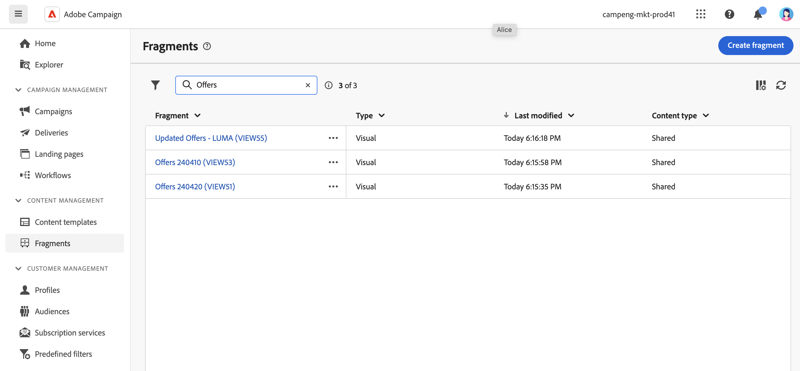

# Creare frammenti di contenuto {#fragments}

>[!CONTEXTUALHELP]
>id="acw_fragments_create"
>title="Definire i frammenti di contenuto personalizzati"
>abstract="Definisci le proprietà del frammento e il tipo di frammento che desideri creare. Puoi utilizzare E-mail designer o l’editor di espressioni per configurare il contenuto del frammento."

<!-- pas vu dans l'UI-->

>[!CONTEXTUALHELP]
>id="acw_fragments_properties"
>title="Proprietà dei frammenti"
>abstract="Immetti l’etichetta del frammento. Se necessario, puoi definire opzioni aggiuntive, ad esempio, il nome interno del frammento, la relativa cartella e una descrizione."

>[!CONTEXTUALHELP]
>id="acw_fragments_type"
>title="Tipo di frammento di contenuto"
>abstract="Scegli il tipo di frammento che desideri creare. I **frammenti visivi** sono blocchi visivi predefiniti riutilizzabili in più consegne e-mail o in modelli di contenuto. I **frammenti di espressione** sono espressioni predefinite disponibili in una voce dedicata nell’editor di espressioni."

Esistono due modi per creare frammenti di contenuto:

* Crea un frammento da zero utilizzando il menu dedicato **[!UICONTROL Frammenti]**. [Scopri come](#create-from-scratch)
* Durante la progettazione di un contenuto, salva una parte del contenuto come frammento. [Scopri come](#save-as-fragment)

  >[!NOTE]
  >
  >Questa funzionalità è disponibile solo per i frammenti visivi. I frammenti di espressione vengono creati esclusivamente dal menu **Frammenti**.

Una volta salvato, il frammento di contenuto è disponibile per l’utilizzo in qualsiasi consegna o modello di contenuto.

## Creare un frammento di contenuto da zero {#create-from-scratch}

Per creare un frammento di contenuto da zero, effettua le seguenti operazioni.

1. [Accedi all&#39;elenco di frammenti](#access-manage-fragments) tramite il menu a sinistra **[!UICONTROL Gestione contenuto]** > **[!UICONTROL Frammenti]** e seleziona **[!UICONTROL Crea frammento]**.

   

1. Immetti l’etichetta del frammento. Se necessario, puoi definire opzioni aggiuntive, ad esempio, il nome interno del frammento, la relativa cartella e una descrizione.

1. Scegliere il tipo di frammento da creare: **Frammento visivo** o **Frammento di espressione**. [Scopri le differenze tra i frammenti visivi e quelli di espressione](fragments.md)

   

   >[!AVAILABILITY]
   >
   >I frammenti visivi si trovano in Disponibilità limitata (LA). Ciò significa che sono limitate a chi esegue la migrazione **da Adobe Campaign Standard ad Adobe Campaign v8** e non possono essere distribuite in nessun altro ambiente.

1. Fai clic sul pulsante **Crea**.

   * Per **frammenti visivi**, viene visualizzato [E-mail Designer](../email/get-started-email-designer.md). Modifica il contenuto come necessario, come per qualsiasi e-mail all&#39;interno di una campagna, quindi fai clic sul pulsante **Salva e chiudi**. Puoi aggiungere immagini, collegamenti, campi di personalizzazione e contenuti dinamici.

     

   * Per **frammenti di espressione**, viene aperto l&#39;editor espressioni. Sfrutta le funzionalità di personalizzazione e authoring per creare i contenuti, quindi fai clic su **Conferma**. [Scopri come utilizzare l&#39;editor di espressioni](../personalization/personalize.md)

     

1. Quando il contenuto è pronto, fai clic su **Salva**.

Il frammento di contenuto è ora pronto per essere utilizzato quando si crea una consegna o un [modello di contenuto](../email/use-email-templates.md) all&#39;interno di Campaign. Scopri come utilizzare i frammenti di visualizzazione ed espressione in questa sezione:
* [Aggiungi frammenti visivi alle e-mail](use-visual-fragments.md)
* [Aggiungere un frammento di espressione all’editor di espressioni](use-expression-fragments.md)

## Salvare un contenuto come frammento visivo {#save-as-fragment}

>[!CONTEXTUALHELP]
>id="acw_fragments_save"
>title="Salva come frammento"
>abstract="Per salvare un contenuto come frammento visivo, seleziona gli elementi che desideri includere nel frammento, inclusi i campi di personalizzazione e il contenuto dinamico. Puoi selezionare solo le sezioni adiacenti l’una all’altra. Non puoi selezionare una struttura vuota o un altro frammento di contenuto. Il contenuto sarà quindi un frammento autonomo, aggiunto all’elenco dei frammenti e accessibile dal menu dedicato. Puoi utilizzare questo frammento durante la creazione di qualsiasi e-mail o modello di contenuto all’interno di una campagna."

<!--pas vu dans l'UI-->

Qualsiasi contenuto e-mail può essere salvato come frammento visivo per riutilizzi futuri. Durante la progettazione di un [modello di contenuto](../email/use-email-templates.md) o di una consegna [e-mail](../email/get-started-email-designer.md), puoi salvare una parte del contenuto come frammento visivo. A questo scopo, segui la procedura indicata di seguito:

1. In [E-mail Designer](../email/get-started-email-designer.md), fai clic sul pulsante **Altro** in alto a destra dello schermo.

1. Seleziona **[!UICONTROL Salva come frammento]** dal menu a discesa.

   

1. Viene visualizzata la schermata **[!UICONTROL Salva come frammento]**. Seleziona gli elementi da includere nel frammento, inclusi i campi di personalizzazione e il contenuto dinamico.

   >[!CAUTION]
   >
   >Puoi selezionare solo le sezioni adiacenti l’una all’altra. Non puoi selezionare una struttura vuota o un altro frammento di contenuto.

   

1. Fai clic su **[!UICONTROL Crea]**. Inserisci il nome del frammento e salvalo.

   

   Il contenuto è ora un frammento autonomo , aggiunto all&#39;[elenco frammenti](#manage-fragments) e accessibile dal menu dedicato. Ora puoi utilizzare questo frammento durante la creazione di qualsiasi [e-mail](../email/get-started-email-designer.md) o [modello di contenuto](../email/use-email-templates.md) all&#39;interno di Campaign. [Scopri come](../content/use-visual-fragments.md)

>[!NOTE]
>
>Eventuali modifiche apportate al nuovo frammento non vengono propagate all’e-mail o al modello di origine. Allo stesso modo, quando il contenuto originale viene modificato all’interno dell’e-mail o del modello, il nuovo frammento non viene modificato.—>

## Gestire i frammenti di contenuto {#manage-fragments}

È possibile modificare, aggiornare, duplicare o eliminare un frammento di contenuto dall’elenco dei frammenti.

### Modificare e aggiornare un frammento di contenuto {#edit-fragments}

Per modificare un frammento di contenuto, effettua le seguenti operazioni.

1. Fare clic sul nome del frammento da modificare dall&#39;elenco **[!UICONTROL Frammenti]**.
1. Fai clic sul pulsante **Modifica contenuto** per aprire il contenuto di questo frammento.

   

1. Apporta le modifiche necessarie e le salva.

>[!CAUTION]
>
>Qualsiasi modifica apportata a un frammento viene propagata alle consegne o ai modelli che lo utilizzano.

### Eliminare un frammento di contenuto {#delete-fragments}

Per eliminare un frammento di contenuto, effettua le seguenti operazioni:

1. Individua l&#39;elenco dei frammenti e fai clic sul pulsante **[!UICONTROL Altre azioni]** accanto al frammento da eliminare.
1. Fai clic su **Elimina** e conferma.

   

>[!CAUTION]
>
>Durante l’eliminazione di un frammento, le consegne e i modelli che lo utilizzano vengono aggiornati: il frammento viene rimosso dal contenuto, ma vi si fa ancora riferimento. Per mantenere il contenuto del frammento in tali consegne e modelli, è necessario interrompere l&#39;ereditarietà prima di eliminare il frammento, [come descritto in questa sezione](use-visual-fragments.md#break-inheritance).

### Archiviare un frammento di contenuto {#archive}

Puoi eliminare dall’elenco i frammenti che non sono più rilevanti per il tuo marchio. A tale scopo, fai clic sul pulsante **[!UICONTROL Altre azioni]** accanto al frammento desiderato e seleziona **[!UICONTROL Archivia]**. Il frammento viene rimosso dall’elenco dei frammenti, impedendo agli utenti di utilizzarlo in e-mail o modelli futuri.

Per accedere ai frammenti archiviati, utilizza il riquadro dei filtri per visualizzarli. Per annullare l&#39;archiviazione di un frammento, fai clic sul pulsante **[!UICONTROL Altre azioni]** e seleziona **[!UICONTROL Annulla archiviazione]**.

>[!NOTE]
>
>Se archivi un frammento utilizzato in un contenuto, tale contenuto non viene interessato.

### Duplicare un frammento di contenuto {#duplicate-fragments}

Puoi duplicare facilmente un frammento di contenuto per crearne uno nuovo. Per duplicare un frammento esistente, effettua le seguenti operazioni:

1. Individua l&#39;elenco dei frammenti e fai clic sul pulsante **[!UICONTROL Altre azioni]** accanto al frammento da duplicare.
1. Fai clic su **Duplica** e conferma.
1. Inserisci l’etichetta del nuovo frammento e salva le modifiche.

   Il frammento viene aggiunto all’elenco dei frammenti di contenuto. Puoi modificarlo e configurarlo in base alle esigenze.
