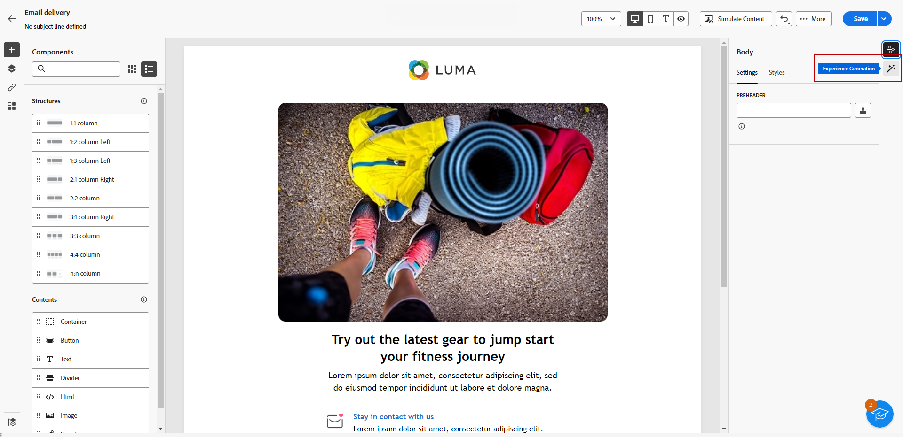

# Generare un messaggio e-mail con l’assistente al contenuto {#generative-email}

L’Assistente per i contenuti migliora l’impatto delle comunicazioni generando automaticamente contenuti e-mail completi, risparmiando tempo e garantendo una qualità coerente.

Utilizzando l’intelligenza artificiale generativa, puoi creare facilmente e-mail coinvolgenti che risuonano con il tuo pubblico, rendendo la comunicazione più efficace ed efficiente.

1. Dopo aver creato e configurato la consegna e-mail, fai clic su **[!UICONTROL Creare contenuti]**.

   Per ulteriori informazioni su come configurare la consegna e-mail, consulta [questa pagina](../content/create-email-content.md).

1. Compila il **[!UICONTROL Dettagli di base]** per la consegna. Al termine, fai clic su **[!UICONTROL Modifica corpo dell’e-mail]**.

1. Scegli il modello struttura su cui desideri che l’Assistente al contenuto basi l’e-mail generata.

   È inoltre possibile importare un file HTML.

1. Dal menu di destra, seleziona **[!UICONTROL Generazione di esperienze]**.

   

1. Ottimizza il contenuto descrivendo cosa desideri generare.

   Abilita **[!UICONTROL Migliora con il contenuto corrente]** l’opzione per l’assistente contenuti di personalizzare i nuovi contenuti in base alla consegna, al nome della consegna e al pubblico selezionato.

   

1. Seleziona **[!UICONTROL Carica file]** se desideri aggiungere una descrizione del marketing per dare più contesto all’assistente contenuti.

   Puoi anche fare clic su **[!UICONTROL Contenuto caricato]** per trovare i file aggiornati in precedenza.

1. Seleziona la **[!UICONTROL Strategia di comunicazione]** che meglio si adatta alle tue esigenze. Questo influenzerà il tono e lo stile dell’e-mail generata.

1. Scegli la **[!UICONTROL Lingua]** e **[!UICONTROL Tono]** che si desidera venga aggiunto al testo generato. In questo modo il testo sarà appropriato al tuo pubblico e allo scopo.

   

1. Personalizzare **[!UICONTROL Tipo di contenuto]** impostazioni corrispondenti alle caratteristiche desiderate per la risorsa.

1. Quando il prompt è pronto, fai clic su **[!UICONTROL Genera]**.

1. Sfoglia **[!UICONTROL Suggerimenti varianti]** per trovare l’e-mail desiderata. Clic **[!UICONTROL Anteprima]** per visualizzare una versione a schermo intero della variante selezionata.

   

1. Clic **[!UICONTROL Seleziona]** una volta trovato il contenuto appropriato.

   

1. Inserisci campi di personalizzazione per personalizzare il contenuto delle e-mail in base ai dati dei profili o, se necessario, per personalizzare ulteriormente il contenuto. [Ulteriori informazioni sulla personalizzazione dei contenuti](../personalization/personalize.md)

1. Dopo aver definito il contenuto dell’e-mail, fai clic su **[!UICONTROL Simula contenuto]** per controllare il rendering e controllare le impostazioni di personalizzazione con i profili di test.  [Ulteriori informazioni](../preview-test/preview-content.md)

   

1. Una volta definiti il contenuto, il pubblico e la pianificazione, puoi preparare la consegna delle e-mail. [Ulteriori informazioni](../monitor/prepare-send.md)

