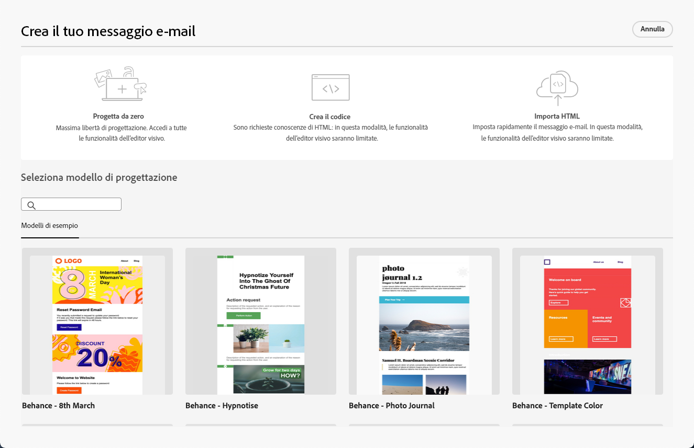

# Guida introduttiva a E-mail Designer {#get-started-email-designer}

Dopo aver creato un’e-mail in Adobe Campaign, è necessario definirne il contenuto.

E-mail Designer consente di creare e-mail accattivanti e personalizzate tramite un’interfaccia intuitiva con funzionalità di trascinamento della selezione. Indipendentemente dal fatto che tu parta da una lavagna vuota, importi un contenuto esistente o sfrutti modelli esistenti, progetta e perfeziona tutti i contenuti per ogni e-mail, sia essa promozionale o transazionale.

<!--Built to deliver HTML optimized for responsive design, the Email Designer allows you to easily define and apply visibility conditions and dynamic content to an email, template, or fragment directly through the user interface. You can seamlessly switch between the drag and drop interface and HTML code at the click of a button.

The Email Designer allows you to create email content and email content templates. It is compatible with simple emails, transactional emails, A/B test emails, multilingual emails, and recurring emails.-->

* Utilizzare [!DNL Campaign] funzionalità di progettazione delle e-mail per creare e-mail dinamiche. [Ulteriori informazioni](create-email-content.md)

* Migliora l’esperienza dei clienti creando contenuti personalizzati in base agli attributi del profilo. [Ulteriori informazioni](../personalization/personalize.md)

* Configura i campi di contenuto condizionale per creare una personalizzazione dinamica in base al profilo del destinatario. [Ulteriori informazioni](../personalization/conditions.md)

## Best practice per la progettazione delle e-mail {#best-practices}

Quando si inviano le e-mail, è importante tenere presente che i destinatari possono inoltrarle, il che a volte può causare problemi con il rendering dell’e-mail. Ciò è particolarmente vero quando si utilizzano classi CSS che potrebbero non essere supportate dal provider di posta elettronica utilizzato per l’inoltro, ad esempio, se si utilizza la classe CSS &quot;is-desktop-hidden&quot; per nascondere un’immagine su dispositivi mobili.

Per ridurre al minimo questi problemi di rendering, ti consigliamo di mantenere la struttura della tua e-mail il più semplice possibile. Prova a utilizzare un’unica progettazione che funzioni bene sia per i dispositivi desktop che mobili ed evita di utilizzare classi CSS complesse o altri elementi di progettazione che potrebbero non essere completamente supportati da tutti i client e-mail. Seguendo queste best practice, puoi contribuire a garantire che le e-mail vengano visualizzate correttamente in modo coerente, indipendentemente da come vengono visualizzate o inoltrate dai destinatari.

## Iniziare a creare i contenuti {#start-authoring}

Dal dashboard di consegna e-mail, passa attraverso [Modifica contenuto](edit-content.md) per aprire la home page di E-mail Designer. Da qui, scegli come progettare l’e-mail tra le seguenti opzioni:

* **Creare un messaggio e-mail da zero** tramite l’interfaccia di e-mail designer. Scopri come progettare il contenuto delle e-mail in [questa sezione](create-email-content.md).

* **Codice o incolla HTML non elaborato** direttamente in e-mail designer. Scopri come programmare i contenuti in [questa sezione](code-content.md).

* **Importa contenuto HTML esistente** da un file o da una cartella .zip. Scopri come importare un contenuto e-mail in [questa sezione](existing-content.md).

* **Seleziona un contenuto esistente** da un elenco di modelli predefiniti o personalizzati. Scopri come utilizzare i modelli e-mail [questa sezione](email-templates.md).

  

