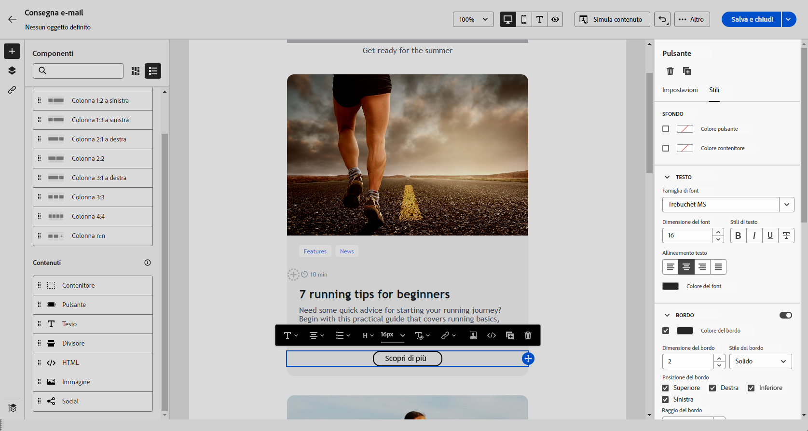

# Introduzione allo stile delle e-mail {#get-started-email-style}

Una volta iniziato a creare il contenuto delle e-mail in [!DNL Adobe Campaign], è possibile modificare una serie di parametri e attributi di stile dal riquadro delle impostazioni di E-mail Designer.

Puoi applicare le modifiche al corpo dell’e-mail, a un componente struttura o a un componente contenuto.

Segui i collegamenti riportati di seguito per scoprire come regolare alcune delle impostazioni di stile delle e-mail.

* Scopri come [personalizzare lo sfondo delle e-mail](backgrounds.md)
* Scopri come [gestire l’allineamento verticale e la spaziatura](alignment-and-padding.md)
* Scopri come [definire lo stile dei collegamenti presenti nell’e-mail](styling-links.md)
* Scopri come [personalizzare gli attributi di stile in linea](inline-styling.md)
