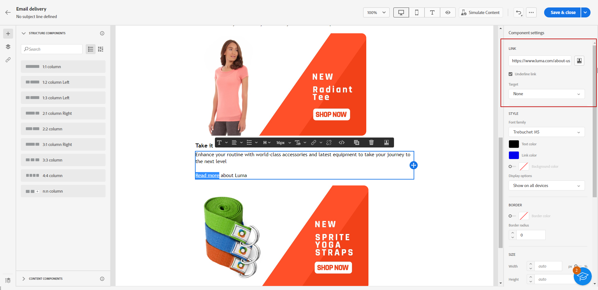

# Aggiungere collegamenti e tenere traccia dei messaggi {#tracking}

Utilizza E-mail Designer per aggiungere collegamenti al contenuto, quindi tieni traccia dei messaggi inviati per monitorare il comportamento dei destinatari.

## Inserire i collegamenti {#insert-links}

Durante la progettazione di un messaggio, puoi aggiungere collegamenti al contenuto.

>[!NOTE]
>
>Quando il tracciamento è abilitato, vengono tracciati tutti i collegamenti inclusi nel contenuto del messaggio.

Per inserire collegamenti nel contenuto delle e-mail, segui la procedura seguente:

1. Seleziona un elemento e fai clic su **[!UICONTROL Inserisci collegamento]** nella barra degli strumenti contestuale.

   

1. Aggiungi un’**[!UICONTROL Etichetta]** e un **[!UICONTROL Collegamento]**.

1. Salva le modifiche.

1. Una volta creato il collegamento, puoi comunque modificarlo dalla scheda **[!UICONTROL Impostazioni]**.

   * Puoi modificare il collegamento e modificarne la relativa **[!UICONTROL Destinazione]**.
   * Puoi scegliere di sottolineare o meno il collegamento, selezionando l’opzione corrispondente.

   

>[!NOTE]
>
>I messaggi e-mail di tipo marketing devono includere un collegamento di rinuncia, che non è invece necessario per i messaggi transazionali. La categoria del messaggio (**[!UICONTROL Marketing]** o **[!UICONTROL Transazionale]**) viene definita a livello di superficie di canale (ad esempio, nel predefinito per messaggi) e durante la creazione del messaggio.

In tutti i messaggi e-mail deve essere aggiunto un collegamento specifico alla pagina mirror. Ulteriori informazioni sulla pagina mirror in [questa sezione](mirror-page.md).

## Gestire il tracciamento {#manage-tracking}

[E-mail Designer](create-email-content.md) consente di gestire gli URL tracciati, ad esempio modificando il tipo di tracciamento per ogni collegamento.

1. Fai clic sull’icona **[!UICONTROL Collegamenti]** nel riquadro a sinistra per visualizzare l’elenco di tutti gli URL del contenuto da tracciare.

   Questo elenco consente di avere una visualizzazione centralizzata e di individuare ogni URL nel contenuto dell’e-mail.

1. Per modificare un collegamento, fai clic sull’icona a forma di matita corrispondente.

   

1. Se necessario, puoi modificare il **[!UICONTROL Tipo di tracciamento]**:

   

   Per ogni URL tracciato, puoi impostare la modalità di tracciamento su uno dei seguenti valori:

   * **[!UICONTROL Tracciato]**: attiva il tracciamento su questo URL.
   * **[!UICONTROL Rinuncia]**: considera questo URL come un URL di rinuncia o di annullamento dell’iscrizione.
   * **[!UICONTROL Pagina mirror]**: considera questo URL come un URL della pagina mirror.
   * **[!UICONTROL Mai]**: non attiva mai il tracciamento di questo URL.<!--This information is saved: if the URL appears again in a future message, its tracking is automatically deactivated.-->

1. Aggiungi una **[!UICONTROL Categoria]** al collegamento per raggruppare i collegamenti tracciati e fai clic su **[!UICONTROL Salva]**.

   

1. Dopo aver inviato la consegna, accedi al rapporto di consegna. Nel menu **[!UICONTROL Tracciamento]**, il rapporto di **[!UICONTROL URL e flussi di clic]** mostra gli URL di consegna più visitati. [Ulteriori informazioni](../reporting/gs-reports.md)
