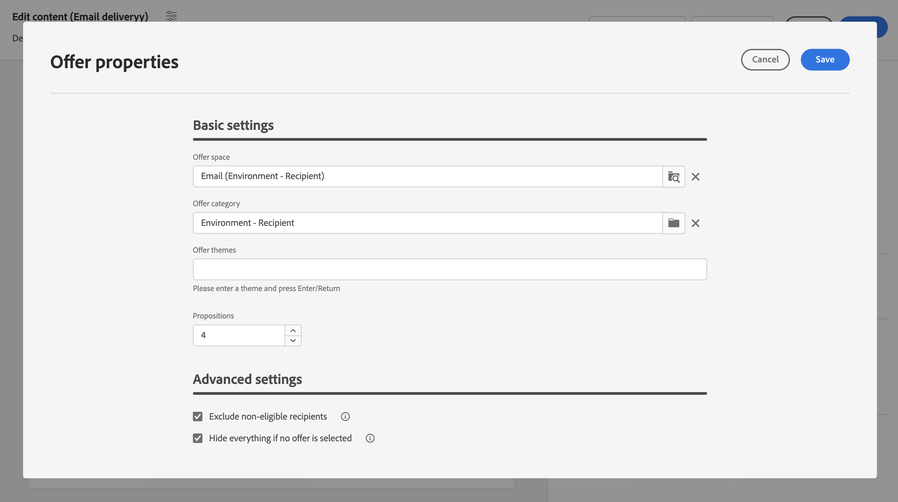

# Inviare offerte {#offers-content}

Adobe Campaign Web v8 consente di inviare, con le e-mail, delle offerte create nella console mediante il modulo **[!UICONTROL Interazione]**. Per ulteriori informazioni su Interazione e su come gestire un catalogo di offerte nella console, consulta la [documentazione di Campaign v8](https://experienceleague.adobe.com/docs/campaign/campaign-v8/offers/interaction.html?lang=it){target="_blank"}.

I passaggi per inviare offerte con un’e-mail sono i seguenti:

1. [Configurare le offerte da proporre](#configure),
1. [Inserire le offerte nell’e-mail](#insert).

## Configurare le offerte da proporre {#configure}

>[!CONTEXTUALHELP]
>id="acw_deliveries_email_offers_settings"
>title="Impostazioni delle offerte"
>abstract="Configura le offerte da proporre ai destinatari."

>[!CONTEXTUALHELP]
>id="acw_deliveries_email_offers_advanced_settings"
>title="Impostazioni avanzate per le offerte"
>abstract="Configurare opzioni avanzate sulle offerte."

1. Per selezionare le offerte da proporre nel messaggio e-mail, fai clic sul pulsante **[!UICONTROL Offerte]** nella schermata per la modifica del contenuto dell’e-mail.

   

1. Configura le offerte da proporre ai destinatari. Seleziona prima lo **[!UICONTROL Spazio offerta]** che corrisponde all’ambiente dell’offerta.

   

1. Per perfezionare le offerte scelte dal motore, seleziona la **[!UICONTROL Categoria offerta]** in base alla quale ordinare le offerte.

   Se non viene specificata alcuna categoria, il motore di offerte prenderà in considerazione tutte le offerte contenute nell’ambiente, a meno che non venga selezionato un **[!UICONTROL Tema offerta]**.

   >[!NOTE]
   >
   >I temi sono parole chiave definite a monte nelle categorie. Fungono da filtro e consentono di perfezionare il numero di offerte da presentare selezionandole in un set di categorie.

1. Utilizza il campo **[!UICONTROL Proposte]** per specificare il numero di offerte da inserire nell’e-mail.

1. Se necessario, seleziona l’opzione **[!UICONTROL Escludi destinatari non idonei]**.

   Questa opzione consente di attivare o disattivare l’esclusione dei destinatari per i quali non sono disponibili sufficienti offerte idonee.

   * Se l’opzione è abilitata, i destinatari che non hanno abbastanza proposte vengono esclusi dalla consegna.
   * Se l’opzione è disabilitata, questi destinatari non vengono esclusi ma non possono disporre del numero di proposte richiesto.

1. Se necessario, seleziona l’opzione **[!UICONTROL Nascondi tutto se non è selezionata alcuna offerta]**.

   Questa opzione consente di scegliere come viene elaborato il messaggio nel caso in cui una delle proposte non esista.

   * Se l’opzione è abilitata, la rappresentazione della proposta mancante non viene visualizzata e nel messaggio per la proposta non viene visualizzato alcun contenuto.
   * Se l’opzione è disabilitata, il messaggio stesso viene annullato durante l’invio e i destinatari non possono più ricevere messaggi.

Dopo aver configurato le offerte da proporre nell’e-mail, puoi inserirle nell’e-mail utilizzando l’editor di espressioni. [Scopri come inserire offerte nell’e-mail](#insert)

## Inserire offerte nell’e-mail {#insert}

Le offerte possono essere aggiunte all’e-mail utilizzando l’editor di espressioni. Possono essere inserite:

* nell’oggetto dell’e-mail;
* nel corpo dell’e-mail consentendo la personalizzazione in qualsiasi componente di contenuto. [Scopri come aggiungere componenti di contenuto](content-components.md)

>[!NOTE]
>
>Prima di inserire un’offerta, assicurati di aver [configurato quali offerte proporre con l’e-mail](#configure).

Per inserire un’offerta utilizzando l’editor di espressioni, effettua le seguenti operazioni:

1. Apri l’editor di espressioni, quindi seleziona il menu **[!UICONTROL Proposte]**.

   Le proposte disponibili vengono visualizzate nell’elenco. Il numero di proposte viene definito durante la configurazione delle offerte da proporre.

   

1. Aggiungi le proposte all’oggetto o al corpo dell’e-mail utilizzando i campi di personalizzazione, le funzioni di rendering o gli attributi dell’offerta disponibili per ogni proposta.

   
