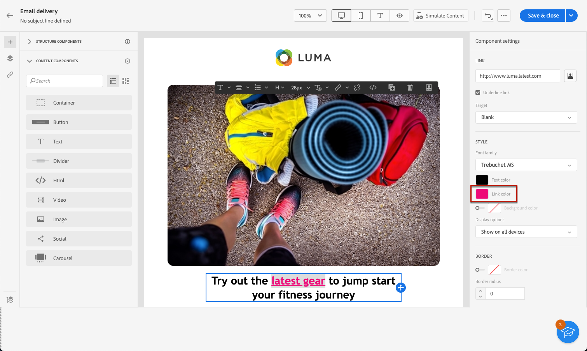

# Definire uno stile per i collegamenti {#styling-links}

In E-mail Designer è possibile sottolineare un collegamento e selezionarne il colore e la destinazione.

1. In un componente **[!UICONTROL Testo]** in cui è stato inserito un collegamento, seleziona il collegamento.

1. Nel menu **[!UICONTROL Impostazioni componenti]**, seleziona **[!UICONTROL Sottolinea collegamento]** per sottolinearne il testo.

   

1. Per scegliere in che modo il pubblico verrà reindirizzato, usa il menu a discesa **[!UICONTROL Destinazione]**:

   * **[!UICONTROL Nessuno]**: il collegamento viene aperto nello stesso frame in cui è stato fatto clic (impostazione predefinita).
   * **[!UICONTROL Vuoto]**: il collegamento viene aperto in una nuova finestra o scheda.
   * **[!UICONTROL Stesso]**: il collegamento viene aperto nello stesso frame in cui è stato fatto clic.
   * **[!UICONTROL Principale]**: il collegamento viene aperto nel frame principale.
   * **[!UICONTROL Superiore]**: il collegamento viene aperto nel corpo completo della finestra.

   

1. Per cambiare il colore del collegamento, fai clic su **[!UICONTROL Colore collegamento]** nel riquadro di destra.

   

1. Salva le modifiche.
