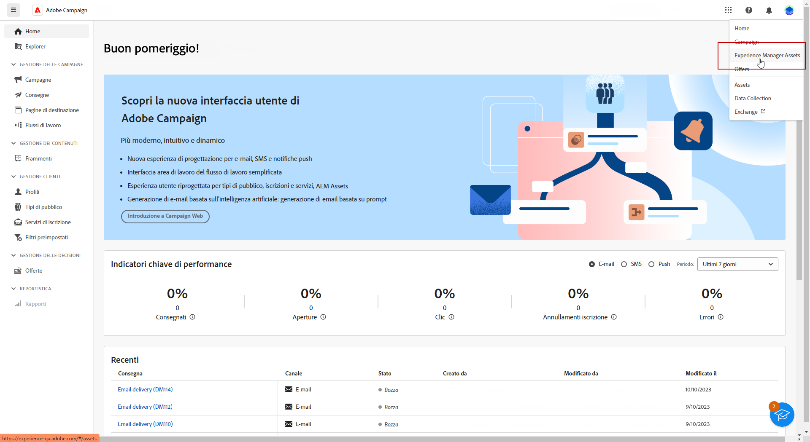
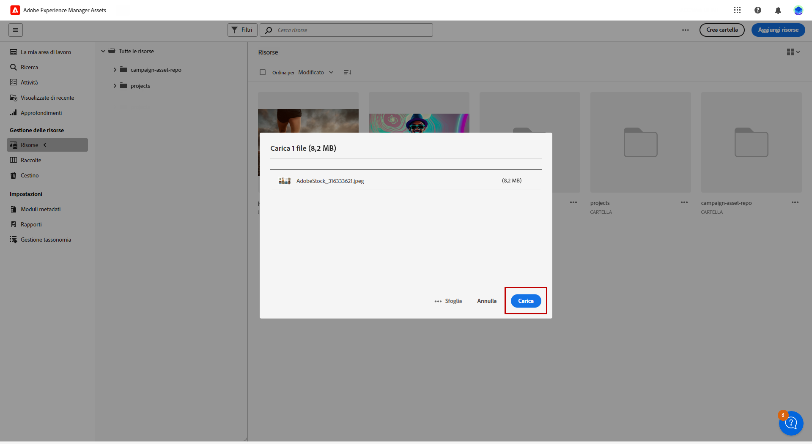
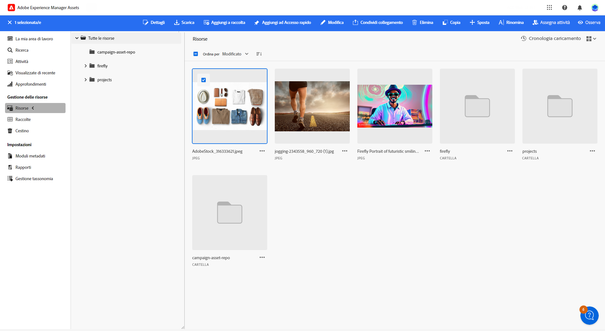
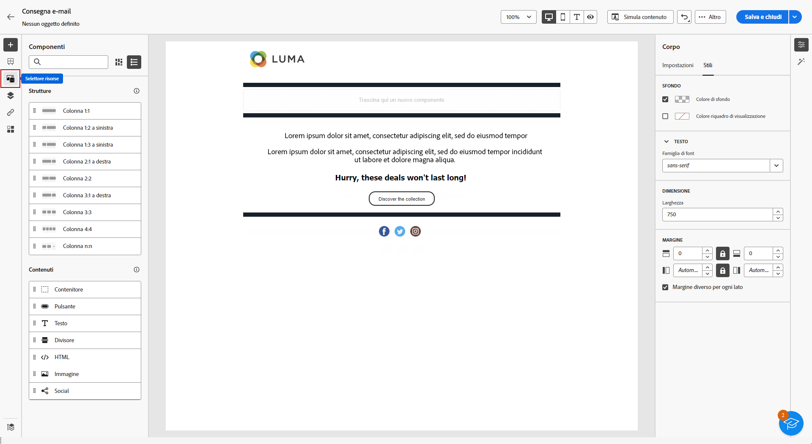
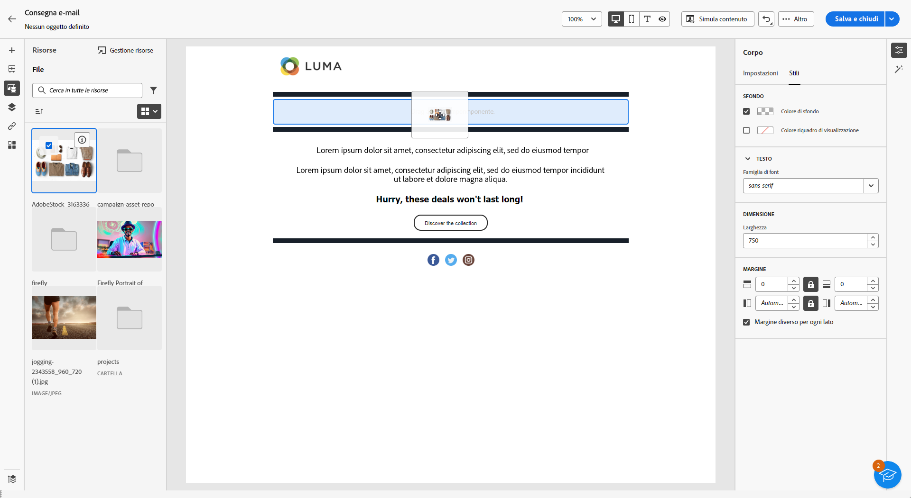
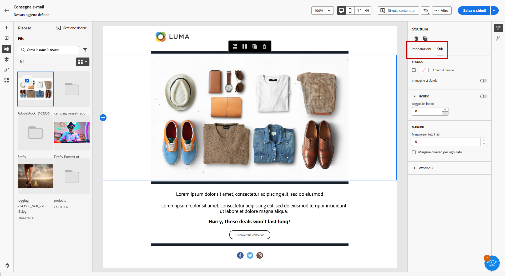

# Gestire le risorse con [!DNL Adobe Experience Manager Assets as a Cloud Service]{#aem-assets}

## Introduzione a [!DNL Adobe Experience Manager Assets as a Cloud Service] {#get-started-assets-essentials}

[!DNL Adobe Experience Manager Assets as a Cloud Service] è una piattaforma integrata e collaborativa progettata per semplificare il flusso di lavoro creativo e centralizzare le risorse digitali per una consegna fluida delle esperienze. Semplifica l’organizzazione, l’assegnazione di tag e il recupero delle risorse di produzione approvate, garantendo la coerenza del brand tra i team. Grazie alla sua interfaccia intuitiva, [!DNL Assets as Cloud Service] consente di accedere e condividere immediatamente le risorse all’interno delle applicazioni Adobe Creative ed Experience Cloud.

Ulteriori informazioni sono disponibili nella [documentazione di Adobe Experience Manager Assets as a Cloud Service](https://experienceleague.adobe.com/docs/experience-manager-cloud-service/content/assets/home.html?lang=it){target="_blank"}.

## Caricare e inserire le risorse{#add-asset}

Per importare file in [!DNL Assets as Cloud Service], è innanzitutto necessario sfogliare o creare la cartella in cui memorizzarli. Potrai quindi inserirli nel contenuto dell’e-mail.

Per ulteriori informazioni su come caricare le risorse, consulta la [documentazione di Adobe Experience Manager Assets as a Cloud Service](https://experienceleague.adobe.com/docs/experience-manager-cloud-service/content/assets/assets-view/add-delete-assets-view.html?lang=it){target="_blank"}.

1. Dalla pagina Home, accedi al menu avanzato e seleziona [!DNL Experience Manager Assets].

   

1. In **Gestione risorse**, fai clic su **Risorse** e scegli l’archivio delle risorse in Adobe Campaign.

1. Fai clic su una cartella dalla sezione centrale o dalla vista ad albero per aprirla.

   Puoi anche fare clic su **[!UICONTROL Crea cartella]** per crearne una nuova.

1. Una volta nella cartella selezionata o creata, fai clic su **[!UICONTROL Aggiungi risorse]** per caricare una nuova risorsa nella cartella.

   

1. Da **[!UICONTROL Carica file]**, fai clic su **[!UICONTROL Sfoglia]** e scegli **[!UICONTROL Sfoglia file]** o **[!UICONTROL Sfoglia cartelle]** a seconda delle esigenze.

1. Seleziona il file da caricare. Al termine, fai clic su **[!UICONTROL Carica]**.

   

1. Per accedere al menu Gestione risorse avanzato, seleziona la risorsa appena caricata.

   Per ulteriori informazioni su come gestire le risorse, consulta questa [pagina](https://experienceleague.adobe.com/docs/experience-manager-cloud-service/content/assets/assets-view/manage-organize-assets-view.html?lang=it).

   

1. Per modificare ulteriormente le risorse con Adobe Photoshop Express, fai doppio clic sulle risorse. Quindi, dal menu a destra, seleziona l’icona corrispondente alla **[!UICONTROL Modalità di modifica]**. [Ulteriori informazioni](https://experienceleague.adobe.com/docs/experience-manager-cloud-service/content/assets/assets-view/edit-images-assets-view.html?lang=it#edit-using-express){target="_blank"}.

1. Da [!DNL Adobe Campaign], seleziona il menu **[!UICONTROL Selettore risorse]** nel riquadro a sinistra dell’E-mail designer.

   

1. Seleziona la cartella **[!UICONTROL Risorse]** creata in precedenza. Puoi anche cercare la risorsa o la cartella nella barra di ricerca.

   Se necessario, fai clic su **[!UICONTROL Gestione risorse]** per accedere direttamente all’area di lavoro di [!DNL Adobe Experience Manager Assets].

1. Trascina la risorsa nel contenuto dell’e-mail.

   

1. Puoi personalizzare ulteriormente le risorse, ad esempio aggiungendo un collegamento esterno o un testo, utilizzando le schede **[!UICONTROL Impostazioni]** e **[!UICONTROL Stili]**. [Ulteriori informazioni sulle impostazioni dei componenti](../email/content-components.md)

   
