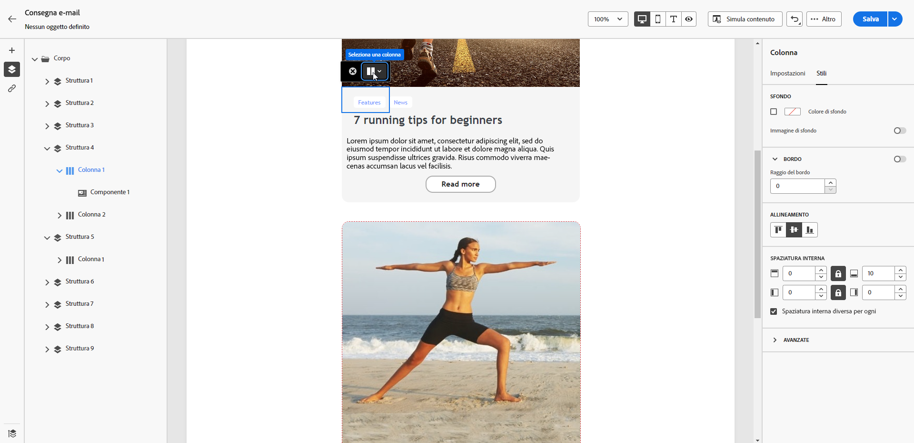
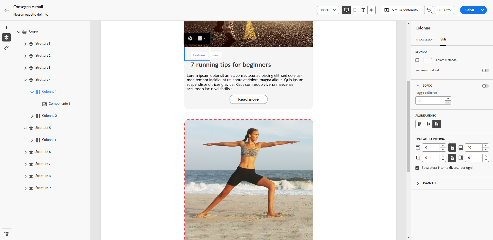
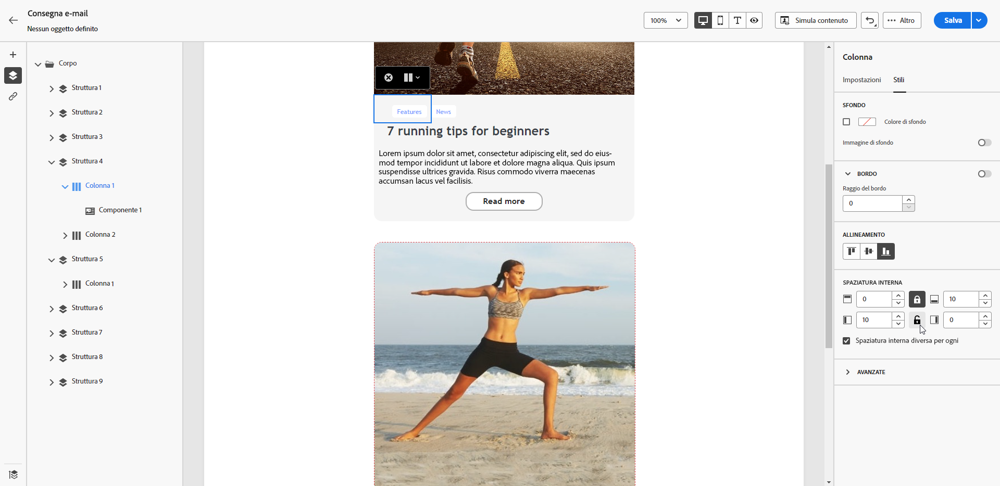

# Regolare l’allineamento verticale e la spaziatura {#alignment-and-padding}

In questo esempio, regoliamo la spaziatura e l’allineamento verticale all’interno di un componente struttura composto da tre colonne.

1. Seleziona il componente struttura direttamente nel messaggio e-mail o utilizza la **[!UICONTROL struttura di navigazione]** disponibile nel riquadro a sinistra.

   {zoomable="yes"}

1. Dalla barra degli strumenti contestuale, fai clic su **[!UICONTROL Seleziona una colonna]** e scegli quella da modificare. Puoi anche selezionarla dalla struttura ad albero a sinistra.

   {zoomable="yes"}

1. I parametri modificabili per tale colonna vengono visualizzati nella scheda **[!UICONTROL Stili]**. Regola l’**[!UICONTROL allineamento]** utilizzando la sezione dedicata.

   {zoomable="yes"}

   Ad esempio, seleziona **[!UICONTROL In basso]**. Il componente contenuto viene posizionato nella parte inferiore della colonna.

1. Per **[!UICONTROL Spaziatura]**, definisci la spaziatura in alto all’interno della colonna e imposta la spaziatura sinistra e destra per tale colonna.

   >[!NOTE]
   >
   >Fai clic sull’icona Blocca per interrompere la sincronizzazione tra la spaziatura Allto/Basso o Sinistra/Destra.

   {zoomable="yes"}

1. Procedi in modo simile per regolare l’allineamento e la spaziatura delle altre colonne.

1. Salva le modifiche.
