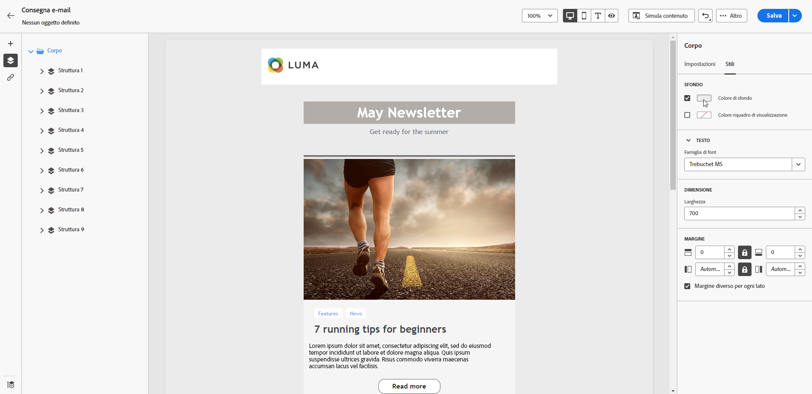
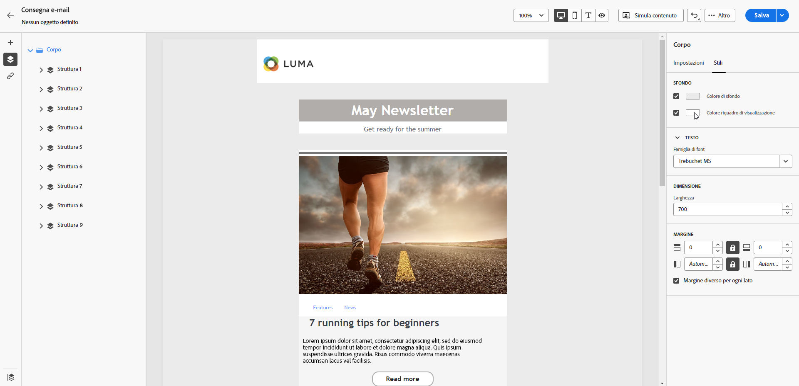
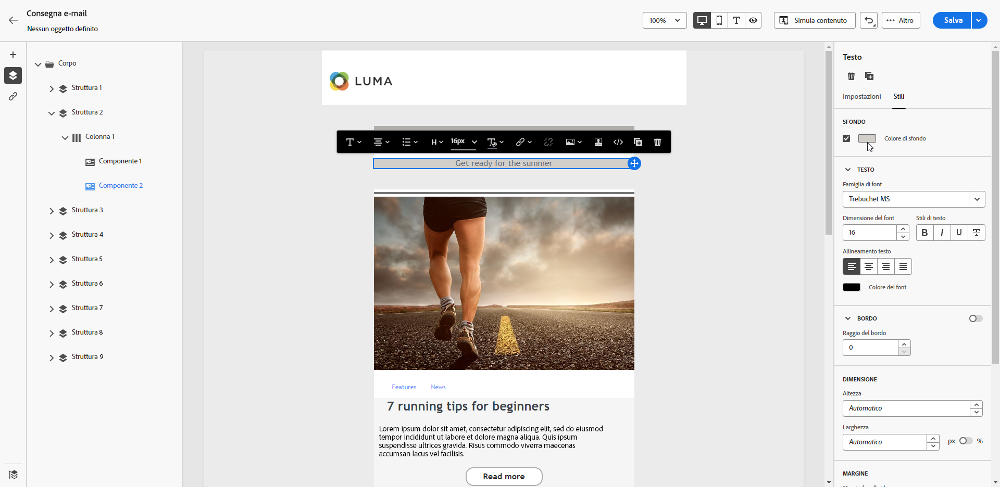
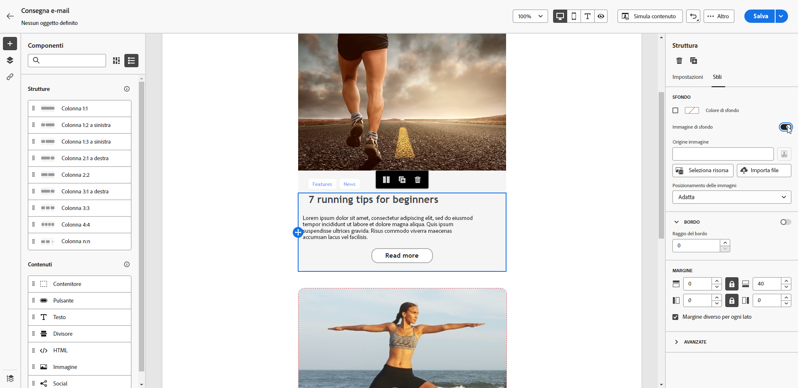
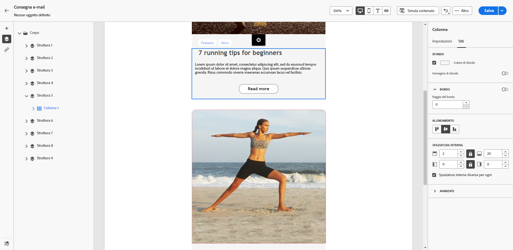

# Personalizzare lo sfondo delle e-mail {#backgrounds}

>[!CONTEXTUALHELP]
>id="ac_edition_backgroundimage"
>title="Impostazioni dello sfondo"
>abstract="Puoi personalizzare il colore o l’immagine di sfondo del tuo contenuto. Ricorda che l’immagine di sfondo non è supportata da tutti i client e-mail."

Per impostare lo sfondo con E-mail Designer, Adobe consiglia quanto segue:

1. Se richiesto dal tuo design, applica un colore di sfondo al corpo dell’e-mail.
1. In genere, conviene impostare i colori di sfondo a livello di colonna.
1. Evita di utilizzare i colori di sfondo su componenti immagine o testo, poiché sono difficili da gestire.

Di seguito sono riportate le impostazioni di sfondo disponibili.

* Imposta un **[!UICONTROL Colore di sfondo]** per l’intera e-mail. Assicurati di selezionare le impostazioni del corpo nella struttura di navigazione accessibile dal riquadro a sinistra.

  {zoomable="yes"}

* Per impostare lo stesso colore di sfondo per tutti i componenti della struttura, seleziona **[!UICONTROL Colore di sfondo del riquadro di visualizzazione]**. Questa opzione consente di selezionare un’impostazione diversa dal colore di sfondo.

  {zoomable="yes"}

* Imposta un colore di sfondo diverso per ciascun componente della struttura. Per applicare un colore di sfondo specifico a una sola struttura, selezionala nell’albero di navigazione nel riquadro a sinistra .

  {zoomable="yes"}

  >[!NOTE]
  >
  >Assicurati di non impostare un colore di sfondo del riquadro di visualizzazione, in quanto questo potrebbe nascondere i colori di sfondo della struttura.

* Imposta un’**[!UICONTROL Immagine di sfondo]** per il contenuto di un componente struttura.

  {zoomable="yes"}

  >[!NOTE]
  >
  >Alcuni programmi e-mail non supportano le immagini di sfondo. In questo caso, viene utilizzato il colore di sfondo della riga. Assicurati di selezionare un colore di sfondo di fallback appropriato nel caso in cui l’immagine non possa essere visualizzata.

* Imposta un colore di sfondo a livello di colonna.

  {zoomable="yes"}

  >[!NOTE]
  >
  >Questo è il caso d’uso più comune. Adobe consiglia di impostare i colori di sfondo a livello di colonna, in quanto ciò consente una maggiore flessibilità nella modifica dell’intero contenuto dell’e-mail.

  Puoi anche impostare un’immagine di sfondo a livello di colonna, ma questa viene utilizzata raramente.
