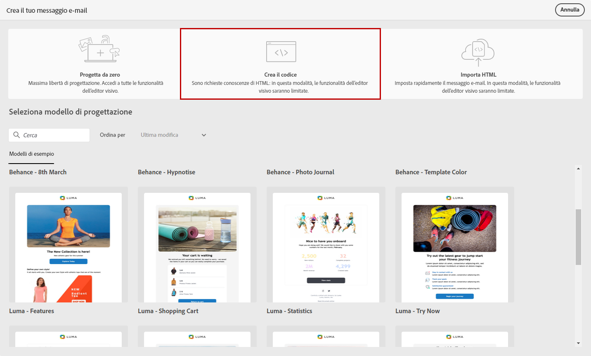
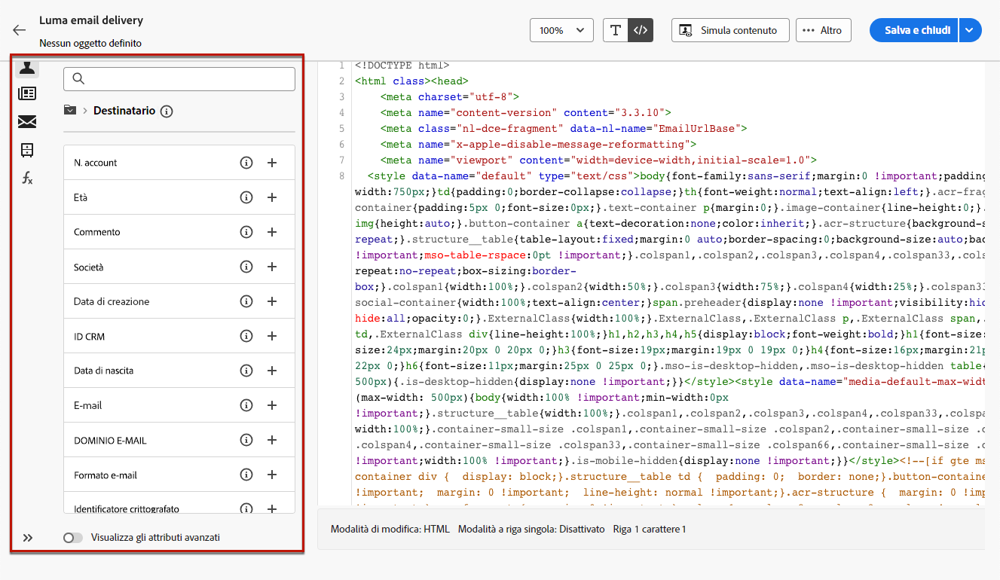

# Creare il codice del contenuto e-mail {#code-content}

Utilizza la modalità **[!UICONTROL Crea il codice]** per importare HTML non elaborati e codificare il contenuto delle e-mail.

>[!CAUTION]
>
>Questo metodo richiede la conoscenza di HTML.

1. Nella pagina home di [E-mail designer](get-started-email-designer.md), seleziona **[!UICONTROL Crea il codice]**.

   {zoomable="yes"}

1. Inserisci o incolla il codice HTML non elaborato nell’area di lavoro principale.

1. Utilizza il riquadro a sinistra per accedere alle funzioni di personalizzazione. [Ulteriori informazioni](../personalization/gs-personalization.md)

   {zoomable="yes"}

1. Fai clic sul pulsante **[!UICONTROL Simula contenuto]** per visualizzare in anteprima la progettazione e la personalizzazione dei messaggi tramite i profili di test. [Ulteriori informazioni](../preview-test/preview-test.md)

1. Una volta completato il codice, fai clic su **[!UICONTROL Salva e chiudi]** per tornare alla schermata di creazione del messaggio e finalizzare il messaggio.