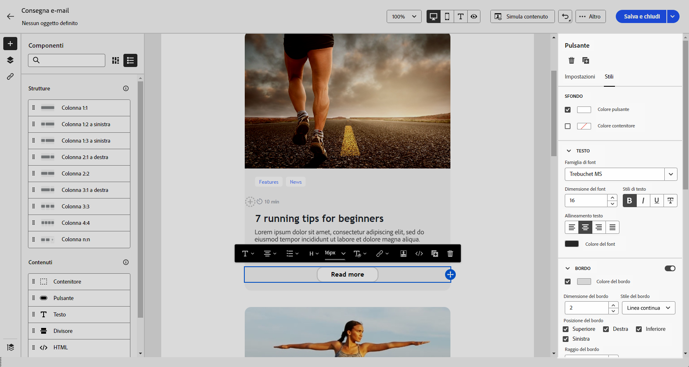

# Utilizzare i componenti per contenuti {#content-components}

>[!CONTEXTUALHELP]
>id="ac_content_components_email"
>title="Informazioni sul contenuto"
>abstract="I componenti per contenuti sono dei segnaposto di contenuto vuoti che possono essere utilizzati per creare il layout di un’e-mail."

>[!CONTEXTUALHELP]
>id="ac_content_components_landing_page"
>title="Informazioni sul contenuto"
>abstract="I componenti per contenuti sono dei segnaposto di contenuto vuoti che possono essere utilizzati per creare il layout di una pagina di destinazione."

>[!CONTEXTUALHELP]
>id="ac_content_components_fragment"
>title="Informazioni sul contenuto"
>abstract="I componenti per contenuti sono dei segnaposto di contenuto vuoti da utilizzare per creare il layout di un frammento di contenuto."

>[!CONTEXTUALHELP]
>id="ac_content_components_template"
>title="Informazioni sul contenuto"
>abstract="I componenti per contenuti sono dei segnaposto di contenuto vuoti che possono essere utilizzati per creare il layout di un modello."

Durante la creazione del contenuto dell&#39;e-mail, i componenti **[!UICONTROL Contenuto]** ti consentono di personalizzare l&#39;e-mail con componenti vuoti e non elaborati che puoi utilizzare una volta inseriti in un messaggio e-mail.

Puoi aggiungere tutti i **[!UICONTROL contenuti]** necessari all&#39;interno di una **[!UICONTROL struttura]**, che definisce il layout dell&#39;e-mail.

## Aggiungere componenti per contenuti {#add-content-components}

Per aggiungere componenti per contenuti all’e-mail e modificarli in base alle tue esigenze, segui i passaggi indicati di seguito:

1. In E-mail designer, utilizza un [contenuto esistente](existing-content.md) oppure trascina una **[!UICONTROL Struttura]** nel contenuto vuoto per definire il layout dell’e-mail. [Scopri come](create-email-content.md)

1. Trascina il **[!UICONTROL Contenuto]** desiderato all’interno delle strutture pertinenti.

   {zoomable="yes"}

   >[!NOTE]
   >
   >È possibile aggiungere più componenti in una singola struttura e in ogni colonna di una struttura.

1. Regola le opzioni per ciascun componente utilizzando la scheda **[!UICONTROL Impostazioni]**. Ad esempio, scegli di visualizzarlo solo su dispositivi desktop o mobili, oppure su entrambi. Da questa scheda puoi anche gestire le opzioni di collegamento. [Ulteriori informazioni sulla gestione dei collegamenti](message-tracking.md)

1. Regola gli attributi di stile per ciascun componente utilizzando la scheda **[!UICONTROL Stile]**. Ad esempio, modifica lo stile del testo, la spaziatura interna o il margine di ciascun componente. [Ulteriori informazioni su allineamento e spaziatura](alignment-and-padding.md)

   {zoomable="yes"}

1. Dal menu avanzato di **[!UICONTROL Content]** nel riquadro di destra, eliminare o duplicare qualsiasi componente di contenuto in base alle esigenze.

## Contenitore {#container}

Puoi aggiungere un contenitore semplice all’interno del quale aggiungere un altro componente di contenuto. Questo consente di applicare uno stile specifico al contenitore, che è diverso dal componente utilizzato al suo interno.

Ad esempio, aggiungi un componente **[!UICONTROL Contenitore]** e quindi un componente [Pulsante](#button) all’interno del contenitore. Utilizza uno sfondo specifico per il contenitore e un altro per il pulsante.

{zoomable="yes"}

## Pulsante {#buttons}

Utilizza il componente **[!UICONTROL Pulsante]** per inserire uno o più pulsanti nell’e-mail e reindirizzare il pubblico dell’e-mail a un’altra pagina.

1. Dall’elenco **[!UICONTROL Contenuti]**, trascina il componente **[!UICONTROL Pulsante]** in un componente **[!UICONTROL Struttura]**.

   {zoomable="yes"}

1. Fai clic sul pulsante appena aggiunto per personalizzare il testo e accedere alle schede **[!UICONTROL Impostazioni]** e **[!UICONTROL Stili]**.

   {zoomable="yes"}

1. Nella scheda **[!UICONTROL Impostazioni]**, nel campo **[!UICONTROL URL]**, aggiungi l&#39;URL a cui reindirizzare quando fai clic sul pulsante.

1. Scegliere la modalità di visualizzazione del contenuto utilizzando l&#39;elenco a discesa **[!UICONTROL Target]**:

   * **[!UICONTROL Nessuno]**: il collegamento viene aperto nello stesso frame in cui è stato fatto clic (impostazione predefinita).
   * **[!UICONTROL Vuoto]**: il collegamento viene aperto in una nuova finestra o scheda.
   * **[!UICONTROL Stesso]**: il collegamento viene aperto nello stesso frame in cui è stato fatto clic.
   * **[!UICONTROL Principale]**: il collegamento viene aperto nel frame principale.
   * **[!UICONTROL Superiore]**: il collegamento viene aperto nel corpo completo della finestra.

   {zoomable="yes"}

1. Personalizza ulteriormente il pulsante modificando gli attributi di stile come **[!UICONTROL Bordo]**, **[!UICONTROL Dimensione]**, **[!UICONTROL Margine]** e altri dalla scheda **[!UICONTROL Stili]**.

## Testo {#text}

Utilizza il componente **[!UICONTROL Testo]** per inserire testo nell&#39;e-mail e modificare lo stile (bordo, dimensione, spaziatura interna, ecc.) utilizzando le schede **[!UICONTROL Impostazioni]** e **[!UICONTROL Stili]**.

1. Dal menu **[!UICONTROL Contenuti]**, trascina **[!UICONTROL Testo]** in un componente **[!UICONTROL Struttura]**.

   {zoomable="yes"}

1. Fai clic sul componente appena aggiunto per personalizzare il testo e accedere alle schede **[!UICONTROL Impostazioni]** e **[!UICONTROL Stili]**.

1. Modifica il testo con le seguenti opzioni disponibili nella barra degli strumenti contestuale:

   {zoomable="yes"}

   * **[!UICONTROL Modifica stile testo]**: applica il grassetto, il corsivo, la sottolineatura o il barrato al testo.
   * **Cambia allineamento**: scegli l&#39;allineamento a sinistra, a destra, al centro o giustificato per il testo.
   * **[!UICONTROL Crea elenco]**: aggiungi elenchi puntati o numerati al testo.
   * **[!UICONTROL Imposta il titolo]**: aggiungi al testo fino a sei livelli di titolo.
   * **Dimensione font**: seleziona la dimensione del font in pixel.
   * **[!UICONTROL Modifica immagine]**: aggiungi un’immagine o una risorsa al componente testo.
   * **[!UICONTROL Mostra il codice sorgente]**: visualizza il codice sorgente del testo. Non può essere modificato.
   * **[!UICONTROL Duplica]**: aggiungi una copia del componente di testo.
   * **[!UICONTROL Elimina]**: elimina dal messaggio e-mail il componente di testo selezionato.
   * **[!UICONTROL Aggiungi personalizzazione]**: aggiungi campi di personalizzazione per personalizzare il contenuto in base ai dati dei profili.
   * **[!UICONTROL Abilita contenuto condizionale]**: aggiungi contenuto condizionale per adattare il contenuto del componente ai profili target.

1. Regola altri attributi di stile come il colore del testo, la famiglia di caratteri, il bordo, la spaziatura interna, il margine e altri dalla scheda **[!UICONTROL Stili]**.

   {zoomable="yes"}

## Divisore {#divider}

Utilizza il componente **[!UICONTROL Divisore]** per inserire una linea di divisione utile per organizzare il layout e il contenuto dell’e-mail.

Dalla scheda **[!UICONTROL Stili]** è possibile regolare gli attributi di stile, ad esempio il colore della linea, lo stile e l&#39;altezza.

{zoomable="yes"}

## HTML {#HTML}

Utilizza il componente **[!UICONTROL HTML]** per copiare e incollare parti del HTML esistente. Questo consente di creare componenti HTML modulari gratuiti per riutilizzare contenuti esterni.

1. Da **[!UICONTROL Componenti]**, trascina e rilascia il componente **[!UICONTROL HTML]** in un componente **[!UICONTROL struttura]**.

   {zoomable="yes"}

1. Fai clic sul componente appena aggiunto, quindi seleziona **[!UICONTROL Mostra il codice sorgente]** dalla barra degli strumenti contestuale per aggiungere il codice HTML.

   {zoomable="yes"}

>[!NOTE]
>
>Per rendere il contenuto esterno conforme a E-mail Designer, Adobe consiglia di [creare un messaggio da zero](create-email-content.md) e copiare il contenuto dall&#39;e-mail esistente nei componenti.

## Immagine {#image}

>[!IMPORTANT]
>
>L’accesso al menu di Assets è limitato agli utenti con una licenza Adobe Experience Manager as a Cloud Service attiva. Se non si dispone di questa licenza, il menu Assets non sarà disponibile.

Utilizza il componente **[!UICONTROL Immagine]** per inserire un file immagine dal computer nell&#39;e-mail.

1. Dal menu **[!UICONTROL Contenuto]** trascinare **[!UICONTROL Immagine]** in un componente **[!UICONTROL Struttura]**.

   {zoomable="yes"}

1. Fai clic su **[!UICONTROL Sfoglia]** per scegliere un file di immagine dalle risorse. Puoi anche scegliere di **[!UICONTROL Importare i contenuti multimediali]**.

   Per ulteriori informazioni sul caricamento e l&#39;aggiunta di risorse in Adobe Experience Manager, consulta la [documentazione di Adobe Experience Manager as a Cloud Service](https://experienceleague.adobe.com/docs/experience-manager-cloud-service/content/assets/manage/add-assets.html?lang=it).

   {zoomable="yes"}

1. Spostati all’interno delle cartelle per individuare la risorsa specifica necessaria oppure utilizza la barra di ricerca per trovarla in modo efficiente.

   Una volta trovata la risorsa che stai cercando, fai clic su **[!UICONTROL Seleziona]**.

   {zoomable="yes"}

1. Fai clic sul componente appena aggiunto e imposta le proprietà dell’immagine utilizzando la scheda **[!UICONTROL Impostazioni]**:

   * **[!UICONTROL Titolo immagine]** consente di definire un titolo per l&#39;immagine.
   * **[!UICONTROL Testo Alt]** consente di definire la didascalia collegata all’immagine. Questo corrisponde all’attributo HTML “alt”.

   {zoomable="yes"}

1. Aggiungi un collegamento per reindirizzare il pubblico a un altro contenuto. [Ulteriori informazioni](message-tracking.md)

1. Regola altri attributi di stile come margine, bordo e altri utilizzando la scheda **[!UICONTROL Stili]**.

## Social {#social}

Utilizza il componente **[!UICONTROL Social]** per inserire nel contenuto dell’e-mail dei collegamenti a pagine social media.

1. Dal menu **[!UICONTROL Componenti]**, trascina il componente **[!UICONTROL Social]** in un componente **[!UICONTROL Struttura]**.

1. Fai clic sul componente appena aggiunto.

1. Nel campo **[!UICONTROL Social]** della scheda **[!UICONTROL Impostazioni]**, scegli i social media da aggiungere o rimuovere.

   {zoomable="yes"}

1. Scegli la dimensione delle icone nel campo **[!UICONTROL Dimensioni delle immagini]**.

1. Fai clic su ciascuna delle icone di social media per configurare l’**[!UICONTROL URL]** a cui il pubblico viene reindirizzato.

   {zoomable="yes"}

1. Se necessario, modifica le icone di ogni social media nel campo **[!UICONTROL Source]**.

1. Regola altri attributi di stile come stile, margine, bordo e altri dalla scheda **[!UICONTROL Stili]**.