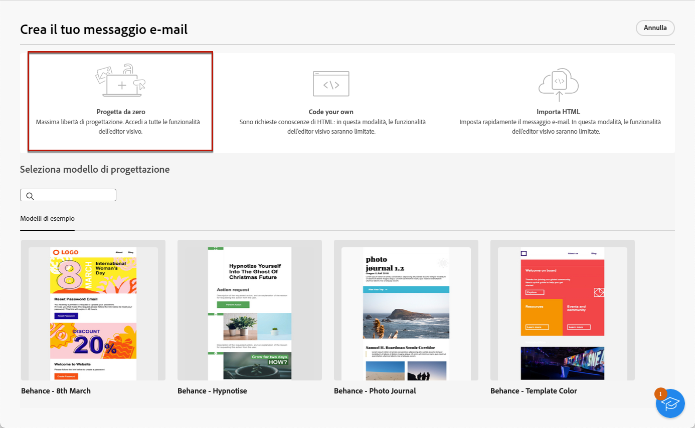
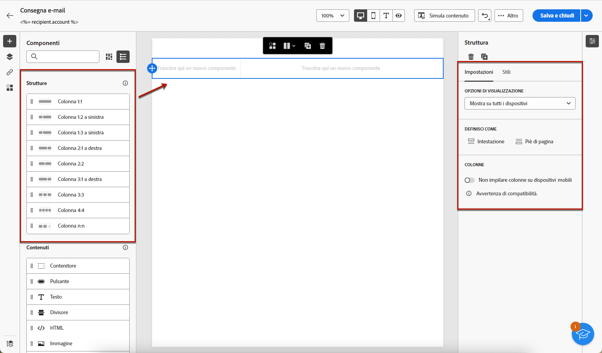
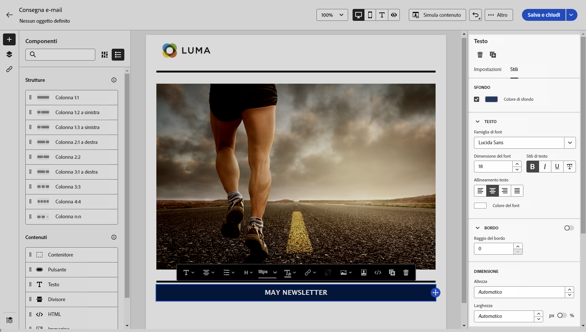
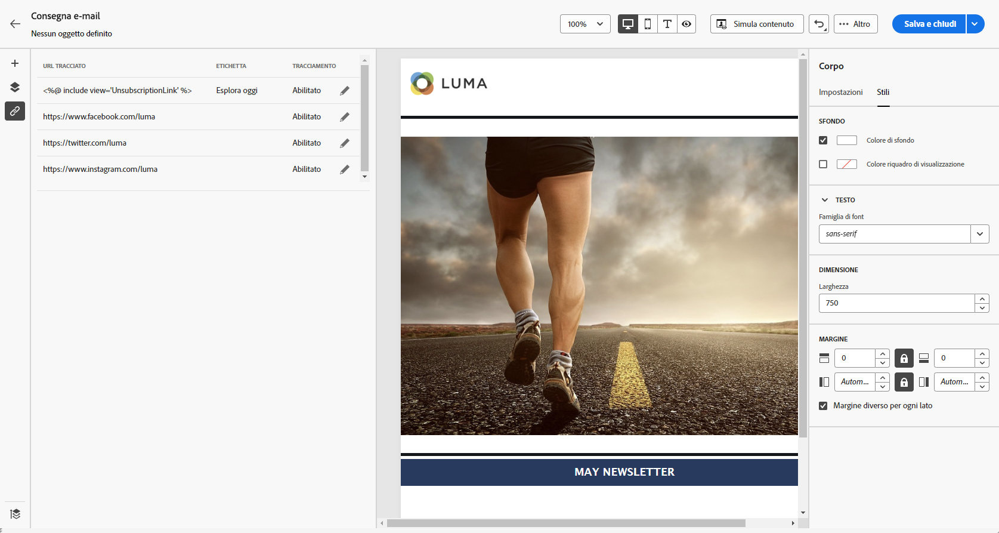
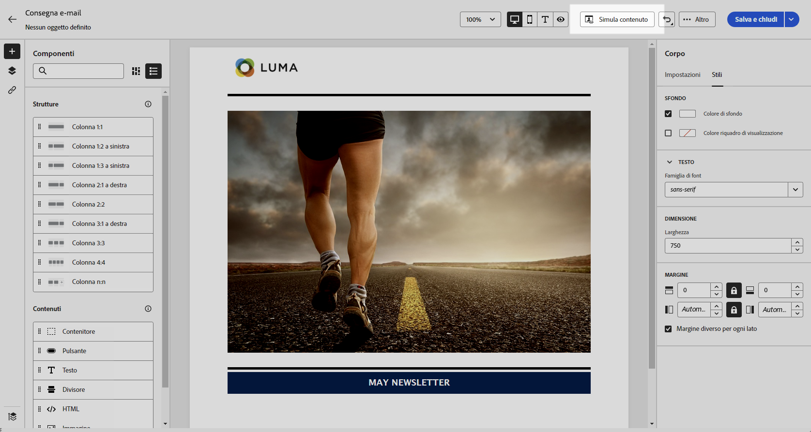

# Creare il contenuto dell’e-mail da zero {#create-email-content}

>[!CONTEXTUALHELP]
>id="ac_structure_components_email"
>title="Aggiungere strutture"
>abstract="Le strutture definiscono il layout del messaggio e-mail. Per iniziare a progettare il contenuto delle e-mail, trascina un componente **Struttura** nell’area di lavoro."

>[!CONTEXTUALHELP]
>id="ac_structure_components_landing_page"
>title="Aggiungere strutture"
>abstract="Le strutture definiscono il layout della pagina di destinazione. Per iniziare a progettare la pagina di destinazione, trascina un componente **Struttura** nell’area di lavoro."

>[!CONTEXTUALHELP]
>id="ac_structure_components_fragment"
>title="Aggiungere strutture"
>abstract="Le strutture definiscono il layout del frammento di contenuto. Per iniziare a progettare il frammento di contenuto, trascina un componente **Struttura** nell’area di lavoro."

>[!CONTEXTUALHELP]
>id="ac_structure_components_template"
>title="Aggiungere strutture"
>abstract="Le strutture definiscono il layout del modello. Per iniziare a progettare il modello di contenuto, trascina un componente **Struttura** nell’area di lavoro."

>[!CONTEXTUALHELP]
>id="ac_edition_columns_email"
>title="Definizione delle colonne nell’e-mail"
>abstract="E-mail Designer consente di definire facilmente il layout dell’e-mail definendone la struttura a colonne."

>[!CONTEXTUALHELP]
>id="ac_edition_columns_landing_page"
>title="Definizione delle colonne nella pagina di destinazione"
>abstract="E-mail Designer consente di definire facilmente il layout della pagina di destinazione definendone la struttura a colonne."

>[!CONTEXTUALHELP]
>id="ac_edition_columns_fragment"
>title="Definizione delle colonne di un frammento di contenuto"
>abstract="E-mail Designer consente di definire facilmente il layout del frammento di contenuto definendo la struttura a colonne."

>[!CONTEXTUALHELP]
>id="ac_edition_columns_template"
>title="Definizione delle colonne nei modelli"
>abstract="E-mail Designer consente di definire facilmente il layout del modello definendone la struttura a colonne."

E-mail Designer consente di definire facilmente la struttura delle e-mail. Aggiungendo e spostando elementi strutturali con semplici azioni di trascinamento della selezione, puoi progettare il corpo dell’e-mail in pochi secondi.

➡️ [Guarda il video su questa funzione](#video)

Per iniziare a creare il contenuto delle e-mail, segui i passaggi indicati di seguito.

1. Dalla pagina Home di [E-mail Designer](get-started-email-designer.md#start-authoring), seleziona l’opzione **[!UICONTROL Progetta da zero]**.

   {zoomable="yes"}

1. Inizia a progettare il contenuto delle e-mail trascinando **[!UICONTROL Strutture]** nell&#39;area di lavoro per definire il layout dell&#39;e-mail.

   >[!NOTE]
   >
   >L’utilizzo di colonne sovrapposte non è compatibile con tutti i programmi e-mail. Se non è supportato, le colonne non vengono sovrapposte.

1. Aggiungi tutte le **[!UICONTROL strutture]** necessarie e modificane le impostazioni nel riquadro dedicato a destra.

   {zoomable="yes"}

1. Seleziona il componente **[!UICONTROL Colonna n:n]** per definire il numero di colonne desiderato (tra 3 e 10). Definite la larghezza di ciascuna colonna spostando le frecce nella parte inferiore di ciascuna colonna.

   >[!NOTE]
   >
   >Le dimensioni di ogni colonna non possono essere inferiori al 10% della larghezza totale del componente struttura. Non è possibile rimuovere una colonna non vuota.

1. Dalla sezione **[!UICONTROL Componenti]**, trascina tutti gli elementi necessari in una o più strutture. [Ulteriori informazioni sui componenti contenuto](content-components.md)

1. Personalizza ogni componente utilizzando le schede **[!UICONTROL Impostazioni]** o **[!UICONTROL Stile]** a destra. Ad esempio, modifica lo stile del testo, la spaziatura interna o il margine di ciascun componente. [Ulteriori informazioni su allineamento e spaziatura](alignment-and-padding.md)

   {zoomable="yes"}

1. Inserisci campi di personalizzazione per personalizzare il contenuto delle e-mail in base ai dati del profilo. [Ulteriori informazioni sulla personalizzazione dei contenuti](../personalization/personalize.md)

1. Aggiungi collegamenti al contenuto.

   Fai clic sulla scheda **[!UICONTROL Collegamenti]** nel riquadro a sinistra per visualizzare tutti gli URL del contenuto che saranno tracciati. Modifica il **[!UICONTROL Tipo di tracciamento]** o **[!UICONTROL Etichetta]** e aggiungi **[!UICONTROL Categorie]** se necessario.

[Ulteriori informazioni sui collegamenti e il tracciamento dei messaggi](message-tracking.md)

   {zoomable="yes"}

1. Se necessario, personalizzare ulteriormente l&#39;e-mail facendo clic su **[!UICONTROL Passa all&#39;editor di codice]** dal menu avanzato. Questo consente di modificare il codice sorgente dell’e-mail, ad esempio per aggiungere tag di tracciamento o HTML personalizzati. [Ulteriori informazioni sull’editor di codice](code-content.md)

   >[!CAUTION]
   >
   >Dopo il passaggio all’editor di codice, per l’e-mail corrente non è possibile tornare al designer visivo.

1. Quando il contenuto è pronto, fai clic su **[!UICONTROL Simula contenuto]** per verificare il rendering dell’e-mail. Scegli la vista desktop o mobile. [Ulteriori informazioni sull’anteprima del messaggio e-mail](../preview-test/preview-test.md)

   {zoomable="yes"}

1. Quando l’e-mail è pronta, fai clic su **[!UICONTROL Salva]**.

## Video dimostrativo {#video}

Scopri come navigare in E-mail Designer. Scopri come strutturare e progettare un’e-mail da zero, personalizzarla e testarla.

>[!VIDEO](https://video.tv.adobe.com/v/3425867/?quality=12)