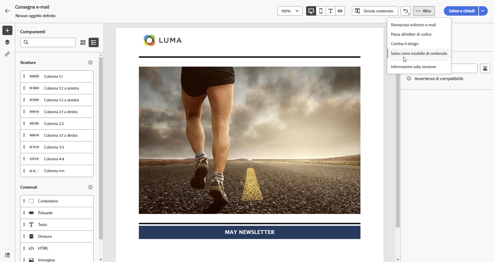
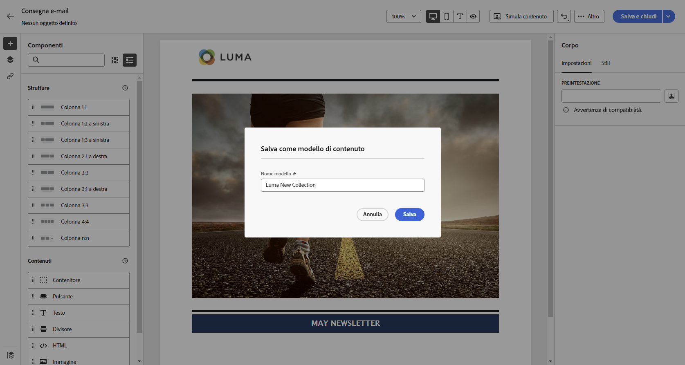
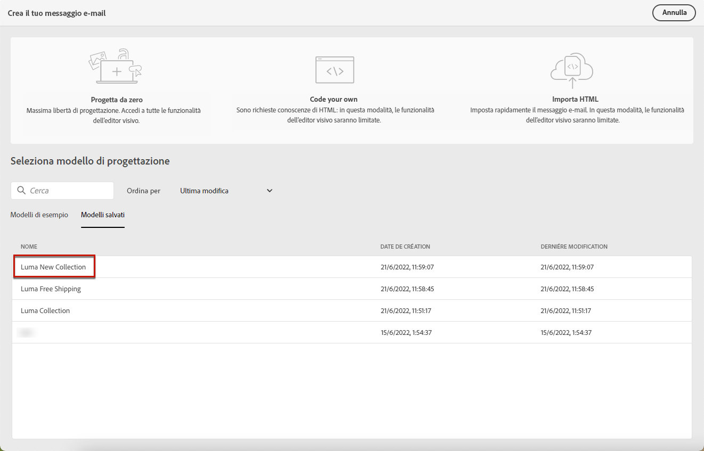

# Utilizzare i modelli di contenuto {#content-templates}

>[!CONTEXTUALHELP]
>id="acw_contenttemplate_menu"
>title="Definisci il tuo contenuto"
>abstract="Crea un modello personalizzato autonomo da zero per rendere il contenuto riutilizzabile in più e-mail."

Per un processo di progettazione accelerato e migliorato, puoi creare modelli autonomi per riutilizzare facilmente i contenuti personalizzati in [!DNL Adobe Campaign].

Questa funzionalità consente agli utenti orientati ai contenuti di lavorare su modelli autonomi in modo che gli utenti di marketing possano riutilizzarli e adattarli all’interno delle proprie campagne e-mail.

>[!NOTE]
>
>Attualmente solo **email** sono supportati i modelli di contenuto.

## Accedere ai modelli e gestirli {#access-manage-templates}

>[!CONTEXTUALHELP]
>id="acw_contenttemplate_edition"
>title="Modificare il contenuto del modello"
>abstract="Fai clic su **Modifica contenuto** per aggiornare il contenuto con E-mail Designer."

Per accedere all&#39;elenco dei modelli di contenuto, selezionare **[!UICONTROL Gestione dei contenuti]** > **[!UICONTROL Modelli di contenuto]** dal menu a sinistra.

Tutti i modelli creati, da un’e-mail che utilizza [Salva come modello](#save-as-template) opzione, dal menu **[!UICONTROL Modelli di contenuto]** menu -.

<!--You can sort content templates by creation or modification date. You can also choose to display only the items that you created or modified.-->

Puoi filtrare in base a una [cartella](../get-started/permissions.md#folders) utilizzando l’elenco a discesa o aggiungere regole utilizzando [query modeler](../query/query-modeler-overview.md).

Per modificare il contenuto di un modello, fai clic sull’elemento desiderato dall’elenco. Puoi eseguire le seguenti azioni:

* Modificarne le proprietà.

* Fai clic su **[!UICONTROL Modifica contenuto]** per aggiornare il contenuto con [E-mail Designer](get-started-email-designer.md).

Per eliminare un modello, selezionare l&#39;opzione corrispondente dalla **[!UICONTROL Altre azioni]** menu.

>[!NOTE]
>
>L’eliminazione di un modello non influisce sulle consegne create utilizzando questo modello.

## Creare modelli di contenuto {#create-content-templates}

>[!CONTEXTUALHELP]
>id="acw_contenttemplate_design"
>title="Progettazione del modello di contenuto"
>abstract="Progettazione del modello di contenuto"

>[!CONTEXTUALHELP]
>id="acw_contenttemplate_selection"
>title="Selezione del modello di contenuto"
>abstract="Selezione del modello di contenuto"

Esistono due modi per creare modelli di contenuto:

* Creare un modello di contenuto da zero utilizzando la barra a sinistra **[!UICONTROL Modelli di contenuto]** menu. [Scopri come](#create-template-from-scratch)

* Durante la progettazione di un’e-mail, salva il contenuto dell’e-mail come modello. [Scopri come](#save-as-template)

Una volta salvato, sia che sia stato creato da zero o da un messaggio e-mail precedente, ora puoi utilizzare questo modello per creare qualsiasi [email](../email/create-email.md) entro [!DNL Adobe Campaign]. [Scopri come](use-email-templates.md)

>[!NOTE]
>
>* Le modifiche apportate ai modelli di contenuto non vengono propagate alle e-mail.
>
>* Allo stesso modo, quando i modelli vengono utilizzati in un messaggio e-mail, eventuali modifiche apportate al contenuto dell’e-mail non influiscono sul modello di contenuto utilizzato in precedenza.

### Crea modello da zero {#create-template-from-scratch}

>[!CONTEXTUALHELP]
>id="acw_contenttemplate_properties"
>title="Definire le proprietà del modello"
>abstract="Quando crei un modello da zero, definisci facilmente le relative proprietà da recuperare quando necessario."

Per creare un modello di contenuto da zero, effettua le seguenti operazioni.

1. Accedere all’elenco dei modelli di contenuto tramite **[!UICONTROL Gestione dei contenuti]** > **[!UICONTROL Modelli di contenuto]** menu a sinistra.

1. Seleziona **[!UICONTROL Crea modello]**.

   

1. Compila i dettagli del modello. È possibile selezionare la cartella in cui memorizzare il modello. Per impostazione predefinita, i modelli di contenuto sono memorizzati in un nodo dedicato della gerarchia di Adobe Campaign: **[!UICONTROL Esplora]** > **[!UICONTROL Risorse]** > **[!UICONTROL Modelli]** > **[!UICONTROL Modelli di contenuto]**. [Scopri come creare cartelle](../get-started/permissions.md#folders)

   

   >[!NOTE]
   >
   >Attualmente solo il **E-mail** channel e **HTML** sono supportati.

1. Clic **[!UICONTROL Crea]** e scegli come progettare il modello tra le diverse opzioni:

   * [Creare un messaggio e-mail da zero](create-email-content.md) tramite l’interfaccia di E-mail Designer.

   * [Codice o copia-incolla raw HTML](code-content.md) direttamente in E-mail Designer.

   * [Importa contenuto HTML esistente](existing-content.md) da un file o da una cartella .zip.

   * Utilizza il contenuto esistente da un elenco di modelli incorporati o personalizzati. I passaggi per utilizzare un modello di contenuto in un messaggio e-mail sono descritti in [questa sezione](use-email-templates.md).

   

1. Il [E-mail Designer](get-started-email-designer.md) visualizzazioni. Modifica il contenuto in base alle esigenze, come faresti per qualsiasi e-mail, in base all’opzione selezionata.

   <!--You can test your content if needed. [Learn how](#test-template)-->

1. Quando il modello è pronto, fai clic su **[!UICONTROL Salva]**.

   Se necessario, fai clic sulla freccia accanto al nome del modello per tornare al **[!UICONTROL Dettagli]** e modificare il modello.

   

Questo modello è ora pronto per essere utilizzato quando crei un messaggio e-mail in [!DNL Adobe Campaign]. [Scopri come](use-email-templates.md)

### Salvare il contenuto di un’e-mail come modello {#save-as-template}

Dopo aver [progettato un’e-mail](create-email-content.md), puoi salvarne il contenuto come modello da riutilizzare in futuro. I modelli salvati sono disponibili per tutti gli utenti dell’ambiente Adobe Campaign.

Per salvare un contenuto e-mail come modello, segui la procedura seguente:

1. Dalla finestra di progettazione e-mail, fai clic su **[!UICONTROL Altro]** in alto a destra.

1. Seleziona **[!UICONTROL Salva come modello di contenuto]** dal menu a discesa.

   

1. Immetti un nome per il modello e salvalo.

   

Ora puoi utilizzare questo modello per creare un nuovo contenuto: è disponibile nella sezione **[!UICONTROL Modelli salvati]** della finestra di E-mail Designer. [Scopri come](use-email-templates.md)

Il modello viene salvato in **[!UICONTROL Modelli di contenuto]** , accessibile dalla [!DNL Adobe Campaign] menu dedicato. Diventa un modello di contenuto autonomo accessibile, modificato ed eliminato come qualsiasi altro elemento dell’elenco. [Ulteriori informazioni](#access-manage-templates)

>[!NOTE]
>
>Eventuali modifiche a tale nuovo modello non vengono propagate all’e-mail da cui provengono. Allo stesso modo, quando il contenuto originale viene modificato all’interno dell’e-mail, il nuovo modello non viene modificato.

<!--
Test your content template {#test-template}

You can test the rendering of any email content template, whether created from scratch or from an email. To do so, follow the steps below.

1. Access the content template list through the **[!UICONTROL Content Management]** > **[!UICONTROL Content Templates]** menu and select any template.

1. Click **[!UICONTROL Edit content]** from the **[!UICONTROL Template properties]**.

1. Click **[!UICONTROL Simulate Content]** and select a test profile to check your email rendering. You can choose the desktop or mobile view. [Learn more](../content-management/preview-test.md)

    

1. You can send a proof to test your content and have it approved by some internal users before using it in a journey or a campaign.

    * To do so, click the **[!UICONTROL Send proof]** button and follow the steps described in [this section](../content-management/proofs.md).
    
    * Before sending the proof, you must select the [email surface](../configuration/channel-surfaces.md) that will be used to test your content.

        

>[!CAUTION]
>
>Currently tracking is not supported when testing email content templates, meaning that tracking events, UTM parameters and landing page links will not be effective in the proofs that are being sent from a template. To test tracking, [use the content template](
use-email-templates.md) in an email and [send a proof](../content-management/preview-test.md#send-proofs).-->

