# Inviare la prima e-mail {#first-email}

Scopri come creare la tua prima e-mail con targeting. In questo caso d’uso, viene pianificato l’invio di un’e-mail ai membri fidelizzati Silver e Gold in una data specifica.

In base a un modello di progettazione predefinito, l’e-mail presenta anche contenuti personalizzati in base agli attributi del profilo del cliente.

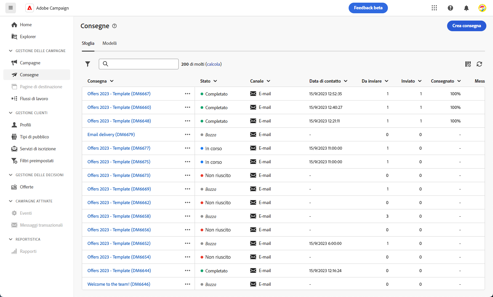

## Creare l’e-mail {#create-email}

>[!CONTEXTUALHELP]
>id="acw_deliveries_email_template_selection"
>title="Selezionare un modello di e-mail"
>abstract="Un modello e-mail è una configurazione di consegna specifica che contiene impostazioni predefinite, ad esempio regole di tipologia e parametri di personalizzazione o di indirizzamento. I modelli sono definiti nella console client di Campaign."

>[!CONTEXTUALHELP]
>id="acw_deliveries_email_properties"
>title="Proprietà e-mail"
>abstract="Le proprietà sono i parametri di consegna comuni che consentono di denominare e classificare la consegna. Se la consegna è basata su uno schema esteso definito nella console Adobe Campaign v8, sono disponibili alcuni campi specifici di **Opzioni personalizzate**."

1. Per creare una nuova consegna, passa a **[!UICONTROL Consegne]** nella barra a sinistra, quindi fai clic sul pulsante **[!UICONTROL Crea una consegna]**.

1. Seleziona **[!UICONTROL E-mail]** come canale e scegli un modello.

   >[!NOTE]
   >
   >I modelli sono impostazioni di consegna preconfigurate e salvate per poter essere riutilizzate. Possono essere creati dagli utenti amministratori nella console Adobe Campaign. [Scopri come utilizzare i modelli di consegna](https://experienceleague.adobe.com/docs/campaign/campaign-v8/campaigns/send/create-templates.html?lang=it){target="_blank"}.

   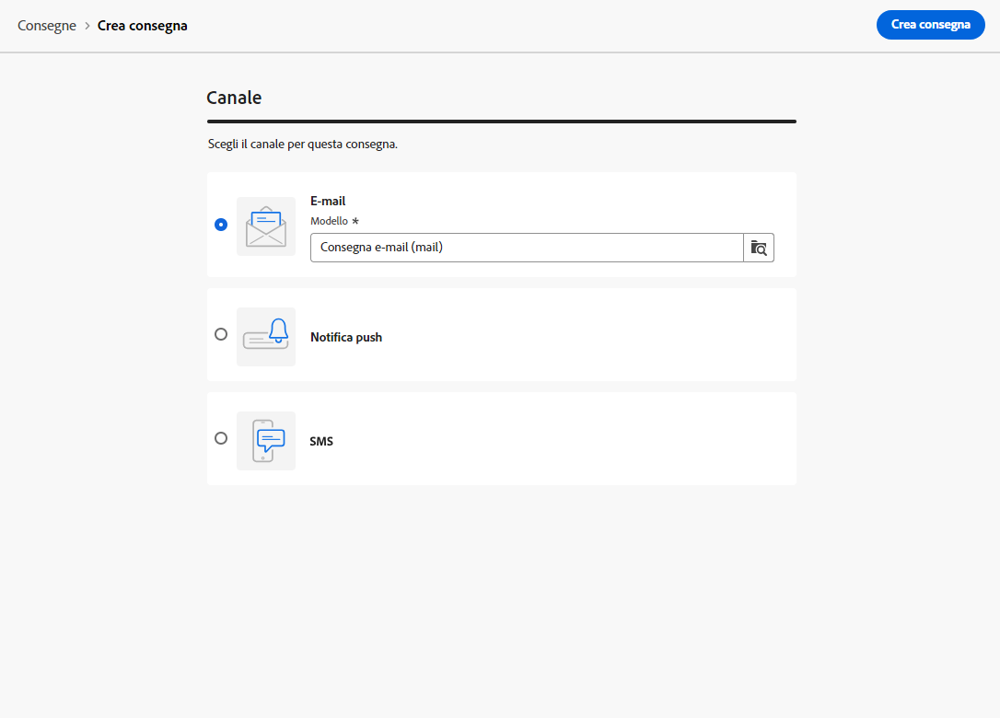

1. Fai clic su **[!UICONTROL Crea una consegna]** per confermare.
1. Specifica un’etichetta per la consegna e configura opzioni aggiuntive in base alle tue esigenze:

   * **[!UICONTROL Nome interno]**: assegna un identificatore univoco alla consegna.
   * **[!UICONTROL Cartella]**: memorizza la consegna in una cartella specifica.
   * **[!UICONTROL Codice di consegna]**: utilizza questo campo per organizzare le consegne in base alla convenzione di denominazione.
   * **[!UICONTROL Descrizione]**: specifica una descrizione della consegna.
   * **[!UICONTROL Natura]**: specifica la natura dell’e-mail a scopo di classificazione.<!--The content of the list is defined in the delivery template selected when creating the email.-->

   >[!NOTE]
   >
   >Se hai esteso lo schema con campi personalizzati specifici, puoi accedervi nella sezione **[!UICONTROL Opzioni personalizzate]**.

   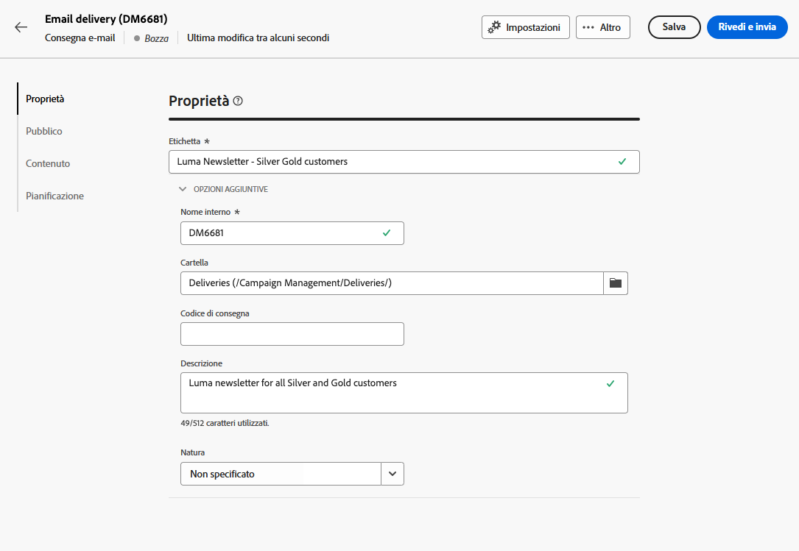

   Inoltre, è possibile accedere alle impostazioni avanzate, come le regole di tipologia e le mappature target, facendo clic sul pulsante situato accanto al nome della consegna. Queste impostazioni sono preconfigurate nel modello selezionato, ma possono essere modificate in base alle esigenze per questo specifico messaggio e-mail.

## Creare il contenuto dell’e-mail {#create-content}

>[!CONTEXTUALHELP]
>id="acw_homepage_card3"
>title="Progettare il contenuto delle e-mail"
>abstract="Scopri come utilizzare E-mail Designer."

Per istruzioni dettagliate su come configurare il contenuto delle e-mail, consulta [questa sezione](../content/edit-content.md).

In questo caso d’uso, viene utilizzato un modello predefinito per progettare l’e-mail.

1. Per iniziare a creare il contenuto dell’e-mail, apri la consegna e fai clic sul pulsante **[!UICONTROL Modifica contenuto]**.

   Viene visualizzata un’interfaccia dedicata in cui puoi configurare il contenuto dell’e-mail e progettarlo utilizzando E-mail Designer.

   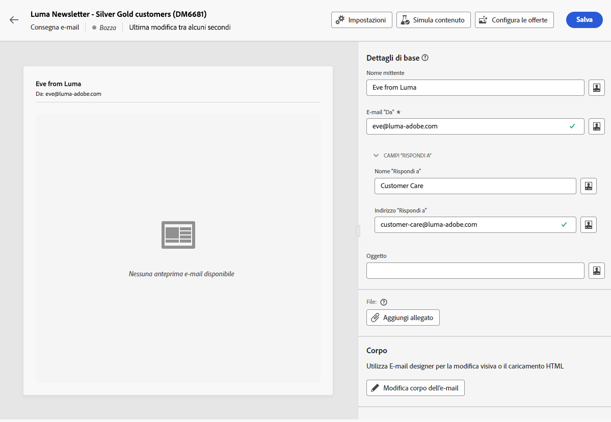

1. Immetti l’oggetto dell’e-mail e personalizzalo utilizzando l’editor di espressioni. [Scopri come personalizzare i contenuti](../personalization/personalize.md)

   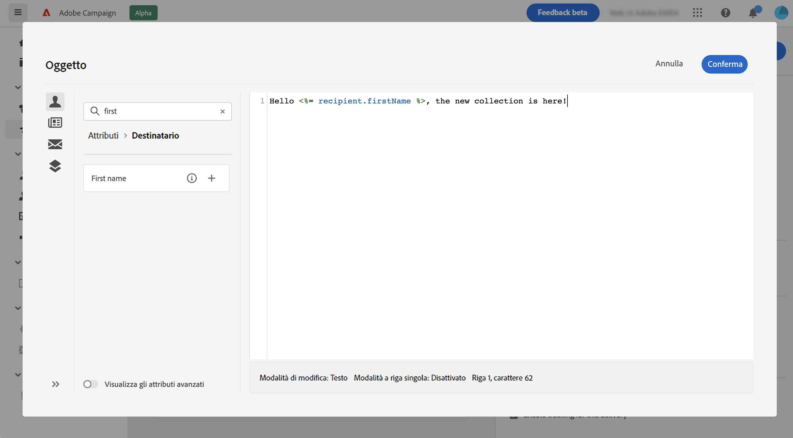

1. Per progettare il contenuto dell’e-mail, fai clic sul pulsante **[!UICONTROL Modifica corpo e-mail]**.

   Scegli il metodo da utilizzare per creare il contenuto delle e-mail. In questo esempio, utilizza un modello di progettazione predefinito.

   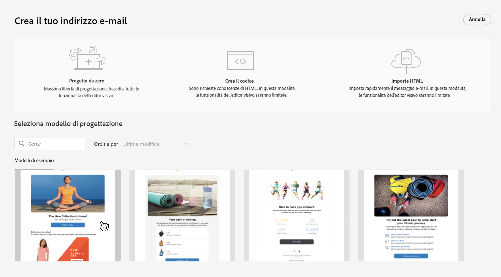

<!--1. Select the HTML or ZIP file to import then click **[!UICONTROL Next]**.

    If your folder contains assets, choose the instance and folder where they should be stored then click **[!UICONTROL Import]**. (+ link to doc on assets?)

    -->

1. Dopo aver selezionato il modello, questo viene visualizzato in E-mail Designer, dove puoi apportare le modifiche necessarie e aggiungere la personalizzazione.

   Ad esempio, per aggiungere la personalizzazione al titolo dell’e-mail, seleziona il blocco del componente e fai clic su **[!UICONTROL Aggiungi personalizzazione]**.

   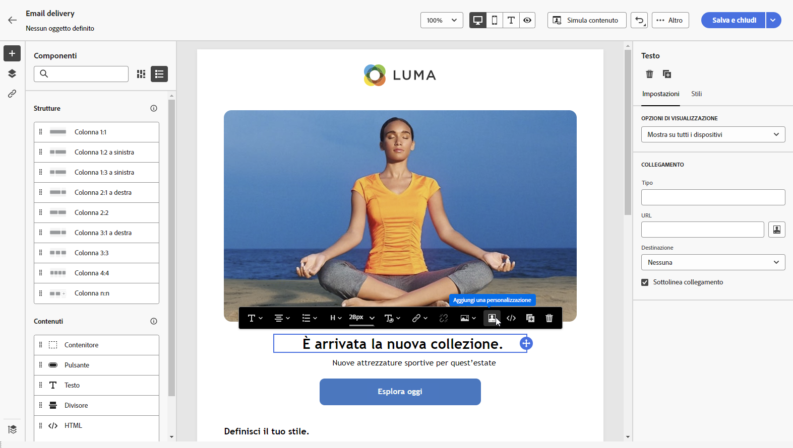

1. Una volta ottenuto il contenuto desiderato, salva e chiudi il progetto. Fai clic su **[!UICONTROL Salva]** per tornare alla schermata di creazione dell’e-mail.

   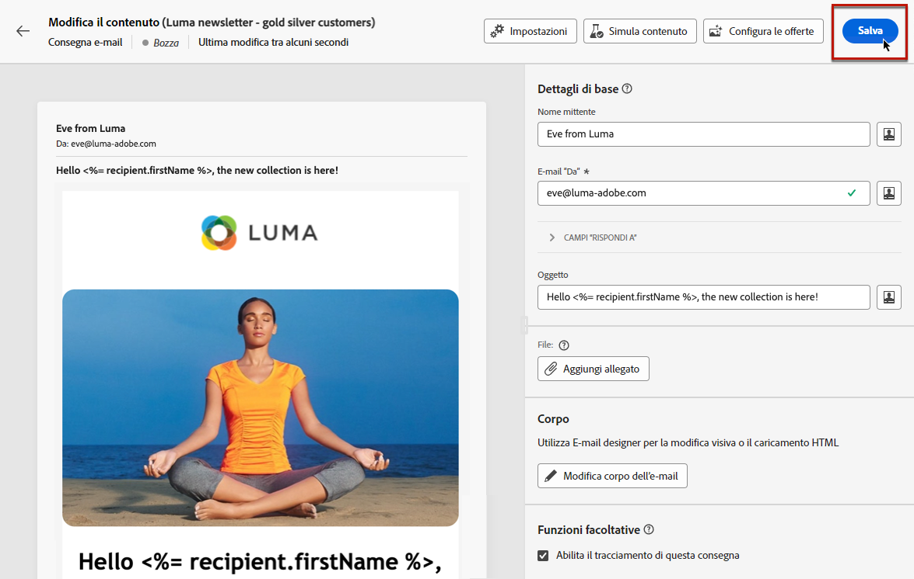

## Definire il pubblico {#define-audience}

>[!CONTEXTUALHELP]
>id="acw_deliveries_email_audience"
>title="Definire il pubblico"
>abstract="Seleziona il pubblico migliore per il messaggio di marketing. Puoi scegliere un pubblico esistente già definito in un’istanza Campaign v8 o da Adobe Experience Platform, oppure puoi creare un nuovo pubblico con il generatore di regole."

In questo caso d’uso, l’e-mail verrà inviata a un pubblico esistente. Per istruzioni su come lavorare con i tipi di pubblico, consulta [questa sezione](../audience/about-audiences.md).

1. Per selezionare il pubblico a cui inviare l’e-mail, fai clic sul pulsante **[!UICONTROL Seleziona pubblico]** e scegli un pubblico esistente tra quelli elencati.

   In questo esempio, verrà utilizzato un pubblico di targeting esistente per i clienti appartenenti ai livelli di punti fedeltà Silver e Gold.

   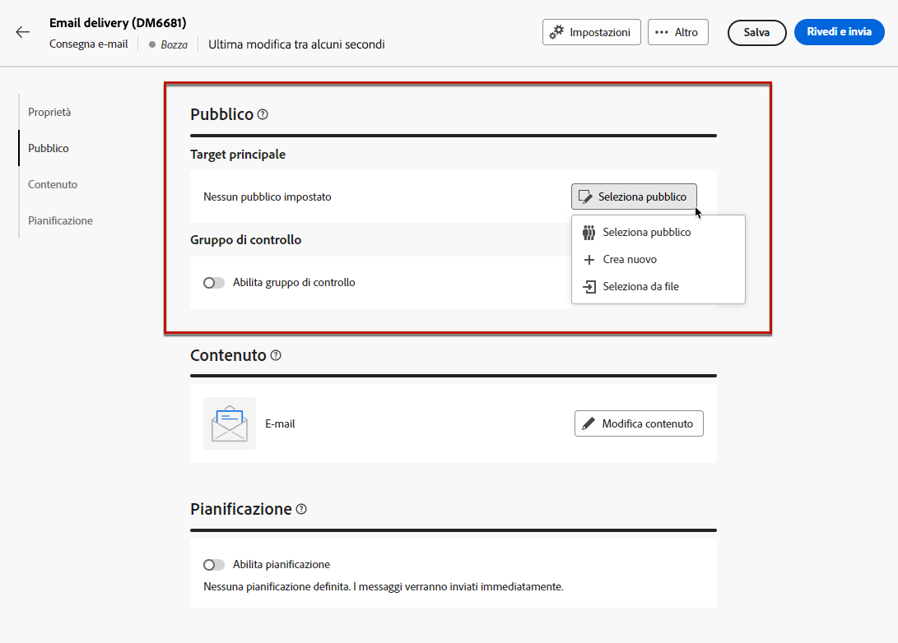

   >[!NOTE]
   >
   >I tipi di pubblico disponibili nell’elenco provengono dall’istanza Campaign v8 oppure, se nell’istanza è stata configurata l’integrazione Destinazione/Origini, da Adobe Experience Platform.
   >
   >L’integrazione Destinazione/Origini consente di inviare segmenti di Experience Platform ad Adobe Campaign e di inviare i registri di consegna e tracciamento di Campaign ad Adobe Experience Platform. [Scopri come utilizzare Campaign e Adobe Experience Platform](https://experienceleague.adobe.com/docs/campaign/campaign-v8/connect/ac-aep.html?lang=it){target="_blank"}.

1. Una volta selezionato il pubblico, puoi perfezionare ulteriormente il target applicando regole aggiuntive.

   Puoi anche impostare un gruppo di controllo per analizzare il comportamento dei destinatari delle e-mail rispetto a quelli non interessati dal targeting. [Scopri come utilizzare i gruppi di controllo](../audience/control-group.md)

   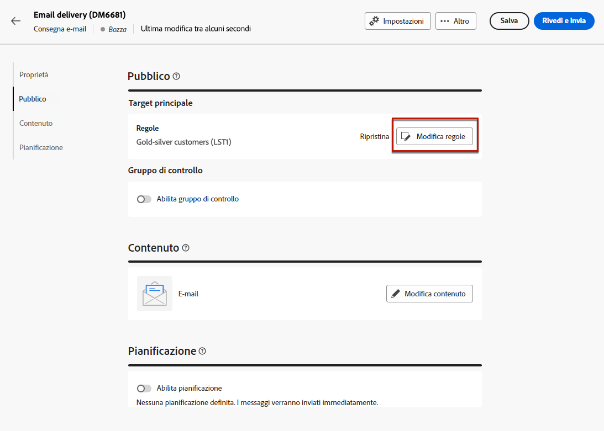

## Pianificare l’invio {#schedule}

>[!CONTEXTUALHELP]
>id="acw_deliveries_email_schedule"
>title="Pianificare l’invio"
>abstract="Definisci la data e l’ora esatta dell’invio. Scegliendo l’orario più appropriato per il messaggio di marketing, puoi massimizzare le percentuali di apertura."

Per pianificare l’invio dell’e-mail, apri la consegna e-mail e passa alla sezione **Pianificazione**. Utilizza l’interruttore **[!UICONTROL Abilita pianificazione]** per attivarla e impostare la data e l’ora desiderate per l’invio. Una volta inviata la consegna, l’invio effettivo inizierà dalla data di contatto definita.

Per impostazione predefinita, l’opzione **[!UICONTROL Abilita la conferma prima dell’invio]** è abilitata. Questa opzione richiede di confermare l’invio prima che l’e-mail venga inviata alla data e all’ora pianificate. Se desideri inviare l’e-mail automaticamente alla data e all’ora pianificate, puoi disattivare questa opzione.

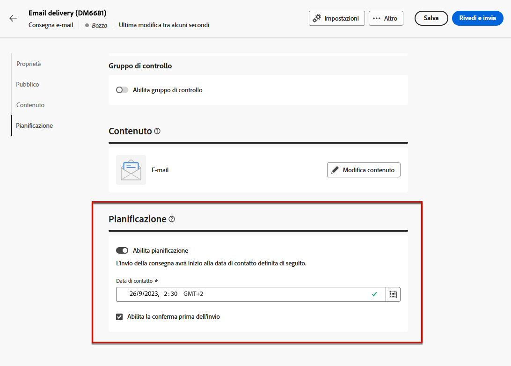

## Anteprima e test dell’e-mail {#preview-test}

Prima di inviare l’e-mail, puoi visualizzarla in anteprima e testarla per assicurarti che soddisfi le tue aspettative.

In questo caso d’uso, puoi visualizzare in anteprima l’e-mail e inviare versioni di test a indirizzi e-mail specifici impersonando alcuni dei profili di destinazione.

Per ulteriori informazioni su come visualizzare in anteprima e testare le e-mail, consulta [questa sezione](../preview-test/preview-test.md).

1. Per esaminare l’e-mail, fai clic su **[!UICONTROL Rivedi e invia]**. Viene visualizzata un’anteprima del messaggio e-mail, nonché tutte le proprietà, il pubblico e la pianificazione configurati. Per modificare uno di questi elementi, fai clic sul pulsante Modifica.

1. Per visualizzare in anteprima l’e-mail e inviare le versioni di test, fai clic sul pulsante **[!UICONTROL Simula contenuto]**.

   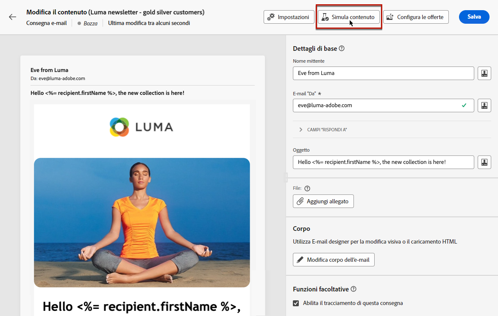

1. Sul lato sinistro, seleziona i profili da utilizzare per visualizzare l’anteprima del messaggio e-mail.

   Nel riquadro a destra viene visualizzata un’anteprima del messaggio e-mail in base al profilo selezionato. Se hai aggiunto più profili, puoi passare da un profilo all’altro per visualizzare in anteprima l’e-mail corrispondente.

   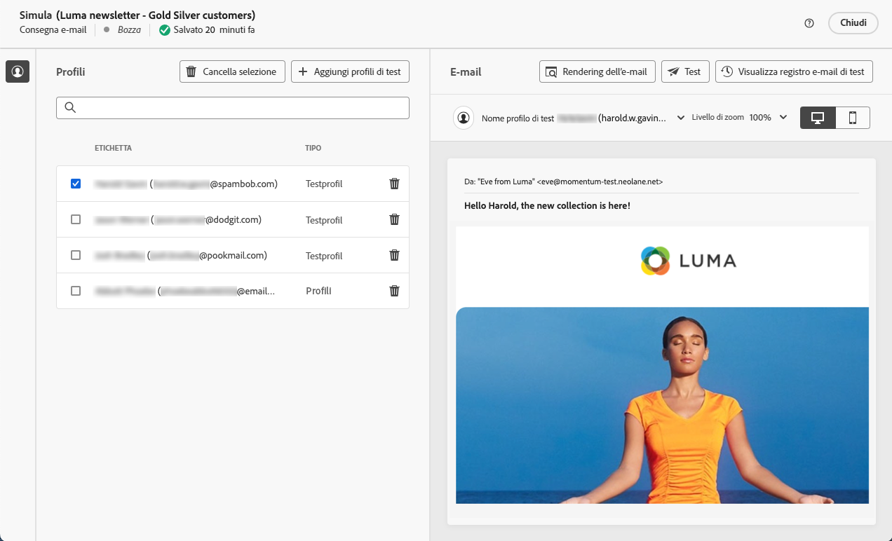

   <!-- !NOTE
    >
    >Additionally, the **[!UICONTROL Render email]** button allows you to preview the email using mutiple devices or mail providers. Learn on how to preview email rendering-->

1. Per inviare le versioni di test dell’e-mail, fai clic sul pulsante **[!UICONTROL Test]** e scegli la modalità da utilizzare.

   In questo esempio, utilizza la modalità **[!UICONTROL Sostituisci dal target principale]**, per inviare le versioni di test a indirizzi e-mail specifici impersonando di alcuni dei profili target dell’e-mail.

   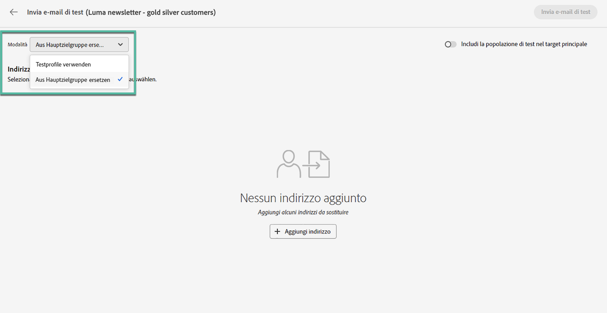

1. Fai clic su **[!UICONTROL Aggiungi indirizzo]** e specifica gli indirizzi e-mail a cui inviare le versioni di test.

   Per ogni indirizzo e-mail, seleziona il profilo da impersonare. Puoi anche consentire ad Adobe Campaign di selezionare un profilo casuale dal target.

   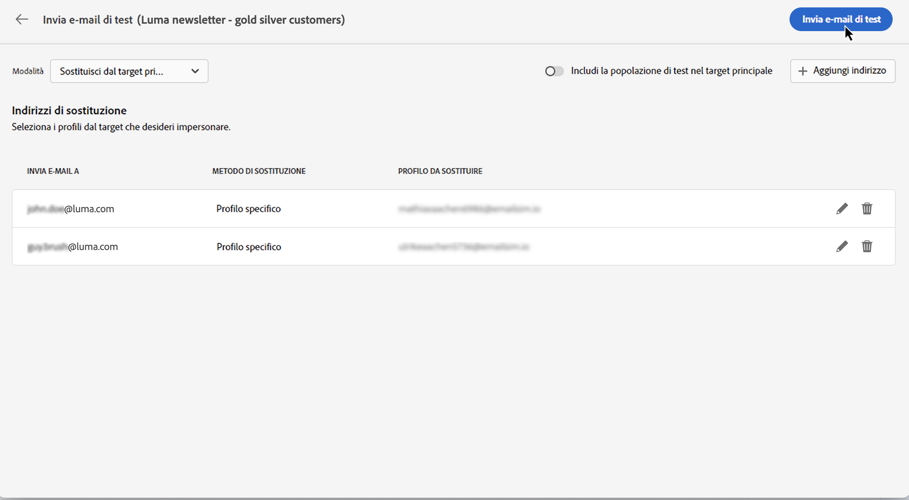

1. Fai clic su **[!UICONTROL Invia e-mail di test]** e conferma l’invio.

   Le versioni di test vengono inviate agli indirizzi e-mail specificati utilizzando il profilo selezionato, con il prefisso **[Bozza x]**.

   

   In qualsiasi momento puoi controllare lo stato dell’invio e accedere alle e-mail di test inviate, facendo clic sul pulsante **[!UICONTROL Visualizza registro e-mail di test]** nella schermata di simulazione del contenuto.

## Inviare e monitorare l’e-mail {#prepare-send}

Dopo aver rivisto e testato l’e-mail, puoi avviarne la preparazione e inviarla.

1. Per avviare la preparazione dell’e-mail, fai clic su **[!UICONTROL Prepara]**. [Scopri come preparare un’e-mail](../monitor/prepare-send.md)

   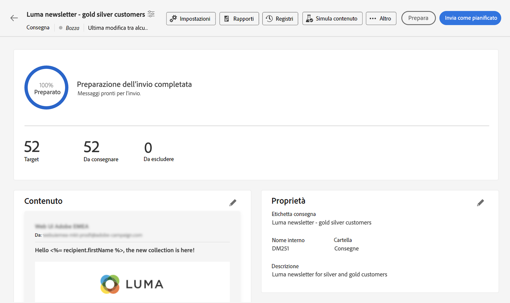

1. Quando l’e-mail è pronta per essere inviata, fai clic sul pulsante **[!UICONTROL Invia]** (oppure su **[!UICONTROL Invia come pianificato]**, se ne hai pianificato l’invio) e conferma l’invio.

1. Durante il processo di invio, puoi tracciarne l’avanzamento e visualizzare le statistiche in tempo reale direttamente in questa schermata.

   

   Puoi anche accedere a informazioni dettagliate sull’invio facendo clic sul pulsante **[!UICONTROL Registri]**. [Scopri come monitorare i registri di consegna](../monitor/delivery-logs.md)

1. Dopo l’invio dell’e-mail, puoi accedere ai rapporti dedicati per ulteriori analisi facendo clic sul pulsante **[!UICONTROL Reporting]**.

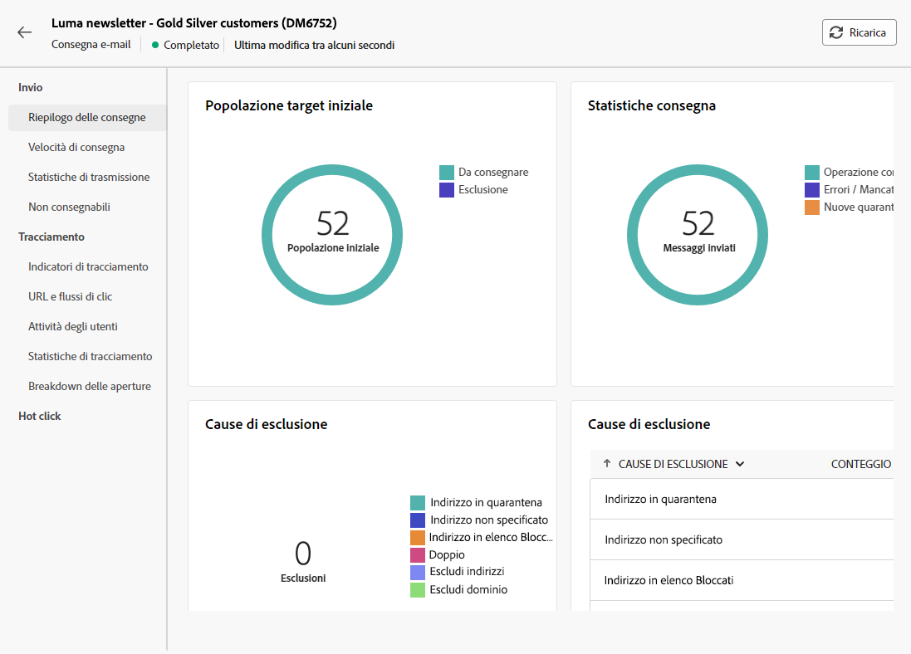
