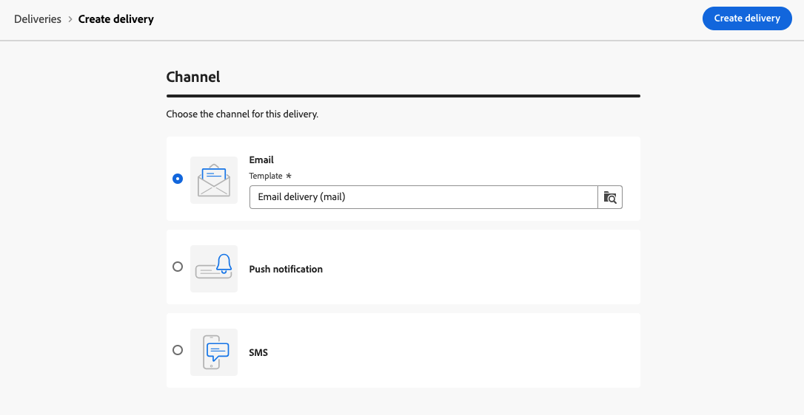

# Creare il primo messaggio e-mail {#first-email}

>[!CONTEXTUALHELP]
>id="acw_homepage_learning_card3"
>title="Introduzione alle e-mail"
>abstract="Puoi creare una consegna e-mail autonoma o un messaggio e-mail nel contesto di un flusso di lavoro della campagna. Scopri come creare la consegna, selezionare il pubblico e progettare il contenuto dell’e-mail."

Scopri come creare la tua prima e-mail con targeting. In questo caso d’uso, viene pianificato l’invio di un’e-mail ai membri fidelizzati Silver e Gold in una data specifica.

In base a un [modello di progettazione](../email/create-email-templates.md) predefinito, l’e-mail presenta anche contenuti personalizzati in base agli attributi del profilo cliente.

➡️ [Scopri questa funzione nel video](#video)

## Creare una consegna e-mail {#create-email}

>[!CONTEXTUALHELP]
>id="acw_deliveries_email_template_selection"
>title="Selezionare un modello di e-mail"
>abstract="Un modello e-mail è una configurazione di consegna specifica che contiene impostazioni predefinite, come regole di tipologia, personalizzazione o parametri di indirizzamento. I modelli sono definiti nella console client di Campaign."

>[!CONTEXTUALHELP]
>id="acw_deliveries_email_properties"
>title="Definire le proprietà dell’e-mail"
>abstract="Le proprietà sono parametri comuni che consentono di denominare e classificare la consegna. Le impostazioni aggiuntive sono facoltative. Se la consegna è basata su uno schema esteso definito nella console Adobe Campaign v8, sono disponibili alcuni campi specifici di **Opzioni personalizzate**."

Puoi creare una consegna e-mail autonoma o un messaggio e-mail nel contesto di un flusso di lavoro della campagna. I passaggi seguenti descrivono la procedura per una consegna e-mail autonoma (singola). Ulteriori informazioni sui passaggi per la creazione della consegna in Adobe Campaign sono disponibili in [questa pagina](../msg/gs-deliveries.md).

Per creare una nuova consegna e-mail autonoma, segui i passaggi indicati di seguito.

1. Passa al menu **[!UICONTROL Consegne]** nella barra a sinistra e fai clic sul pulsante **[!UICONTROL Crea consegna]**.

   

1. Seleziona **[!UICONTROL E-mail]** come canale e scegli un modello di consegna e-mail dall&#39;elenco.

   >[!NOTE]
   >
   >I modelli sono impostazioni di consegna preconfigurate e salvate per poter essere riutilizzate. [Ulteriori informazioni](../msg/delivery-template.md)

   {zoomable="yes"}

1. Fai clic sul pulsante **[!UICONTROL Crea una consegna]** per confermare.
1. Immetti un’etichetta per la consegna e configura opzioni aggiuntive in base alle tue esigenze:

   * **[!UICONTROL Nome interno]**: assegna un identificatore univoco alla consegna.
   * **[!UICONTROL Cartella]**: memorizza la consegna in una cartella specifica.
   * **[!UICONTROL Codice consegna]**: utilizza questo campo per organizzare le consegne in base alla tua convenzione di denominazione.
   * **[!UICONTROL Descrizione]**: specificare una descrizione per la consegna.
   * **[!UICONTROL Natura]**: specifica la natura dell&#39;e-mail a scopo di classificazione.<!--The content of the list is defined in the delivery template selected when creating the email.-->

   >[!NOTE]
   >
   >Se hai esteso lo schema con campi personalizzati specifici, puoi accedervi nella sezione **[!UICONTROL Opzioni personalizzate]**.

   {zoomable="yes"}

1. Inoltre, è possibile accedere alle impostazioni avanzate, come le regole di tipologia e le mappature dei target, tramite il pulsante **[!UICONTROL Impostazioni]** che si trova in alto a destra della schermata. Queste impostazioni sono preconfigurate nel modello selezionato, ma possono essere modificate in base alle esigenze per questo messaggio e-mail specifico. [Ulteriori informazioni](../advanced-settings/delivery-settings.md)

## Definire il pubblico {#define-audience}

>[!CONTEXTUALHELP]
>id="acw_deliveries_email_audience"
>title="Selezionare un pubblico per la consegna"
>abstract="Seleziona il pubblico migliore per il messaggio di marketing. Puoi scegliere un pubblico esistente (già definito in un’istanza di Campaign v8 o da Adobe Experience Platform), creare un nuovo pubblico utilizzando il query modeler oppure caricare un file contenente il pubblico. I gruppi di controllo non sono abilitati per l’opzione **Seleziona da file** e viceversa."
>additional-url="https://experienceleague.adobe.com/docs/campaign-web/v8/audiences/target-audiences/add-audience.html?lang=it" text="Selezionare il pubblico principale"
>additional-url="https://experienceleague.adobe.com/docs/campaign-web/v8/audiences/target-audiences/control-group.html?lang=it" text="Impostare un gruppo di controllo"

In questo caso d’uso, l’e-mail verrà inviata a un pubblico esistente.

Per istruzioni su come lavorare con i tipi di pubblico, consulta [questa sezione](../audience/about-recipients.md).

1. Per selezionare il pubblico per l&#39;e-mail, fai clic sul pulsante **[!UICONTROL Seleziona pubblico]** e scegli un pubblico esistente dall&#39;elenco.

   In questo esempio, vogliamo utilizzare un pubblico esistente che esegue il targeting dei clienti appartenenti ai livelli dei punti fedeltà Silver e Gold.

   {zoomable="yes"}

   >[!NOTE]
   >
   >I tipi di pubblico disponibili nell’elenco provengono dall’istanza di Campaign v8 o da Adobe Experience Platform, se l’integrazione Destinazione/Source è stata configurata nell’istanza. Questa integrazione ti consente di inviare i segmenti di Experience Platform ad Adobe Campaign e i registri di consegna e tracciamento di Campaign a Adobe Experience Platform. Scopri come utilizzare Campaign e Adobe Experience Platform nella [documentazione di Campaign v8 (console client)](https://experienceleague.adobe.com/docs/campaign/campaign-v8/connect/ac-aep/ac-aep.html?lang=it){target="_blank"}.

1. Una volta selezionato il pubblico, puoi perfezionare ulteriormente il target applicando regole aggiuntive.

   {zoomable="yes"}

1. Puoi anche impostare un gruppo di controllo per analizzare il comportamento dei destinatari delle e-mail rispetto a quelli non interessati dal targeting. [Scopri come utilizzare i gruppi di controllo](../audience/control-group.md)

## Definire il contenuto dell’e-mail {#create-content}

Per iniziare a creare il contenuto delle e-mail, segui i passaggi seguenti. In questo caso d’uso, per progettare l’e-mail viene utilizzato un [modello di consegna](../msg/delivery-template.md) e-mail già definito.<!--TBC delivery template or email content template?-->

<!--Detailed instructions on how to configure the email content are available in [this section](../email/edit-content.md).-->

1. Nella dashboard della consegna e-mail, fai clic sul pulsante **[!UICONTROL Modifica contenuto]**.

   {zoomable="yes"}

   Viene visualizzata un’interfaccia dedicata in cui puoi configurare il contenuto dell’e-mail e accedere a E-mail designer. [Ulteriori informazioni](edit-content.md)

   {zoomable="yes"}

1. Inserisci l’oggetto del messaggio e-mail e personalizzalo utilizzando l’editor di espressioni. [Scopri come personalizzare i contenuti](../personalization/personalize.md)

   {zoomable="yes"}

1. Per progettare il contenuto dell’e-mail, fai clic sul pulsante **[!UICONTROL Modifica corpo e-mail]**.

   Scegli il metodo da utilizzare per creare il contenuto delle e-mail. In questo esempio, utilizza un [modello di contenuto già definito](create-email-templates.md).

   {zoomable="yes"}

1. Dopo aver selezionato il modello, questo viene visualizzato in [E-mail designer](create-email-content.md), dove puoi apportare le modifiche necessarie e aggiungere la personalizzazione.

   Ad esempio, per aggiungere la personalizzazione al titolo dell&#39;e-mail, seleziona il blocco del componente e fai clic su **[!UICONTROL Aggiungi Personalization]**.

   {zoomable="yes"}

1. Una volta ottenuto il contenuto desiderato, salva e chiudi il progetto. Fai clic su **[!UICONTROL Salva]** per tornare alla schermata di creazione dell’e-mail.

   {zoomable="yes"}

## Pianificare l’invio {#schedule}

Quando una consegna viene inviata nel contesto di un flusso di lavoro, è necessario utilizzare l&#39;attività **Scheduler**. Ulteriori informazioni in [questa pagina](../workflows/activities/scheduler.md). I passaggi seguenti si applicano solo alle consegne autonome.

1. Passa alla sezione **[!UICONTROL Pianificazione]** delle proprietà di consegna.

1. Utilizza l’opzione **[!UICONTROL Abilita pianificazione]** per attivarla.

1. Imposta la data e l’ora desiderate per l’invio.

   {zoomable="yes"}

Una volta inviata la consegna, l’invio effettivo inizia dalla data di contatto definita.

Per ulteriori informazioni sulla pianificazione della consegna, consulta [questa sezione](../msg/gs-deliveries.md#schedule-the-delivery-sending).

## Anteprima di un’e-mail e invio di bozze {#preview-test}

Prima di inviare l’e-mail, puoi visualizzarla in anteprima e testarla per assicurarti che soddisfi le tue aspettative.

In questo caso d’uso, puoi visualizzare in anteprima il messaggio e-mail e inviare bozze a indirizzi e-mail specifici, rappresentando al contempo alcuni dei profili target.

Ulteriori informazioni su come visualizzare in anteprima un&#39;e-mail e inviare bozze sono disponibili in [questa sezione](../preview-test/preview-test.md).

1. Per esaminare l’e-mail, fai clic su **[!UICONTROL Rivedi e invia]**. Viene visualizzata un’anteprima del messaggio e-mail, insieme a tutte le proprietà configurate, il pubblico e la pianificazione. Per modificare uno di questi elementi, fai clic sul pulsante Modifica.

1. Per visualizzare l&#39;anteprima dell&#39;e-mail e inviare le bozze, fare clic sul pulsante **[!UICONTROL Simula contenuto]**.

   {zoomable="yes"}

   >[!NOTE]
   >
   >Il pulsante **[!UICONTROL Simula contenuto]** è disabilitato in contesti specifici. Le limitazioni sono dettagliate [in questa sezione](#content-simulation-limitations).

1. Sul lato sinistro, seleziona i profili da utilizzare per visualizzare l’anteprima del messaggio e-mail.

   Nel riquadro a destra viene visualizzata un’anteprima del messaggio e-mail in base al profilo selezionato. Se hai aggiunto più profili, puoi passare da un profilo all’altro per visualizzare in anteprima l’e-mail corrispondente.

   {zoomable="yes"}

   <!--Additionally, the **[!UICONTROL Render email]** button allows you to preview the email using multiple devices or mail providers. Learn on how to preview email rendering
    -->

1. Per inviare le bozze, fai clic sul pulsante **[!UICONTROL Invia bozze]**, quindi scegli la modalità da utilizzare.

   In questo esempio, utilizza la modalità **[!UICONTROL Sostituisci da destinazione principale]**, che invia bozze a indirizzi e-mail specifici impersonando alcuni dei profili target dell&#39;e-mail.

   {zoomable="yes"}

1. Fai clic su **[!UICONTROL Aggiungi indirizzo]** e specifica gli indirizzi e-mail che ricevono le bozze.

   Per ogni indirizzo e-mail, seleziona il profilo da impersonare. Puoi anche consentire ad Adobe Campaign di selezionare un profilo casuale dal target.

   {zoomable="yes"}

1. Fai clic su **[!UICONTROL Invia bozza]** e conferma l&#39;invio.

   Le bozze vengono inviate agli indirizzi e-mail specificati utilizzando il profilo selezionato con il prefisso **[Proof x]**.

   {zoomable="yes"}

   Puoi controllare lo stato dell&#39;invio e accedere alle bozze inviate in qualsiasi momento facendo clic sul pulsante **[!UICONTROL Visualizza bozze]** nella schermata simula contenuto.

### Limiti di simulazione del contenuto {#content-simulation-limitations}

>[!CONTEXTUALHELP]
>id="acw_simulation_limitation_multilingual"
>title="La simulazione del contenuto non è supportata"
>abstract="Il pulsante **Simula contenuto** è disabilitato perché la consegna multilingue contiene una sola lingua."

>[!CONTEXTUALHELP]
>id="acw_simulation_limitation_reconcilied_deliveries"
>title="La simulazione del contenuto non è supportata"
>abstract="Il pulsante **Simula contenuto** è disabilitato perché non è compatibile con le consegne riconciliate in questa fase."

>[!CONTEXTUALHELP]
>id="acw_simulation_limitation_ffda"
>title="La simulazione del contenuto non è supportata"
>abstract="Il pulsante **Simula contenuto** è disabilitato perché non supportato nella modalità FFDA (Full Federated Access) di Campaign Enterprise."

>[!CONTEXTUALHELP]
>id="acw_simulation_limitation_no_file"
>title="La simulazione del contenuto non è supportata"
>abstract="Il pulsante **Simula contenuto** è disabilitato perché non è stato caricato alcun contenuto."

In alcuni casi non è possibile eseguire la simulazione del contenuto e il pulsante **[!UICONTROL Simula contenuto]** è disabilitato.

La simulazione del contenuto non è supportata in questi casi:

<!--* When a multilingual delivery contains only one locale,-->
* Con consegne riconciliate,
* Quando il modello di distribuzione di Campaign è [Adobe Campaign Enterprise Full Federated Access (FFDA)](https://experienceleague.adobe.com/it/docs/campaign/campaign-v8/config/architecture/ffda/enterprise-deployment){target="_blank"}
* Quando non è stato caricato alcun file.

## Inviare e monitorare l’e-mail {#prepare-send}

Dopo aver rivisto e testato l’e-mail, puoi avviarne la preparazione e inviarla.

1. Per avviare la preparazione dell’e-mail, fai clic su **[!UICONTROL Prepara]**. [Scopri come preparare un’e-mail](../monitor/prepare-send.md)

   {zoomable="yes"}

1. Quando l&#39;e-mail è pronta per essere inviata, fai clic sul pulsante **[!UICONTROL Invia]** (o **[!UICONTROL Invia come pianificato]** se l&#39;invio è stato pianificato) e conferma l&#39;invio.

1. Durante il processo di invio, puoi tracciarne l’avanzamento e visualizzare le statistiche in tempo reale direttamente in questa schermata.

   {zoomable="yes"}

   <!--
    {zoomable="yes"}-->

   Puoi anche accedere a informazioni dettagliate sull’invio facendo clic sul pulsante **[!UICONTROL Registri]**. [Scopri come monitorare i registri di consegna](../monitor/delivery-logs.md)

1. Dopo l’invio dell’e-mail, puoi accedere ai rapporti dedicati per ulteriori analisi facendo clic sul pulsante **[!UICONTROL Reporting]**.

{zoomable="yes"}

## Video dimostrativo {#video}

Scopri come creare una consegna e-mail da zero, definire il pubblico, progettare il contenuto, simulare l’anteprima e inviare una bozza.

>[!VIDEO](https://video.tv.adobe.com/v/3454013/?quality=12&captions=ita)