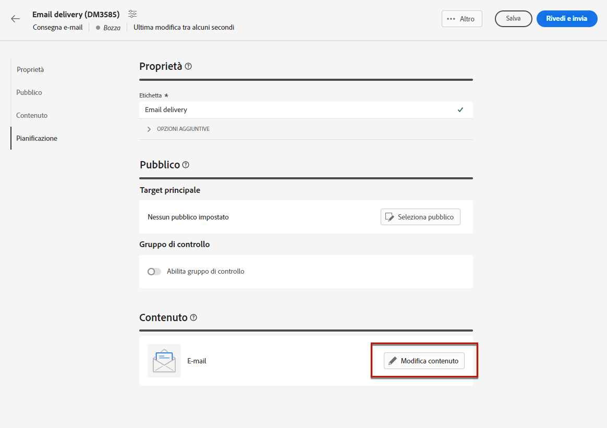
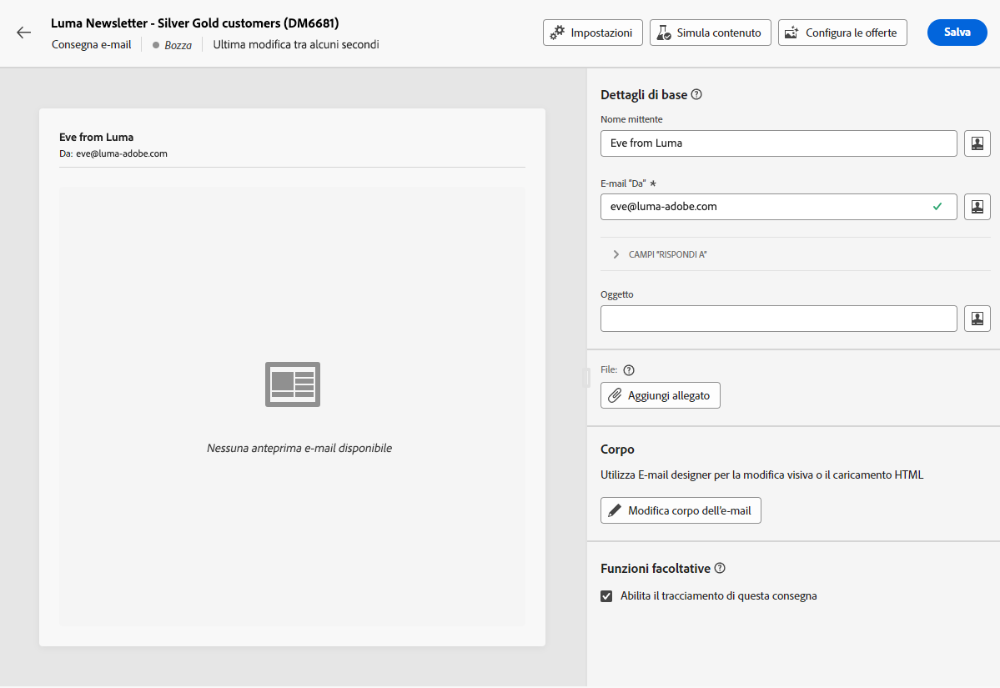
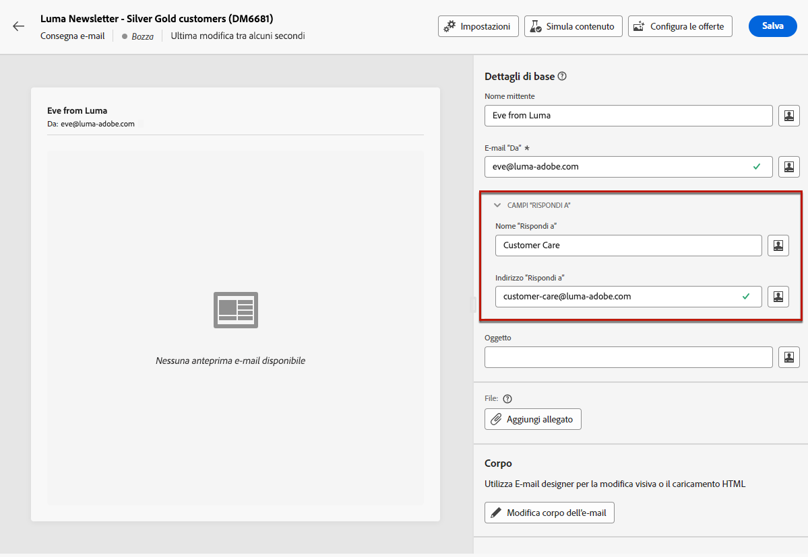
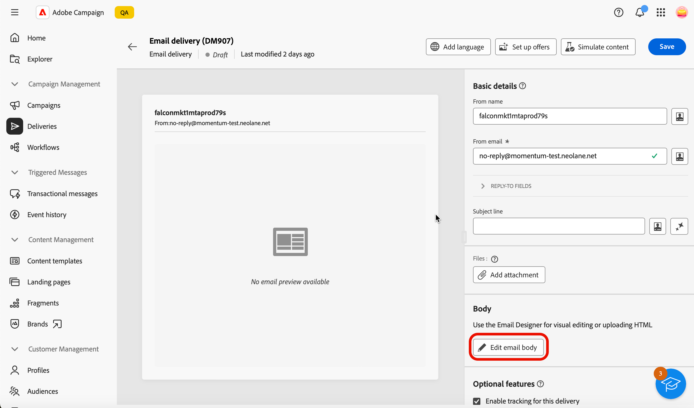
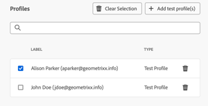
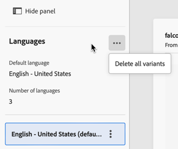

# Configurare il contenuto dell’e-mail {#edit-content}

>[!CONTEXTUALHELP]
>id="acw_deliveries_email_content"
>title="Definire il contenuto dell’e-mail"
>abstract="La schermata **Modifica contenuto** consente di definire gli elementi di base del messaggio come l’indirizzo del mittente e l’oggetto, eseguire ulteriori azioni come l’aggiunta di allegati o offerte, e accedere a E-mail designer per conferire al messaggio un aspetto professionale."

>[!CONTEXTUALHELP]
>id="acw_deliveries_email_header"
>title="Impostare le proprietà dell’e-mail"
>abstract="La sezione **Dettagli di base** consente di aggiornare l’indirizzo del mittente e l’indirizzo di risposta e di definire la riga dell’oggetto utilizzando l’editor di espressioni."

>[!CONTEXTUALHELP]
>id="acw_deliveries_email_attachment"
>title="Allegare file all’e-mail"
>abstract="Seleziona uno o più file da inserire nel messaggio. Per evitare problemi di prestazioni, si consiglia di non includere più di un allegato per e-mail."

>[!CONTEXTUALHELP]
>id="acw_deliveries_email_options"
>title="Modificare il tracciamento"
>abstract="Per impostazione predefinita, quando il tracciamento è abilitato per la consegna, vengono tracciati tutti i collegamenti inclusi nel contenuto del messaggio. Puoi disattivare questa opzione da qui."
>additional-url="https://experienceleague.adobe.com/it/docs/campaign-web/v8/content/email-design/design-content/message-tracking" text="Aggiungere collegamenti e tenere traccia dei messaggi"

>[!CONTEXTUALHELP]
>id="acw_deliveries_email_multilingual"
>title="Aggiungere lingue"
>abstract="In questa scheda troverai un elenco delle lingue in cui deve essere inviata la consegna. Puoi aggiungere altre lingue facendo clic sul pulsante Aggiungi lingua o duplicando un’altra lingua tramite questa scheda."

La schermata e-mail **[!UICONTROL Modifica contenuto]** consente di:

* Definire gli elementi di base del messaggio, ad esempio l’indirizzo del mittente e la riga dell’oggetto
* Eseguire azioni aggiuntive, ad esempio aggiungere gli allegati o configurare le offerte
* Accedi a [E-mail Designer](get-started-email-designer.md#start-authoring) per iniziare a creare il contenuto corretto dell’e-mail
* Aggiungi varianti di lingua alle consegne.

>[!NOTE]
>
>Tutti i campi di testo modificabili di questa schermata possono essere compilati utilizzando i campi di personalizzazione. [Scopri come personalizzare il contenuto](../personalization/personalize.md)

## Configurare la consegna

Per configurare o modificare il contenuto di un’e-mail, segui i passaggi indicati di seguito.

1. Fai clic sul pulsante **[!UICONTROL Modifica contenuto]** dalla schermata della [dashboard di consegna e-mail](../email/create-email.md).

   {zoomable="yes"}

1. Viene visualizzata la schermata di modifica del contenuto dell’e-mail.

   {zoomable="yes"}

   >[!NOTE]
   >
   >Se stai configurando una nuova e-mail, i campi **[!UICONTROL Da nome]** e **[!UICONTROL Da e-mail]** sono già compilati.

1. Il **[!UICONTROL Nome mittente]** è definito nel modello e-mail. Se desideri modificarlo, utilizza un nome facilmente identificabile dai destinatari, ad esempio il nome del tuo marchio, per aumentare il tasso di apertura delle consegne.

   >[!NOTE]
   >
   >Per migliorare ulteriormente l’esperienza del destinatario, puoi aggiungere il nome di una persona, ad esempio &quot;Eva da Luma&quot;.

1. Anche il campo dell’indirizzo **[!UICONTROL Da e-mail]** è definito nel modello e-mail. Assicurati che il dominio dell’indirizzo corrisponda al sottodominio delegato ad Adobe.

   >[!NOTE]
   >
   >È possibile modificare la parte che precede “@”, ma non l’indirizzo del dominio.

1. Espandi la sezione **[!UICONTROL Campi Rispondi a]**. Il nome e gli indirizzi del mittente vengono utilizzati per le risposte per impostazione predefinita. Tuttavia, Adobe consiglia di utilizzare un indirizzo reale esistente, ad esempio l’assistenza clienti del tuo marchio. In questo caso, se un destinatario invia una risposta, il team di assistenza clienti potrà gestirla.

   {zoomable="yes"}

1. Definisci l’**[!UICONTROL Oggetto]** del messaggio e-mail. Digita l&#39;oggetto direttamente nel campo dedicato, oppure apri l&#39;editor espressioni per aggiungere [personalizzazione](../personalization/personalize.md) utilizzando vari attributi, frammenti di espressione o offerte.

1. Per allegare un file all&#39;e-mail, fare clic sul pulsante **[!UICONTROL Aggiungi allegato]**, quindi selezionare uno o più file.

   >[!NOTE]
   >
   >Per evitare problemi di prestazioni, si consiglia di non includere più di un allegato per e-mail.

   <!--limitation on size + number of files?-->

1. Se desideri inviare offerte con il messaggio e-mail, selezionale utilizzando il pulsante **[!UICONTROL Configura offerte]**.

   Puoi quindi inserirli nell’e-mail utilizzando i campi di personalizzazione. [Scopri come inviare offerte](../msg/offers.md)

## Modifica il corpo dell’e-mail

1. Fai clic sul pulsante **[!UICONTROL Modifica corpo e-mail]** per strutturare e progettare il contenuto dell&#39;e-mail utilizzando [E-mail Designer](get-started-email-designer.md#start-authoring).

   >[!NOTE]
   >
   >Puoi anche passare il cursore sull’anteprima e-mail e selezionare **[!UICONTROL Apri E-mail designer]**.

   Per ulteriori informazioni sulla progettazione del contenuto delle e-mail, consulta le seguenti sezioni:

   * [Creare di e-mail da zero](create-email-content.md)
   * [Personalizzare lo stile del contenuto](get-started-email-style.md)

1. Per impostazione predefinita, il tracciamento è abilitato per la consegna. Puoi disattivare questa opzione dalla sezione **[!UICONTROL Funzioni facoltative]**. [Scopri come aggiungere collegamenti e gestire il tracciamento](message-tracking.md)

1. Una volta definito il contenuto dell’e-mail, prima di inviarla utilizza il pulsante **[!UICONTROL Simula contenuto]** per controllarne l’aspetto. [Scopri come visualizzare in anteprima e verificare l&#39;e-mail](../preview-test/preview-test.md).

## Configurare una consegna multilingue

Nell’interfaccia utente web di Campaign, puoi impostare le consegne e-mail come multilingue, che consente di inviare messaggi in base alla lingua preferita di un profilo. Se non è definita alcuna preferenza, il messaggio viene inviato nella lingua predefinita.

In una distribuzione multilingue, la gestione della lingua si basa su varianti. Ogni variante rappresenta una lingua.

Durante la creazione della consegna, nel messaggio puoi aggiungere il numero di varianti corrispondente al numero di lingue necessarie. È inoltre possibile definire la lingua predefinita quando si aggiungono nuove lingue.

### Aggiungi una variante di lingua

Per creare varianti di lingua, effettua le seguenti operazioni:

1. Fai clic sul pulsante **[!UICONTROL Aggiungi lingua]** nella sezione superiore della schermata di configurazione e-mail.

   >[!IMPORTANT]
   >
   >Il pulsante **[!UICONTROL Aggiungi lingua]** è disponibile solo se la dimensione di destinazione contiene lo schema Lingua. Per ulteriori informazioni sugli schemi e sulle dimensioni di Target, consulta la [documentazione dettagliata](https://experienceleague.adobe.com/en/docs/campaign-web/v8/audiences/targeting-dimensions){target=_blank}.

   {zoomable="yes"}

1. Selezionare la lingua da aggiungere nell&#39;elenco a discesa **[!UICONTROL Lingua]**. Quando si aggiunge la prima lingua, questa viene impostata come predefinita e il contenuto corrente è quello predefinito. Quando aggiungi nuove lingue, il contenuto si basa su quello predefinito.

   >[!NOTE]
   >
   >Le lingue disponibili in questo elenco dipendono dai valori definiti dall&#39;attributo Language (valori quali: system, user, dbenum, ecc.) Ulteriori informazioni sulla gestione dell&#39;enumerazione in questa [sezione](https://experienceleague.adobe.com/en/docs/campaign-web/v8/conf/enumerations){target=_blank}.

   {zoomable="yes"}

   Ad esempio qui, per inglese (US):

   {zoomable="yes"}

1. Ripetere la procedura per aggiungere altre lingue. Il pannello **[!UICONTROL Lingua]** mostra l&#39;elenco delle lingue scelte, il numero di lingue diverse e anche la lingua predefinita.

   Ad esempio, se hai scelto l’inglese, il francese e lo svedese, puoi visualizzare queste 3 lingue come illustrato di seguito:

   {zoomable="yes"}

   Per eliminare tutte le lingue, fai clic sul pulsante di espansione nell’angolo in alto a destra.

### Definisci il contenuto dell’e-mail per ogni variante

Una volta impostate le lingue, definisci il contenuto dell’e-mail che verrà inviata ai profili con questa lingua preferita.

Per definire un contenuto e-mail, effettua le seguenti operazioni:

1. Apri [Invia e-mail a Designer](get-started-email-designer.md#start-authoring) facendo clic sul pulsante **[!UICONTROL Modifica corpo e-mail]**.

   >[!NOTE]
   >
   >Puoi anche passare il cursore sull’anteprima e-mail e selezionare **[!UICONTROL Apri E-mail designer]**.

   {zoomable="yes"}

1. Puoi visualizzare l&#39;anteprima della consegna facendo clic sul pulsante **[!UICONTROL Simula contenuto]** e scegliere il profilo e la lingua in cui viene visualizzata l&#39;e-mail.

1. Nella finestra Simula contenuto, puoi passare da un profilo all’altro per visualizzare in anteprima il contenuto dell’e-mail corrispondente alla lingua impostata per tale profilo.

   {zoomable="yes"}

### Duplica o rimuovi varianti di lingua

Puoi fare clic sul pulsante di espansione nell&#39;angolo in alto a destra, quindi fare clic sul pulsante **[!UICONTROL Elimina tutte le varianti]** per eliminare tutte le lingue.

{zoomable="yes"}

Per rimuovere una variante di lingua, fai clic sui tre punti a destra della scheda e seleziona Rimuovi.

Per duplicare una variante di lingua, fai clic sui tre punti a destra della scheda e seleziona Duplica. Se scegli di duplicare una lingua diversa da quella predefinita, il contenuto duplicato si baserà sulla lingua scelta per la duplicazione.

1. Una volta definito il contenuto dell’e-mail, prima di inviarla utilizza il pulsante **[!UICONTROL Simula contenuto]** per controllarne l’aspetto. [Scopri come visualizzare in anteprima e verificare l&#39;e-mail](../preview-test/preview-test.md).