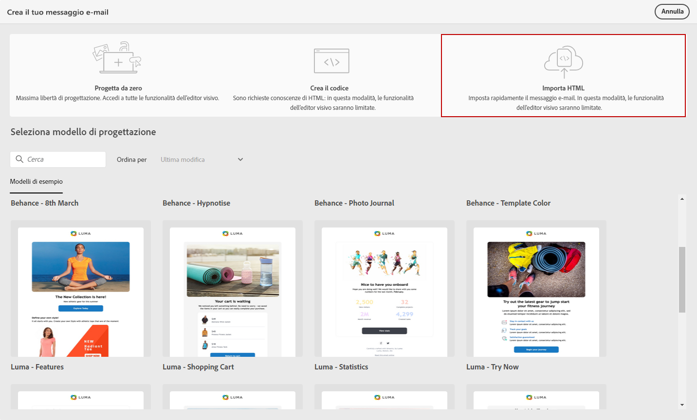
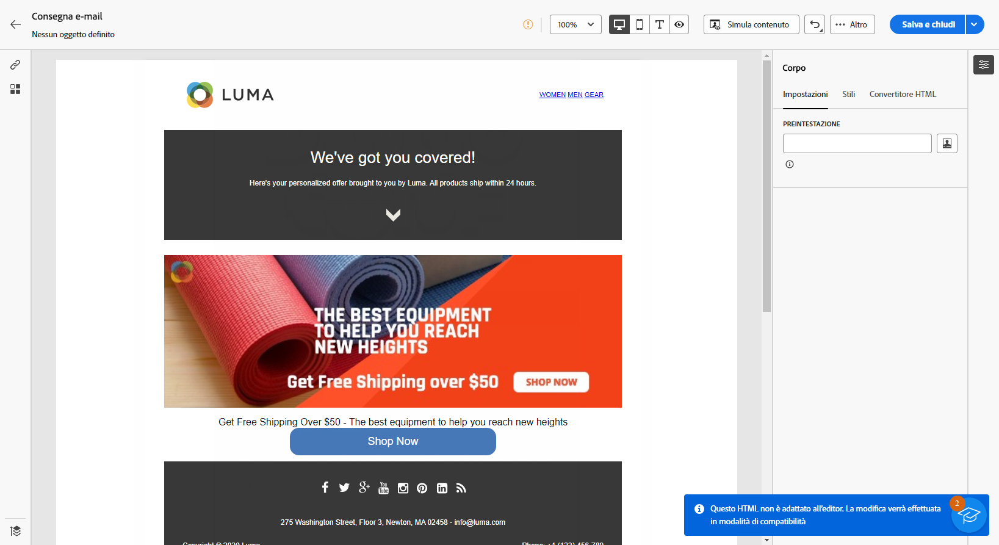
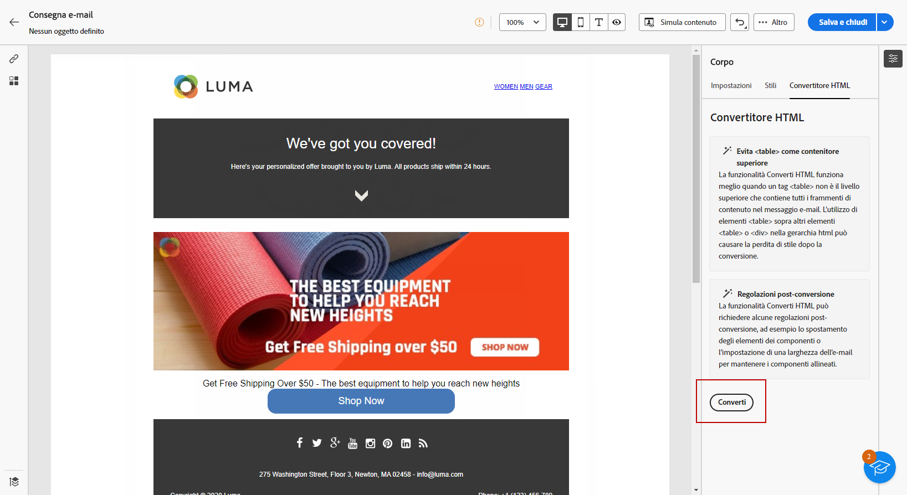

# Importare il contenuto dell’e-mail {#existing-content}

>[!CONTEXTUALHELP]
>id="acw_deliveries_email_import_content"
>title="Utilizzare un contenuto e-mail esistente"
>abstract="E-mail designer consente di importare contenuti HTML esistenti. Tali contenuti possono essere un file HTML con un foglio di stile incorporato o una cartella .zip con il file HTML, il foglio di stile (.css) e le immagini."

Puoi importare i contenuti HTML esistenti in E-mail designer. Tali contenuti possono essere:

* un **file HTML** con un foglio di stile incorporato;
* Una cartella **.zip** con il file HTML, il foglio di stile (.css) e le immagini.

>[!NOTE]
>
>La struttura del file .zip non è soggetta a specifici vincoli. Tuttavia, i riferimenti devono essere relativi e coerenti con la struttura ad albero della cartella .zip.

➡️ [Guarda il video su questa funzione](#video)

Per importare un file contenente contenuti HTML, attieniti alla procedura seguente.

1. Nella pagina Home di [E-mail designer](get-started-email-designer.md), seleziona **[!UICONTROL Importa HTML]**.

   {zoomable="yes"}

1. Trascina e rilascia il file HTML o .zip che contiene il tuo contenuto HTML e fai clic su **[!UICONTROL Importa]**.

1. Una volta caricato il contenuto HTML, questo sarà in **[!UICONTROL Modalità di compatibilità]**.

   In questa modalità, puoi personalizzare il testo, aggiungere collegamenti o includere risorse nel contenuto.

   {zoomable="yes"}

1. Per sfruttare i componenti di contenuto di E-mail Designer, accedi alla scheda **[!UICONTROL HTML converter]** e fai clic su **[!UICONTROL Converti]**.

   {zoomable="yes"}

>[!NOTE]
>
>L’utilizzo di un tag `<table>` come primo livello in un file HTML può causare la perdita di stile, incluse le impostazioni di sfondo e larghezza nel tag del livello superiore.

1. Personalizza il file importato in base alle esigenze con le funzionalità di E-mail Designer. [Ulteriori informazioni](content-components.md)

## Video dimostrativo {#video}

Scopri come creare un’e-mail caricando HTML, renderla compatibile con E-mail Designer e convertirla in un modello.

>[!VIDEO](https://video.tv.adobe.com/v/3427633/?quality=12)