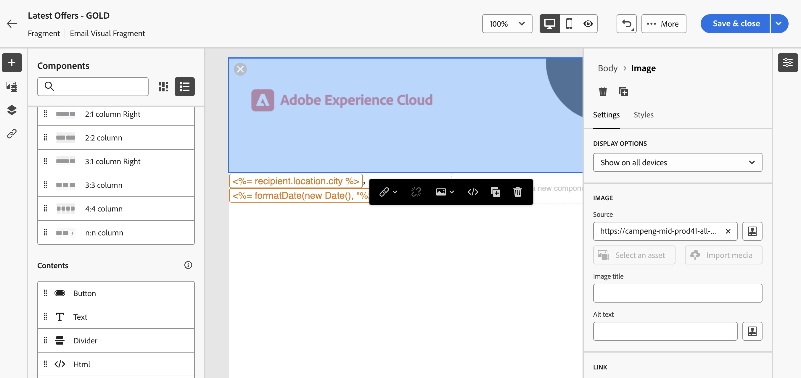

# Creare frammenti di contenuto {#fragments}

>[!CONTEXTUALHELP]
>id="acw_fragments_menu"
>title="Definisci il tuo frammento"
>abstract="Un frammento è un componente riutilizzabile a cui è possibile fare riferimento in una o più e-mail di campagne diverse. Questa funzionalità viene utilizzata per precreare più blocchi di contenuto personalizzati che possono essere utilizzati dagli utenti di marketing per assemblare rapidamente i contenuti delle e-mail in un processo di progettazione migliorato."

>[!CONTEXTUALHELP]
>id="acw_fragments_save"
>title="Salvataggio di frammenti"
>abstract="Salvataggio di frammenti"

>[!CONTEXTUALHELP]
>id="acw_fragments_create"
>title="Definisci il tuo frammento"
>abstract="Un frammento è un componente riutilizzabile a cui è possibile fare riferimento in una o più e-mail di campagne diverse."

>[!CONTEXTUALHELP]
>id="acw_fragments_properties"
>title="Proprietà dei frammenti"
>abstract="Proprietà dei frammenti"

>[!CONTEXTUALHELP]
>id="acw_fragments_type"
>title="Tipo di frammento"
>abstract="Seleziona il tipo di frammento. Per il momento, sono disponibili solo i frammenti visivi per le e-mail."

>[!CONTEXTUALHELP]
>id="acw_fragments_list"
>title="Definisci il tuo frammento"
>abstract="Un frammento è un componente riutilizzabile a cui è possibile fare riferimento in una o più e-mail di campagne diverse. Puoi anche utilizzare i frammenti nei modelli e-mail. Per il momento, sono disponibili solo i frammenti visivi."

>[!CONTEXTUALHELP]
>id="acw_fragments_details"
>title="Dettagli dei frammenti"
>abstract="Dettagli dei frammenti"

>[!CONTEXTUALHELP]
>id="acw_create_fragment"
>title="Definisci il tuo frammento"
>abstract="Un frammento è un componente riutilizzabile a cui è possibile fare riferimento in una o più e-mail di campagne diverse."

Un frammento è un componente riutilizzabile a cui è possibile fare riferimento in una o più e-mail di campagne diverse. Quando si modifica un frammento, viene aggiornato ogni contenuto che lo utilizza.

Questa funzionalità consente di precreare più blocchi di contenuto personalizzati che possono essere utilizzati dagli utenti di marketing per assemblare rapidamente i contenuti delle e-mail in un processo di progettazione migliorato.

Per utilizzare al meglio i frammenti:

* Crea frammenti visivi personalizzati, come descritto di seguito.
* Puoi utilizzarli tutte le volte che è necessario nel contenuto tramite E-mail Designer. Consulta [Aggiungi frammenti visivi alle e-mail](../email/use-visual-fragments.md).

## Creare un frammento visivo {#create-fragments}

Esistono due modi per creare i frammenti:

* Creare un frammento da zero utilizzando **[!UICONTROL Frammenti]** menu dedicato. [Scopri come](#create-from-scratch)

* Durante la progettazione di un contenuto, salva una parte del contenuto come frammento. [Scopri come](#save-as-fragment)

Una volta salvato, il frammento è disponibile per l’utilizzo in un’e-mail o in un modello e-mail. Indipendentemente dal fatto che sia stato creato da zero o da un contenuto esistente, ora puoi utilizzare questo frammento durante la creazione di qualsiasi contenuto all’interno di Campaign. Consulta [Aggiungere frammenti visivi](../email/use-visual-fragments.md).

### Creare un frammento da zero {#create-from-scratch}

Per creare un frammento da zero, segui la procedura riportata di seguito.

1. [Accedere all’elenco dei frammenti](#access-manage-fragments) tramite **[!UICONTROL Gestione dei contenuti]** > **[!UICONTROL Frammenti]** menu a sinistra.

   

1. Seleziona **[!UICONTROL Crea frammento]**.

1. Inserisci l’etichetta del frammento.

   

1. Se necessario, puoi definire opzioni aggiuntive, ad esempio il nome interno del frammento, la relativa cartella e una descrizione.

   >[!NOTE]
   >
   >Per il momento, puoi creare solo frammenti visivi.

1. Fai clic su **Crea** per configurare il contenuto del frammento.

1. Il [E-mail Designer](../email/get-started-email-designer.md) visualizzazioni. Modifica il contenuto in base alle esigenze, come faresti per qualsiasi e-mail all’interno di una campagna. Puoi aggiungere immagini, collegamenti, campi di personalizzazione e contenuti dinamici.

   

1. Quando il frammento è pronto, fai clic su **[!UICONTROL Salva e chiudi]**. Viene aggiunto al [elenco frammenti](#access-manage-fragments).

Questo frammento è ora pronto per essere utilizzato durante la creazione di qualsiasi [email](../email/get-started-email-designer.md) o [modello di contenuto](use-email-templates.md) all’interno di Campaign. [Scopri come](../email/use-visual-fragments.md)

### Salvare un contenuto come frammento {#save-as-fragment}

Qualsiasi contenuto e-mail può essere salvato come frammento per riutilizzi futuri. Durante la progettazione di un [modello di contenuto](use-email-templates.md) o un [email](../email/get-started-email-designer.md) di distribuzione, puoi salvare una parte del contenuto come frammento visivo. A questo scopo, segui la procedura indicata di seguito:

1. In [E-mail Designer](../email/get-started-email-designer.md), fare clic su **Altro** in alto a destra.

1. Seleziona **[!UICONTROL Salva come frammento]** dal menu a discesa.

   

1. Il **[!UICONTROL Salva come frammento]** schermo. Seleziona gli elementi da includere nel frammento, inclusi i campi di personalizzazione e il contenuto dinamico.

   >[!CAUTION]
   >
   >Potete selezionare solo le sezioni adiacenti. Non puoi selezionare una struttura vuota o un altro frammento.

   

1. Fai clic su **[!UICONTROL Crea]**. Inserisci il nome del frammento e salvalo.

   

   Questo contenuto è ora un frammento autonomo , aggiunto al [elenco frammenti](#manage-fragments), e accessibile dal menu dedicato. Ora puoi utilizzare questo frammento durante la creazione di qualsiasi [email](../email/get-started-email-designer.md) o [modello di contenuto](use-email-templates.md) all’interno di Campaign. [Scopri come](../email/use-visual-fragments.md)

>[!NOTE]
>
>Eventuali modifiche apportate al nuovo frammento non vengono propagate all’e-mail o al modello di origine. Allo stesso modo, quando il contenuto originale viene modificato all’interno dell’e-mail o del modello, il nuovo frammento non viene modificato.

## Gestire i frammenti {#manage-fragments}

È possibile modificare, aggiornare, duplicare o eliminare un frammento dall’elenco dei frammenti.

### Modificare e aggiornare un frammento {#edit-fragments}

Per modificare un frammento, effettua le seguenti operazioni.

1. Fai clic sul nome del frammento da modificare dal menu **[!UICONTROL Frammenti]** elenco.
1. Fai clic su **Modifica contenuto** per aprire il contenuto di questo frammento.

   

1. Apporta le modifiche necessarie e le salva.

>[!CAUTION]
>
>Qualsiasi modifica a un frammento viene propagata alle consegne e-mail o ai modelli che lo utilizzano.

### Eliminare un frammento {#delete-fragments}

Per eliminare un frammento, effettua le seguenti operazioni:

1. Individua l’elenco dei frammenti e fai clic su **[!UICONTROL Altre azioni]** accanto al frammento da eliminare.
1. Clic **Elimina** e confermare.

   

>[!CAUTION]
>
>Durante l’eliminazione di un frammento di contenuto, le consegne e i modelli e-mail che lo utilizzano vengono aggiornati e il frammento viene rimosso dal contenuto del messaggio. Se necessario, puoi interrompere l’ereditarietà. [Ulteriori informazioni](use-visual-fragments.md#break-inheritance)
>

### Duplicare un frammento {#duplicate-fragments}

Puoi duplicare facilmente un frammento per crearne uno nuovo. Per duplicare un frammento esistente, effettua le seguenti operazioni:

1. Individua l’elenco dei frammenti e fai clic su **[!UICONTROL Altre azioni]** accanto al frammento da eliminare.
1. Clic **Duplica** e confermare.
1. Inserisci l’etichetta del nuovo frammento e salva le modifiche.

   Il frammento viene aggiunto all’elenco dei frammenti. Puoi modificarlo e configurarlo in base alle esigenze.
