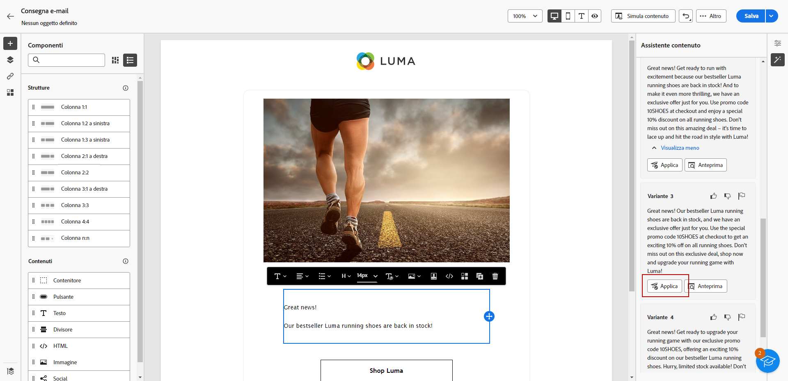
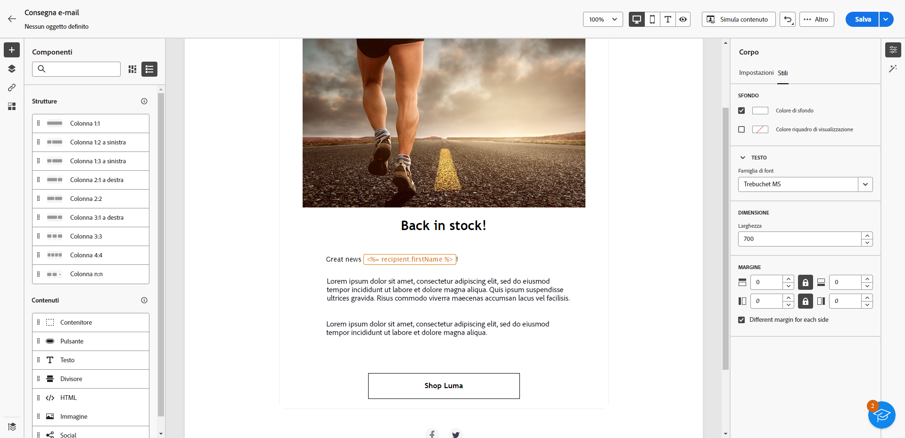
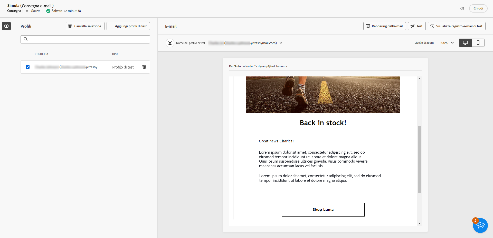

# Generazione di e-mail con l’Assistente AI {#generative-content}

>[!BEGINSHADEBOX]

**Sommario**

* [Introduzione all’Assistente AI](generative-gs.md)
* **[Generazione di e-mail con l’Assistente AI](generative-content.md)**
* [Generazione di SMS con l’Assistente AI](generative-sms.md)
* [Generazione di notifiche push con l’Assistente AI](generative-push.md)

>[!ENDSHADEBOX]

Dopo aver creato e personalizzato le e-mail, utilizza l’Assistente di intelligenza artificiale di Journey Optimizer in Campaign basato sull’intelligenza artificiale generativa per portare il contenuto al livello successivo.

L’Assistente AI può aiutarti a ottimizzare l’impatto delle consegne suggerendo contenuti diversi che hanno maggiori probabilità di risuonare con il pubblico.

>[!NOTE]
>
>Prima di iniziare a utilizzare questa funzionalità, leggi l’articolo sui relativi [Guardrail e limitazioni](generative-gs.md#guardrails-and-limitations).

## Generazione di contenuti con l’Assistente AI {#generative-text}

1. Dopo aver creato e configurato la consegna e-mail, fai clic su **[!UICONTROL Modifica contenuto]**.

   Per ulteriori informazioni su come configurare la consegna e-mail, consulta [questa pagina](../email/create-email-content.md).

1. Compila i **[!UICONTROL Dettagli di base]** per la consegna. Al termine, fai clic su **[!UICONTROL Modifica contenuto]**.

1. Personalizza l’e-mail in base alle esigenze. [Ulteriori informazioni](content-components.md)

1. Accedere a **[!UICONTROL Assistente AI]** menu.

   È inoltre possibile selezionare una **[!UICONTROL Componente testo]** per impostare come destinazione solo un contenuto specifico.

   {zoomable=&quot;yes&quot;}

1. Ottimizza il contenuto descrivendo cosa desideri generare nel **[!UICONTROL Prompt]** campo.

   Se stai cercando assistenza per creare il tuo prompt, accedi al **[!UICONTROL Libreria dei prompt]** che offre una vasta gamma di idee per migliorare le tue consegne.

   {zoomable=&quot;yes&quot;}

1. Attiva/disattiva **[!UICONTROL Oggetto]** o **[!UICONTROL Preheader]** per includerli nella generazione delle varianti.

1. Nel menu di scelta rapida, abilita **[!UICONTROL Migliora con il contesto corrente]** Opzione per l’Assistente AI per personalizzare i nuovi contenuti in base alla consegna, al nome della consegna e al pubblico selezionato.

   >[!IMPORTANT]
   >
   > Il prompt deve sempre essere associato a un contesto specifico caricando una risorsa del brand o abilitando **[!UICONTROL Migliora il contenuto corrente]** opzione.

1. Clic **[!UICONTROL Carica risorsa marchio]** per aggiungere qualsiasi risorsa del brand contenente contenuti che possano fornire ulteriore contesto all’Assistente AI.

   {zoomable=&quot;yes&quot;}

1. Seleziona la **[!UICONTROL Strategia di comunicazione]** più adatta alle tue esigenze. Questa influisce sul tono e sullo stile del testo generato.

1. Scegli la **[!UICONTROL Lingua]** e il **[!UICONTROL Tono]** da applicare al testo generato. Il testo generato sarà quindi appropriato per il pubblico e lo scopo a cui è destinato.

   {zoomable=&quot;yes&quot;}

1. Una volta completato il prompt, fai clic su **[!UICONTROL Genera]**.

1. Sfoglia le **[!UICONTROL Varianti]** generate, individua il contenuto apprpriato e fai clic su **[!UICONTROL Applica]**.

   Fai clic su **[!UICONTROL Anteprima]** per visualizzare una versione a schermo intero della variante selezionata.

   {zoomable=&quot;yes&quot;}

1. Inserisci campi di personalizzazione per personalizzare il contenuto delle e-mail in base ai dati dei profili. [Ulteriori informazioni sulla personalizzazione dei contenuti](../personalization/personalize.md)

   {zoomable=&quot;yes&quot;}

1. Dopo aver definito il contenuto del messaggio, fai clic sul pulsante **[!UICONTROL Simula contenuto]** per controllare il rendering e verifica le impostazioni di personalizzazione con i profili di test. [Ulteriori informazioni](../preview-test/preview-content.md)

   {zoomable=&quot;yes&quot;}

1. Una volta definiti il contenuto, il pubblico e la pianificazione, puoi preparare la consegna e-mail. [Ulteriori informazioni](../monitor/prepare-send.md)

## Generazione di immagini con l’Assistente AI {#generative-image}

Nell’esempio seguente, scopri come sfruttare l’Assistente AI per ottimizzare e migliorare i contenuti, garantendo un’esperienza più semplice da usare. Segui questi passaggi:

1. Dopo aver creato e configurato la consegna e-mail, fai clic su **[!UICONTROL Modifica contenuto]**.

   Per ulteriori informazioni su come configurare la consegna e-mail, consulta [questa pagina](../email/create-email-content.md).

1. Compila i **[!UICONTROL Dettagli di base]** per la consegna. Al termine, fai clic su **[!UICONTROL Modifica contenuto e-mail]**.

1. Seleziona la risorsa da modificare con l’Assistente AI.

1. Dal menu di destra, seleziona **[!UICONTROL Assistente AI]**.

   {zoomable=&quot;yes&quot;}

1. Ottimizza il contenuto descrivendo cosa desideri generare nel **[!UICONTROL Prompt]** campo.

   Se stai cercando assistenza per creare il tuo prompt, accedi al **[!UICONTROL Libreria dei prompt]** che offre una vasta gamma di idee per migliorare le tue consegne.

   {zoomable=&quot;yes&quot;}

1. Clic **[!UICONTROL Carica risorsa marchio]** per aggiungere qualsiasi risorsa del brand contenente contenuti che possano fornire ulteriore contesto all’Assistente AI.

   >[!IMPORTANT]
   >
   > La richiesta deve essere sempre associata a un contesto specifico.

1. Seleziona le **[!UICONTROL Proporzioni]** della risorsa. Queste determinano la larghezza e l’altezza della risorsa.

   È possibile scegliere tra rapporti comuni, ad esempio 16:9, 4:3, 3:2 o 1:1, oppure immettere una dimensione personalizzata.

1. Personalizza le impostazioni di **[!UICONTROL Colore e tono]**, **[!UICONTROL Tipo di contenuto]**, **[!UICONTROL Illuminazione]** e **[!UICONTROL Composizione]** in base alle caratteristiche desiderate per la risorsa.

   {zoomable=&quot;yes&quot;}

1. Una volta completata la configurazione del prompt, fai clic su **[!UICONTROL Genera]**.

1. Sfoglia **[!UICONTROL Suggerimenti varianti]** per trovare la risorsa desiderata.

   Fai clic su **[!UICONTROL Anteprima]** per visualizzare una versione a schermo intero della variante selezionata.

   {zoomable=&quot;yes&quot;}

1. Scegli **[!UICONTROL Mostra simili]** se desideri visualizzare le immagini correlate a questa variante.

1. Una volta trovato il contenuto appropriato, fai clic su **[!UICONTROL Seleziona]**.

   {zoomable=&quot;yes&quot;}

1. Dopo aver definito il contenuto del messaggio, fai clic sul pulsante **[!UICONTROL Simula contenuto]** per controllare il rendering e verificare le impostazioni di personalizzazione con i profili di test.  [Ulteriori informazioni](../preview-test/preview-content.md)

   {zoomable=&quot;yes&quot;}

1. Una volta definiti il contenuto, il pubblico e la pianificazione, puoi preparare la consegna e-mail. [Ulteriori informazioni](../monitor/prepare-send.md)
