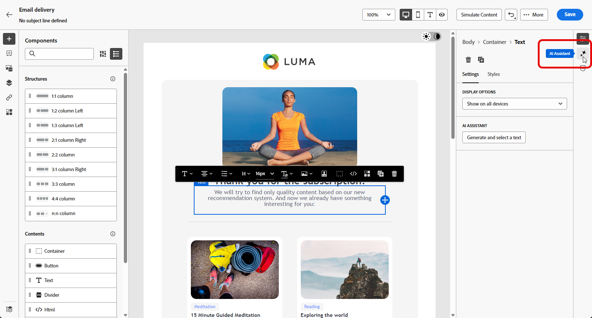
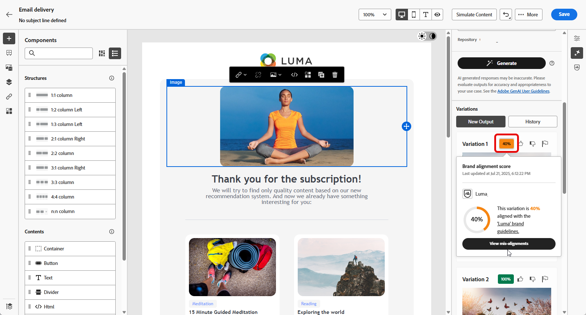

# Generazione di testo con Assistente contenuto {#generative-content}

Dopo aver creato e personalizzato le e-mail, puoi utilizzare la funzione Assistente contenuto basata sull’intelligenza artificiale generativa per elaborare ulteriormente il contenuto.

La funzione Assistente contenuto può aiutarti a ottimizzare l’impatto delle consegne suggerendo contenuti alternativi che possono essere receptiti meglio dal tuo pubblico.

>[!NOTE]
>
>Prima di iniziare a utilizzare questa funzionalità, leggi l’articolo sui relativi [Guardrail e limitazioni](generative-gs.md#guardrails-and-limitations).

Per generare e migliorare un contenuto e-mail con Assistente contenuto, segui i passaggi seguenti. Con Assistente contenuto è anche possibile creare il contenuto HTML completo, come descritto in [questa pagina](generative-email.md).

1. Dopo aver creato e configurato la consegna e-mail, fai clic su **[!UICONTROL Modifica contenuto]**.

   Per ulteriori informazioni su come configurare la consegna e-mail, consulta [questa pagina](../email/create-email-content.md).

1. Compila i **[!UICONTROL Dettagli di base]** per la consegna. Al termine, fai clic su **[!UICONTROL Modifica contenuto e-mail]**.

1. Personalizza l’e-mail in base alle tue esigenze.

1. Seleziona il **[!UICONTROL componente Testo]** che desideri aggiornare e accedi al menu Generazione di esperienze.

   {zoomable=&quot;yes&quot;}

1. Ottimizza il contenuto descrivendo cosa desideri generare.

   Abilita l’opzione **[!UICONTROL Migliora con il contesto corrente]** in Assistente contenuto, per personalizzare i nuovi contenuti in base alla consegna, al nome della consegna e al pubblico selezionato.

   {zoomable=&quot;yes&quot;}

1. Seleziona **[!UICONTROL Carica file]** per aggiungere eventuali risorse del tuo marchio in cui siano presenti contenuti che possano fornire ulteriore contesto alla funzione Assistente contenuto.

   Puoi anche fare clic su **[!UICONTROL Contenuto caricato]** per trovare i file aggiornati in precedenza. tieni presente che i contenuti caricati possono essere riutilizzati solo da parte dell’utente corrente.

1. Seleziona la **[!UICONTROL Strategia di comunicazione]** più adatta alle tue esigenze. Questa influisce sul tono e sullo stile del testo generato.

1. Scegli la **[!UICONTROL Lingua]** e il **[!UICONTROL Tono]** da applicare al testo generato. Il testo generato sarà quindi appropriato per il pubblico e lo scopo a cui è destinato.

   {zoomable=&quot;yes&quot;}

1. Utilizza il cursore per impostare la lunghezza del testo generato.

1. Una volta completato il prompt, fai clic su **[!UICONTROL Genera]**.

1. Sfoglia le **[!UICONTROL Varianti]** generate, individua il contenuto apprpriato e fai clic su **[!UICONTROL Applica]**.

   {zoomable=&quot;yes&quot;}

1. Inserisci campi di personalizzazione per personalizzare il contenuto delle e-mail in base ai dati dei profili. [Ulteriori informazioni sulla personalizzazione dei contenuti](../personalization/personalize.md)

   {zoomable=&quot;yes&quot;}

1. Dopo aver definito il contenuto del messaggio, fai clic sul pulsante **[!UICONTROL Simula contenuto]** per controllare il rendering e verifica le impostazioni di personalizzazione con i profili di test. [Ulteriori informazioni](../preview-test/preview-content.md)

   {zoomable=&quot;yes&quot;}

1. Una volta definiti il contenuto, il pubblico e la pianificazione, puoi preparare la consegna e-mail. [Ulteriori informazioni](../monitor/prepare-send.md)
