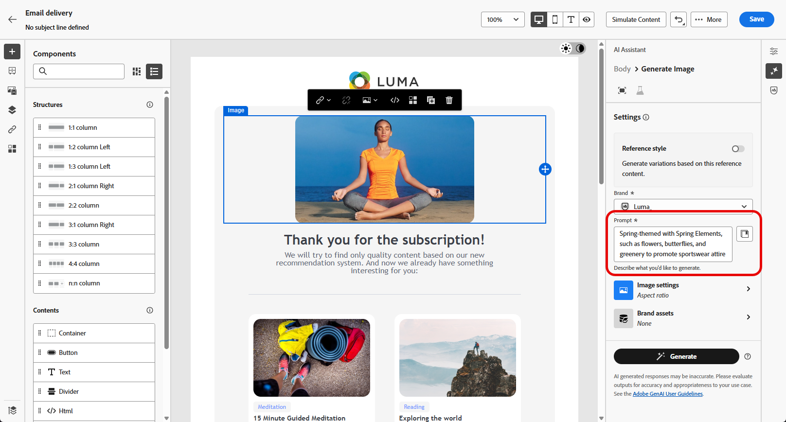

# Generazione di e-mail con l’Assistente AI {#generative-content}

>[!IMPORTANT]
>
>Prima di iniziare a utilizzare questa funzionalità, leggi le [protezioni e limitazioni](generative-gs.md#generative-guardrails) correlate.
> 
>
>È necessario accettare un [contratto utente](https://www.adobe.com/legal/licenses-terms/adobe-dx-gen-ai-user-guidelines.html){target="_blank"} prima di utilizzare l&#39;Assistente IA in Adobe Campaign Web. Per ulteriori informazioni, contatta il rappresentante Adobe.

Dopo aver creato e personalizzato le e-mail, utilizza l’Assistente AI in Adobe Campaign Web per migliorare il contenuto.

L’Assistente AI in Adobe Campaign Web consente di ottimizzare l’impatto delle consegne generando interi messaggi e-mail, contenuti di testo mirati e immagini su misura per la risonanza con il pubblico. Questo migliora le campagne e-mail per un coinvolgimento migliore.

Con le campagne e-mail, utilizza l’Assistente AI per generare e-mail, testo o immagini completi. Esplora le schede seguenti per scoprire come utilizzare l’Assistente AI in Adobe Campaign Web.

>[!BEGINTABS]

>[!TAB Generazione e-mail completa]

Nell’esempio seguente, sfrutta l’Assistente AI in Adobe Campaign Web per perfezionare un’e-mail esistente, personalizzandola per un evento speciale.

1. Dopo aver creato e configurato la consegna e-mail, fai clic su **[!UICONTROL Modifica contenuto]**.

   Per ulteriori informazioni sulla configurazione della consegna e-mail, consulta [questa pagina](../email/create-email-content.md).

1. Personalizza il layout in base alle esigenze e accedi al menu **[!UICONTROL Assistente AI]**.

   {zoomable="yes"}

1. Abilita l&#39;opzione **[!UICONTROL Usa contenuto originale]** per l&#39;Assistente AI per personalizzare nuovi contenuti in base al contenuto selezionato.

1. Ottimizzare il contenuto descrivendo cosa si desidera generare nel campo **[!UICONTROL Prompt]**.

   Se hai bisogno di assistenza per creare il prompt, accedi alla **[!UICONTROL Libreria prompt]**, che fornisce una vasta gamma di idee per migliorare le consegne.

   {zoomable="yes"}

1. Attiva/disattiva **[!UICONTROL Oggetto]** o **[!UICONTROL Preheader]** per includerli nella generazione della variante.

1. Personalizza la richiesta utilizzando l&#39;opzione **[!UICONTROL Impostazioni testo]**:

   * **[!UICONTROL Strategia di comunicazione]**: scegli lo stile di comunicazione più adatto al testo generato.
   * **[!UICONTROL Tono]**: assicurati che il tono dell&#39;e-mail risuoni con il pubblico. Che tu voglia essere informativo, giocoso o persuasivo, l’Assistente AI adatta il messaggio di conseguenza.

   {zoomable="yes"}

1. Scegli le **[!UICONTROL impostazioni immagine]**:

   * **[!UICONTROL Tipo di contenuto]**: categorizza la natura dell&#39;elemento visivo, distinguendo tra diverse forme di rappresentazione visiva come foto, immagini o immagini.
   * **[!UICONTROL Intensità visiva]**: controlla l&#39;impatto dell&#39;immagine regolandone l&#39;intensità. Un&#39;impostazione più bassa (2) crea un aspetto più morbido, mentre un&#39;impostazione più alta (10) rende l&#39;immagine più vibrante.
   * **[!UICONTROL Colore e tono]**: regola l&#39;aspetto complessivo dei colori e dell&#39;umore o dell&#39;atmosfera veicolati.
   * **[!UICONTROL Illuminazione]**: modifica l&#39;illuminazione nell&#39;immagine per modellarne l&#39;atmosfera ed evidenziare elementi specifici.
   * **[!UICONTROL Composizione]**: dispone gli elementi all&#39;interno della cornice dell&#39;immagine.

   {zoomable="yes"}

1. Dal menu **[!UICONTROL Risorse per i marchi]**, fai clic su **[!UICONTROL Carica risorsa per i marchi]** per aggiungere qualsiasi risorsa per i marchi che fornisca contesto aggiuntivo all&#39;Assistente di intelligenza artificiale, oppure selezionane una caricata in precedenza.

   I file precedentemente caricati sono disponibili nel menu a discesa **[!UICONTROL Risorse del brand caricate]**. Attiva/disattiva le risorse da includere nella generazione.

1. Una volta completato il prompt, fai clic su **[!UICONTROL Genera]**.

1. Sfoglia le **[!UICONTROL Varianti]** generate e fai clic su **[!UICONTROL Anteprima]** per visualizzare una versione a schermo intero della variante selezionata.

1. Passa all&#39;opzione **[!UICONTROL Perfeziona]** nella finestra **[!UICONTROL Anteprima]** per accedere ad altre funzioni di personalizzazione:

   * **[!UICONTROL Riformula]**: l&#39;Assistente AI riformula il messaggio in diversi modi, mantenendo la scrittura fresca e coinvolgente per diversi tipi di pubblico.
   * **[!UICONTROL Usa un linguaggio più semplice]**: semplifica la lingua per garantire chiarezza e accessibilità a un pubblico più ampio.

   Puoi anche modificare il **[!UICONTROL Tono]** e la **[!UICONTROL Strategia di comunicazione]** del tuo testo.

   {zoomable="yes"}

1. Fai clic su **[!UICONTROL Seleziona]** una volta trovato il contenuto appropriato.

1. Inserisci campi di personalizzazione per personalizzare il contenuto delle e-mail in base ai dati del profilo. Quindi, fai clic sul pulsante **[!UICONTROL Simula contenuto]** per controllare il rendering e controllare le impostazioni di personalizzazione con i profili di test. [Ulteriori informazioni](../preview-test/preview-content.md)

   {zoomable="yes"}

Quando definisci contenuto, pubblico e pianificazione, prepara la consegna e-mail. [Ulteriori informazioni](../monitor/prepare-send.md)

>[!TAB Generazione solo testo]

Nell’esempio seguente, sfrutta l’Assistente AI per migliorare il contenuto dell’invito e-mail per un evento imminente.

1. Dopo aver creato e configurato la consegna e-mail, fai clic su **[!UICONTROL Modifica contenuto]**.

   Per ulteriori informazioni sulla configurazione della consegna e-mail, consulta [questa pagina](../email/create-email-content.md).

1. Seleziona un **[!UICONTROL componente testo]** per eseguire il targeting di contenuto specifico e accedi al menu **[!UICONTROL Assistente IA]**.

   {zoomable="yes"}

1. Abilita l&#39;opzione **[!UICONTROL Usa contenuto originale]** per l&#39;Assistente AI per personalizzare nuovi contenuti in base al contenuto selezionato.

1. Ottimizzare il contenuto descrivendo cosa si desidera generare nel campo **[!UICONTROL Prompt]**.

   Se hai bisogno di assistenza per creare il prompt, accedi alla **[!UICONTROL Libreria prompt]**, che fornisce una vasta gamma di idee per migliorare le consegne.

   {zoomable="yes"}

1. Personalizza la richiesta utilizzando l&#39;opzione **[!UICONTROL Impostazioni testo]**:

   * **[!UICONTROL Strategia di comunicazione]**: scegli lo stile di comunicazione più adatto al testo generato.
   * **[!UICONTROL Tono]**: assicurati che il tono dell&#39;e-mail risuoni con il pubblico. Che tu voglia essere informativo, giocoso o persuasivo, l’Assistente AI adatta il messaggio di conseguenza.
   * **Lunghezza testo**: utilizza il cursore per selezionare la lunghezza desiderata del testo.

   {zoomable="yes"}

1. Dal menu **[!UICONTROL Risorse per i marchi]**, fai clic su **[!UICONTROL Carica risorsa per i marchi]** per aggiungere qualsiasi risorsa per i marchi che fornisca contesto aggiuntivo all&#39;Assistente di intelligenza artificiale, oppure selezionane una caricata in precedenza.

   I file precedentemente caricati sono disponibili nel menu a discesa **[!UICONTROL Risorse del brand caricate]**. Attiva/disattiva le risorse da includere nella generazione.

1. Una volta completato il prompt, fai clic su **[!UICONTROL Genera]**.

1. Sfoglia le **[!UICONTROL Varianti]** generate e fai clic su **[!UICONTROL Anteprima]** per visualizzare una versione a schermo intero della variante selezionata.

1. Passa all&#39;opzione **[!UICONTROL Perfeziona]** nella finestra **[!UICONTROL Anteprima]** per accedere ad altre funzioni di personalizzazione:

   * **[!UICONTROL Utilizza come contenuto di riferimento]**: la variante scelta funge da contenuto di riferimento per la generazione di altri risultati.
   * **[!UICONTROL Elaborare]**: espandere argomenti specifici, fornendo ulteriori dettagli per una migliore comprensione e coinvolgimento.
   * **[!UICONTROL Riepiloga]**: riduci i punti chiave in riepiloghi chiari e concisi per attirare l&#39;attenzione e incoraggiare ulteriori letture.
   * **[!UICONTROL Riformula]**: riformula il messaggio in diversi modi, mantenendo la scrittura fresca e coinvolgente per diversi tipi di pubblico.
   * **[!UICONTROL Usa un linguaggio più semplice]**: semplifica la lingua per garantire chiarezza e accessibilità a un pubblico più ampio.

   Puoi anche modificare il **[!UICONTROL Tono]** e la **[!UICONTROL Strategia di comunicazione]** del tuo testo.

   {zoomable="yes"}

1. Fai clic su **[!UICONTROL Seleziona]** una volta trovato il contenuto appropriato.

1. Inserisci campi di personalizzazione per personalizzare il contenuto delle e-mail in base ai dati del profilo. Quindi, fai clic sul pulsante **[!UICONTROL Simula contenuto]** per controllare il rendering e controllare le impostazioni di personalizzazione con i profili di test. [Ulteriori informazioni](../preview-test/preview-content.md)

Quando definisci contenuto, pubblico e pianificazione, prepara la consegna e-mail. [Ulteriori informazioni](../monitor/prepare-send.md)

>[!TAB Generazione immagine]

Nell’esempio seguente, scopri come sfruttare l’Assistente AI per ottimizzare e migliorare le risorse, garantendo un’esperienza più semplice da usare.

1. Dopo aver creato e configurato la consegna e-mail, fai clic su **[!UICONTROL Modifica contenuto]**.

   Per ulteriori informazioni sulla configurazione della consegna e-mail, consulta [questa pagina](../email/create-email-content.md).

1. Compila i **[!UICONTROL Dettagli di base]** per la consegna. Al termine, fai clic su **[!UICONTROL Modifica contenuto e-mail]**.

1. Seleziona la risorsa da modificare con l’Assistente AI.

1. Dal menu di destra, selezionare **[!UICONTROL Assistente AI]**.

   {zoomable="yes"}

1. Abilita l&#39;opzione **[!UICONTROL Stile riferimento]** affinché l&#39;Assistente AI personalizzi nuovi contenuti in base al contenuto selezionato.

1. Ottimizzare il contenuto descrivendo cosa si desidera generare nel campo **[!UICONTROL Prompt]**.

   Se hai bisogno di assistenza per creare il prompt, accedi alla **[!UICONTROL Libreria prompt]**, che fornisce una vasta gamma di idee per migliorare le consegne.

   {zoomable="yes"}

1. Personalizza la richiesta utilizzando l&#39;opzione **[!UICONTROL Impostazioni immagine]**:

   * **[!UICONTROL Proporzioni]**: determina la larghezza e l&#39;altezza della risorsa. Scegliete uno dei rapporti più comuni, ad esempio 16:9, 4:3, 3:2 o 1:1, oppure immettete una dimensione personalizzata.
   * **[!UICONTROL Tipo di contenuto]**: categorizza la natura dell&#39;elemento visivo, distinguendo tra diverse forme di rappresentazione visiva come foto, immagini o immagini.
   * **[!UICONTROL Intensità visiva]**: controlla l&#39;impatto dell&#39;immagine regolandone l&#39;intensità. Un&#39;impostazione più bassa (2) crea un aspetto più morbido, mentre un&#39;impostazione più alta (10) rende l&#39;immagine più vibrante.
   * **[!UICONTROL Colore e tono]**: regola l&#39;aspetto complessivo dei colori e dell&#39;umore o dell&#39;atmosfera veicolati.
   * **[!UICONTROL Illuminazione]**: modifica l&#39;illuminazione nell&#39;immagine per modellarne l&#39;atmosfera ed evidenziare elementi specifici.
   * **[!UICONTROL Composizione]**: dispone gli elementi all&#39;interno della cornice dell&#39;immagine.

   {zoomable="yes"}

1. Dal menu **[!UICONTROL Risorse per i marchi]**, fai clic su **[!UICONTROL Carica risorsa per i marchi]** per aggiungere qualsiasi risorsa per i marchi che fornisca contesto aggiuntivo all&#39;Assistente di intelligenza artificiale, oppure selezionane una caricata in precedenza.

   I file precedentemente caricati sono disponibili nel menu a discesa **[!UICONTROL Risorse del brand caricate]**. Attiva/disattiva le risorse da includere nella generazione.

1. Una volta completata la configurazione del prompt, fai clic su **[!UICONTROL Genera]**.

1. Sfoglia i **[!UICONTROL suggerimenti varianti]** per trovare la risorsa desiderata.

   Fai clic su **[!UICONTROL Anteprima]** per visualizzare una versione a schermo intero della variante selezionata.

   {zoomable="yes"}

1. Scegliere **[!UICONTROL Genera simili]** se si desidera visualizzare le immagini correlate a questa variante.

   {zoomable="yes"}

1. Fai clic su **[!UICONTROL Seleziona]** una volta trovato il contenuto appropriato.

1. Dopo aver definito il contenuto del messaggio, fai clic sul pulsante **[!UICONTROL Simula contenuto]** per controllare il rendering e verificare le impostazioni di personalizzazione con i profili di test. [Ulteriori informazioni](../preview-test/preview-content.md)

1. Quando definisci contenuto, pubblico e pianificazione, prepara la consegna e-mail. [Ulteriori informazioni](../monitor/prepare-send.md)

>[!ENDTABS]

## Video dimostrativo {#video}

Scopri come utilizzare l’Assistente AI per generare contenuti e-mail, testo e immagini completi.

>[!VIDEO](https://video.tv.adobe.com/v/3428984)