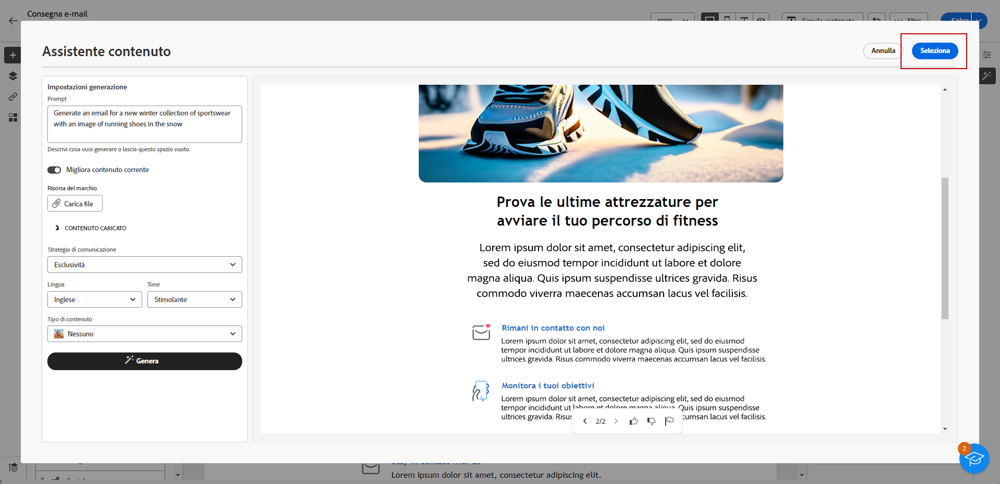

# Generare un’e-mail con Assistente contenuto {#generative-email}

L’Assistente contenuto migliora l’impatto delle comunicazioni generando automaticamente contenuti e-mail completi, facendoti risparmiare tempo e garantendo una qualità costante. Utilizzando la IA generativa puoi creare facilmente e-mail coinvolgenti che possono essere recepiti meglio dal tuo pubblico, rendendo la comunicazione più efficace ed efficiente.

>[!NOTE]
>
>Prima di iniziare a utilizzare questa funzionalità, leggi l’articolo sui relativi [Guardrail e limitazioni](generative-gs.md#guardrails-and-limitations).

Per generare un contenuto e-mail con Assitente contenuto, segui i passaggi seguenti. Con Assistente contenuto è anche possibile migliorare un contenuto esistente, come descritto in [questa pagina](generative-content.md).

1. Dopo aver creato e configurato la consegna e-mail, fai clic su **[!UICONTROL Crea contenuto]**.

   Per ulteriori informazioni su come configurare la consegna e-mail, consulta [questa pagina](../email/create-email-content.md).

1. Compila i **[!UICONTROL Dettagli di base]** per la consegna. Al termine, fai clic su **[!UICONTROL Modifica corpo dell’e-mail]**.

1. Scegli il modello di progettazione su cui desideri che Assistente contenuto basi l’e-mail generata.

   Puoi anche importare un file HTML.

1. Dal menu di destra, seleziona **[!UICONTROL Generazione di esperienze]**.

   

1. Ottimizza il contenuto descrivendo cosa desideri generare.

   Di seguito sono riportati alcuni esempi di prompt:

   * Per una newsletter: genera una newsletter mensile con articoli di viaggio, punti salienti della destinazione e offerte esclusive per gli iscritti.
   * Per feedback e sondaggi: crea un’e-mail che invita la clientela a fornire feedback sulla recente esperienza software e a partecipare a un sondaggio sul miglioramento dei prodotti.
   * Per e-mail di anniversario o compleanno: genera un’e-mail di compleanno per celebrare questo giorno speciale e offrire uno sconto per il compleanno.

   

1. Se desideri aggiungere una risorsa del marchio con contenuto che possa fornire ulteriore contesto all&#39;Assistente contenuto, seleziona **[!UICONTROL Carica file]**.

   Puoi anche fare clic su **[!UICONTROL Contenuto caricato]** per trovare i file aggiornati in precedenza. tieni presente che i contenuti caricati possono essere riutilizzati solo da parte dell’utente corrente.

1. Seleziona la **[!UICONTROL Strategia di comunicazione]** più adatta alle tue esigenze. Questa influisce sul tono e sullo stile dell’e-mail generata.

1. Scegli la **[!UICONTROL Lingua]** e il **[!UICONTROL Tono]** da applicare al testo generato. Il testo generato sarà quindi appropriato per il pubblico e lo scopo a cui è destinato.

   

1. Personalizza le impostazioni delle risorse del **[!UICONTROL Tipo di contenuto]** per farle corrispondere con le caratteristiche desiderate.

1. Una volta completato il prompt, fai clic su **[!UICONTROL Genera]**.

1. Sfoglia i **[!UICONTROL Suggerimenti per le varianti]** per trovare l’e-mail desiderata. Fai clic su **[!UICONTROL Anteprima]** per visualizzare una versione a schermo intero della variante selezionata.

   

1. Una volta trovato il contenuto appropriato, fai clic su **[!UICONTROL Seleziona]**.

   

1. Inserisci campi di personalizzazione per personalizzare il contenuto delle e-mail in base ai dati dei profili o, se necessario, per personalizzare ulteriormente il contenuto. [Ulteriori informazioni sulla personalizzazione dei contenuti](../personalization/personalize.md)

1. Dopo aver definito il contenuto dell’e-mail, fai clic sul pulsante **[!UICONTROL Simula contenuto]** per controllare il rendering e verificare le impostazioni di personalizzazione con i profili di test.  [Ulteriori informazioni](../preview-test/preview-content.md)

   

1. Una volta definiti il contenuto, il pubblico e la pianificazione, puoi preparare la consegna e-mail. [Ulteriori informazioni](../monitor/prepare-send.md)
