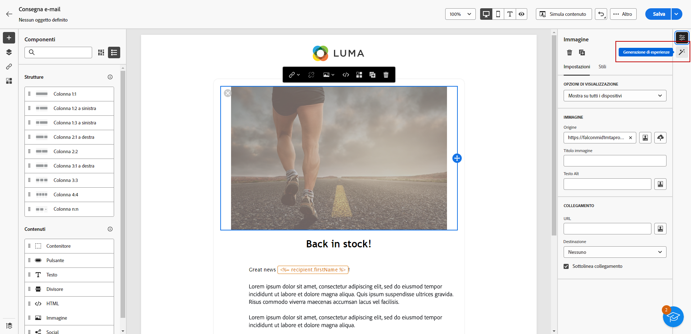
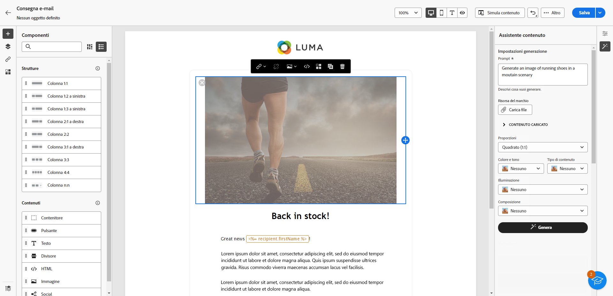
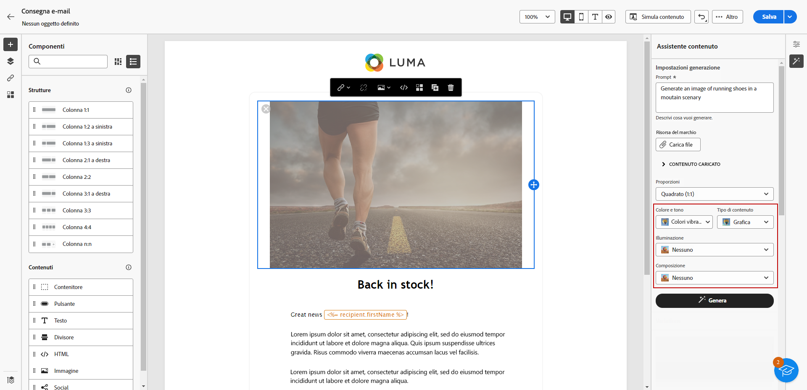
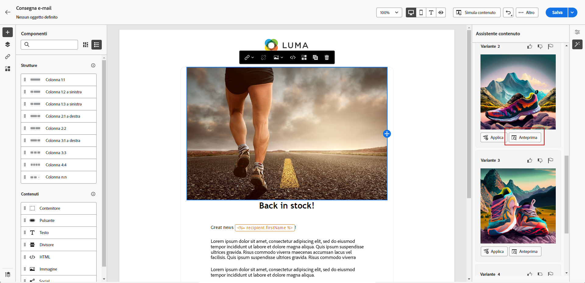
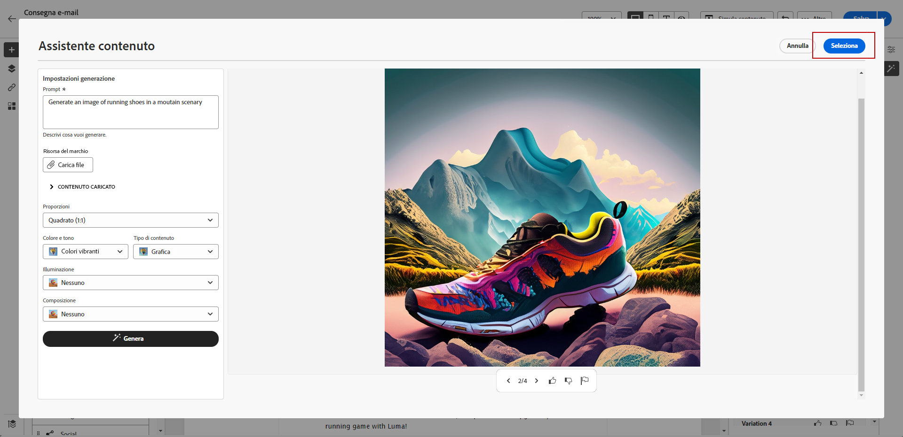
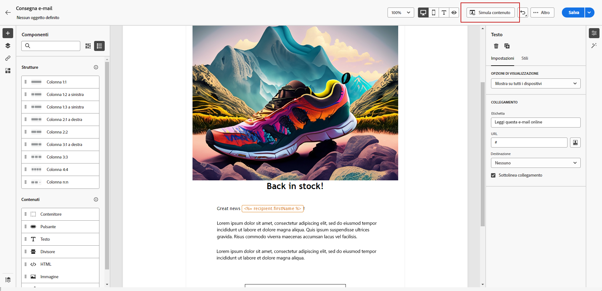

# Generazione di immagini con Assistente contenuto {#generative-image}

Dopo aver creato e personalizzato le e-mail, puoi migliorare il contenuto utilizzando la funzione Assistente contenuto, basata sull’intelligenza artificiale generativa. Questa funzione semplifica il processo di personalizzazione e di miglioramento dei contenuti.

Per generare e migliorare un’immagine nelle e-mail con Assistente contenuto, segui i passaggi seguenti. Con Assistente contenuto è anche possibile creare il contenuto HTML completo come descritto in [questa pagina](generative-email.md), o generare contenuti di testo come spiegato in [questa pagina](generative-content.md).

>[!NOTE]
>
>Prima di iniziare a utilizzare questa funzionalità, leggi l’articolo sui relativi [Guardrail e limitazioni](generative-gs.md#guardrails-and-limitations).

Nell’esempio seguente, scopri come sfruttare la funzione Assistente contenuto per ottimizzare e migliorare i contenuti, per un’esperienza più intuitiva. Segui questi passaggi:

1. Dopo aver creato e configurato la consegna e-mail, fai clic su **[!UICONTROL Modifica contenuto]**.

   Per ulteriori informazioni su come configurare la consegna e-mail, consulta [questa pagina](../email/create-email-content.md).

1. Compila i **[!UICONTROL Dettagli di base]** per la consegna. Al termine, fai clic su **[!UICONTROL Modifica contenuto e-mail]**.

1. Seleziona la risorsa da modificare con Assistente contenuto.

1. Dal menu di destra, seleziona **[!UICONTROL Generazione di esperienze]**.

   {zoomable=&quot;yes&quot;}

1. Aggiungi un prompt per ottimizzare i risultati.

   {zoomable=&quot;yes&quot;}

1. Seleziona **[!UICONTROL Carica file]** se desideri aggiungere eventuali risorse del tuo marchio in cui siano presenti contenuti che possano fornire ulteriore contesto alla funzione Assistente contenuto.

   Puoi anche fare clic su **[!UICONTROL Contenuto caricato]** per trovare i file aggiornati in precedenza. tieni presente che i contenuti caricati possono essere riutilizzati solo da parte dell’utente corrente.

1. Seleziona le **[!UICONTROL Proporzioni]** della risorsa. Queste determinano la larghezza e l’altezza della risorsa.

   Puoi scegliere tra le proporzioni di uso più comune come 16:9, 4:3, 3:2 o 1:1, oppure immettere una dimensione personalizzata.

1. Personalizza le impostazioni di **[!UICONTROL Colore e tono]**, **[!UICONTROL Tipo di contenuto]**, **[!UICONTROL Illuminazione]** e **[!UICONTROL Composizione]** in base alle caratteristiche desiderate per la risorsa.

   {zoomable=&quot;yes&quot;}

1. Una volta completata la configurazione del prompt, fai clic su **[!UICONTROL Genera]**.

1. Sfoglia i **[!UICONTROL Suggerimenti per le varianti]** per trovare la risorsa desiderata. Fai clic su **[!UICONTROL Anteprima]** per visualizzare una versione a schermo intero della variante selezionata.

   {zoomable=&quot;yes&quot;}

1. Una volta trovato il contenuto appropriato, fai clic su **[!UICONTROL Seleziona]**.

   {zoomable=&quot;yes&quot;}

1. Dopo aver definito il contenuto del messaggio, fai clic sul pulsante **[!UICONTROL Simula contenuto]** per controllare il rendering e verificare le impostazioni di personalizzazione con i profili di test.  [Ulteriori informazioni](../preview-test/preview-content.md)

   {zoomable=&quot;yes&quot;}

1. Una volta definiti il contenuto, il pubblico e la pianificazione, puoi preparare la consegna e-mail. [Ulteriori informazioni](../monitor/prepare-send.md)
