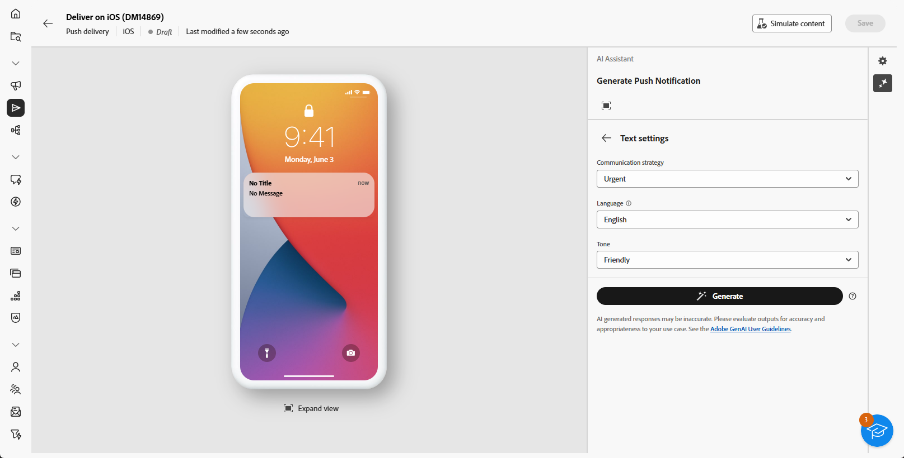

# Generazione di notifiche push con l’Assistente IA {#generative-push}

>[!BEGINSHADEBOX]

**Sommario**

* [Introduzione all’Assistente IA](generative-gs.md)
* [Generazione di e-mail con l’Assistente IA](generative-content.md)
* [Generazione di SMS con l’Assistente IA](generative-sms.md)
* **[Generazione di notifiche push con l’Assistente AI](generative-push.md)**

>[!ENDSHADEBOX]

L’Assistente AI può aiutarti a ottimizzare l’impatto delle consegne suggerendo contenuti diversi che hanno maggiori probabilità di risuonare con il pubblico.

>[!NOTE]
>
>Prima di iniziare a utilizzare questa funzionalità, leggi l’articolo sui relativi [Guardrail e limitazioni](generative-gs.md#guardrails-and-limitations).

Nell’esempio seguente, sfrutteremo l’assistente AI per creare messaggi convincenti per creare un’esperienza del cliente più coinvolgente.

1. Dopo aver creato e configurato la consegna delle notifiche push, fai clic su **[!UICONTROL Modifica contenuto]**.

   Per ulteriori informazioni su come configurare la consegna push, consulta [questa pagina](../push/create-push.md).

1. Compila i **[!UICONTROL Dettagli di base]** per la consegna. Al termine, fai clic su **[!UICONTROL Modifica contenuto]**.

1. Personalizza la notifica push in base alle esigenze. [Ulteriori informazioni](../push/content-push.md)

1. Accedere a **[!UICONTROL Mostra Assistente IA]** menu.

   {zoomable=&quot;yes&quot;}

1. Abilita **[!UICONTROL Usa contenuto originale]** Opzione per l’Assistente AI per personalizzare i nuovi contenuti in base alla consegna, al nome della consegna e al pubblico selezionato.

   >[!IMPORTANT]
   >
   > La richiesta deve essere sempre associata al contenuto corrente.

   {zoomable=&quot;yes&quot;}

1. Ottimizza il contenuto descrivendo cosa desideri generare nel **[!UICONTROL Prompt]** campo.

   Se stai cercando assistenza per creare il tuo prompt, accedi al **[!UICONTROL Libreria dei prompt]** che offre una vasta gamma di idee per migliorare le tue consegne.

   {zoomable=&quot;yes&quot;}

1. Seleziona **[!UICONTROL Carica risorsa marchio]** per aggiungere qualsiasi risorsa del brand contenente contenuti che possano fornire ulteriore contesto all’Assistente AI.

1. Scegliere il campo da generare: **[!UICONTROL Titolo]**, **[!UICONTROL Sottotitolo]** o **[!UICONTROL Messaggio]**.

1. Personalizza il prompt con le diverse opzioni:

   * **[!UICONTROL Strategia di comunicazione]**: scegli lo stile di comunicazione più adatto al testo generato.
   * **[!UICONTROL Lingua]**: seleziona la lingua in cui desideri generare il contenuto.
   * **[!UICONTROL Tono]**: il tono dell’e-mail dovrebbe risuonare con il pubblico. Che tu voglia essere informativo, giocoso o persuasivo, l’Assistente AI può adattare il messaggio di conseguenza.

   {zoomable=&quot;yes&quot;}

1. Una volta completato il prompt, fai clic su **[!UICONTROL Genera]**.

1. Sfoglia il generato **[!UICONTROL Varianti]** e fai clic su **[!UICONTROL Anteprima]** per visualizzare una versione a schermo intero della variante selezionata.

1. Accedi a **[!UICONTROL Perfeziona]** all&#39;interno del **[!UICONTROL Anteprima]** finestra per accedere ad altre funzioni di personalizzazione:

   * **[!UICONTROL Utilizza come contenuto di riferimento]**: la variante scelta fungerà da contenuto di riferimento per la generazione di altri risultati.

   * **[!UICONTROL Riformula]**: l’Assistente AI può riformulare il messaggio in diversi modi, mantenendo la scrittura fresca e coinvolgente per diversi tipi di pubblico.

   * **[!UICONTROL Utilizza un linguaggio più semplice]**: sfrutta l’Assistente AI per semplificare la lingua, garantendo chiarezza e accessibilità a un pubblico più ampio.

   {zoomable=&quot;yes&quot;}

1. Una volta trovato il contenuto appropriato, fai clic su **[!UICONTROL Seleziona]**.

1. Inserisci campi di personalizzazione per personalizzare il contenuto delle e-mail in base ai dati dei profili. Quindi, fai clic su **[!UICONTROL Simula contenuto]** per controllare il rendering e controllare le impostazioni di personalizzazione con i profili di test. [Ulteriori informazioni](../preview-test/preview-content.md)

   {zoomable=&quot;yes&quot;}

Una volta definiti il contenuto, il pubblico e la pianificazione, sei pronto per preparare la consegna push. [Ulteriori informazioni](../monitor/prepare-send.md)

