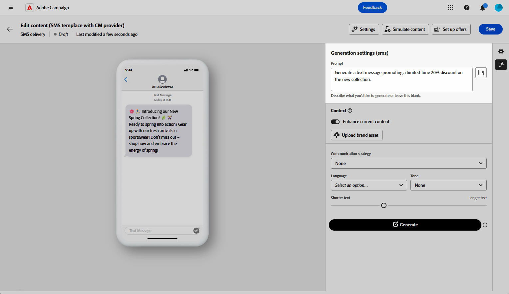
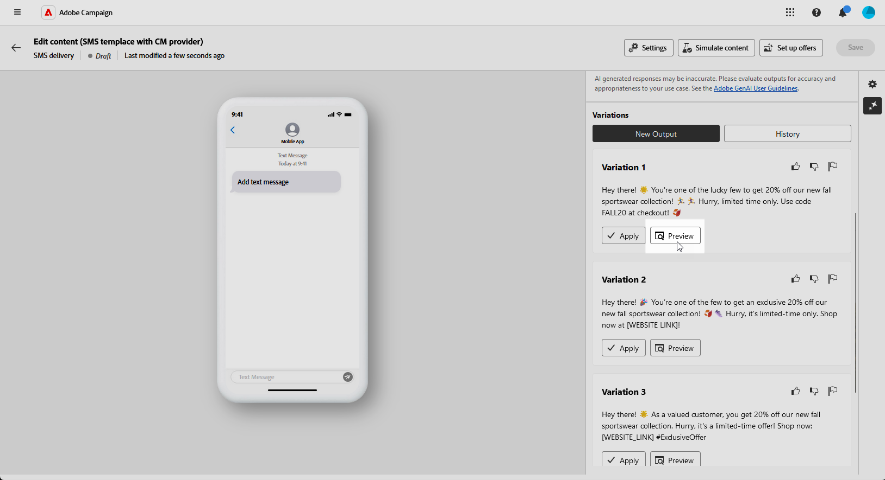

# Generazione di SMS con l’Assistente IA {#generative-sms}

>[!BEGINSHADEBOX]

**Sommario**

* [Introduzione all’Assistente IA](generative-gs.md)
* [Generazione di e-mail con l’Assistente IA](generative-content.md)
* Generazione di SMS con l’Assistente IA
* [Generazione di notifiche push con l’Assistente IA](generative-push.md)

>[!ENDSHADEBOX]

Dopo aver creato e personalizzato i messaggi SMS in base alle esigenze del pubblico, porta la tua comunicazione a un livello successivo con l’aiuto dell’Assistente AI in Campaign, basato su una tecnologia di intelligenza artificiale innovativa.

Questo comodo strumento offre suggerimenti intelligenti per perfezionare i contenuti, garantendo una riproduzione efficace dei messaggi e massimizzando il coinvolgimento.

>[!NOTE]
>
>Prima di iniziare a utilizzare questa funzionalità, leggi l’articolo sui relativi [Guardrail e limitazioni](generative-gs.md#generative-guardrails).

1. Dopo aver creato e configurato la consegna SMS, fai clic su **[!UICONTROL Modifica contenuto]**.

   Per ulteriori informazioni su come configurare la consegna SMS, consulta [questa pagina](../sms/create-sms.md).

1. Compila i **[!UICONTROL Dettagli di base]** per la consegna. Al termine, fai clic su **[!UICONTROL Modifica contenuto]**.

1. Personalizza il messaggio SMS in base alle esigenze. [Ulteriori informazioni](../sms/content-sms.md)

1. Accedere a **[!UICONTROL Mostra Assistente IA]** menu.

   {zoomable=&quot;yes&quot;}

1. Abilita **[!UICONTROL Usa contenuto originale]** Opzione per l’Assistente AI per personalizzare i nuovi contenuti in base alla consegna, al nome della consegna e al pubblico selezionato.

   >[!IMPORTANT]
   >
   > La richiesta deve essere sempre associata al contenuto corrente.

1. Ottimizza il contenuto descrivendo cosa desideri generare nel **[!UICONTROL Prompt]** campo.

   Se stai cercando assistenza per creare il tuo prompt, accedi al **[!UICONTROL Libreria dei prompt]** che offre una vasta gamma di idee per migliorare le tue consegne.

   {zoomable=&quot;yes&quot;}

1. Seleziona **[!UICONTROL Carica risorsa marchio]** per aggiungere qualsiasi risorsa del brand contenente contenuti che possano fornire ulteriore contesto all’Assistente AI.

1. Personalizza il prompt con le diverse opzioni:

   * **[!UICONTROL Strategia di comunicazione]**: seleziona l’approccio di comunicazione desiderato per il testo generato.
   * **[!UICONTROL Lingua]**: scegli la lingua per il contenuto della variante.
   * **[!UICONTROL Tono]**: assicurati che il testo sia appropriato per il pubblico e lo scopo.
   * **[!UICONTROL Lunghezza]**: seleziona la lunghezza del contenuto utilizzando il cursore intervallo.

   {zoomable=&quot;yes&quot;}

1. Una volta completato il prompt, fai clic su **[!UICONTROL Genera]**.

1. Sfoglia il generato **[!UICONTROL Varianti]** e fai clic su **[!UICONTROL Anteprima]** per visualizzare una versione a schermo intero della variante selezionata.

1. Accedi a **[!UICONTROL Perfeziona]** all&#39;interno del **[!UICONTROL Anteprima]** finestra per accedere a funzioni di personalizzazione aggiuntive e perfezionare la variante in base alle preferenze:

   * **[!UICONTROL Utilizza come contenuto di riferimento]**: la variante scelta fungerà da contenuto di riferimento per la generazione di altri risultati.

   * **[!UICONTROL Utilizza un linguaggio più semplice]**: l’assistente AI ti aiuta a scrivere messaggi chiari e concisi che tutti possono comprendere.

   * **[!UICONTROL Riformula]**: l’Assistente AI riformula il messaggio per mantenere il coinvolgimento per diversi tipi di pubblico.

   {zoomable=&quot;yes&quot;}

1. Una volta trovato il contenuto appropriato, fai clic su **[!UICONTROL Seleziona]**.

1. Inserisci campi di personalizzazione per personalizzare il contenuto SMS in base ai dati dei profili. [Ulteriori informazioni sulla personalizzazione dei contenuti](../personalization/personalize.md)

   {zoomable=&quot;yes&quot;}

1. Dopo aver definito il contenuto del messaggio, fai clic sul pulsante **[!UICONTROL Simula contenuto]** per controllare il rendering e verifica le impostazioni di personalizzazione con i profili di test. [Ulteriori informazioni](../preview-test/preview-content.md)

   {zoomable=&quot;yes&quot;}

Una volta definiti il contenuto, il pubblico e la pianificazione, sei pronto per preparare la consegna SMS. [Ulteriori informazioni](../monitor/prepare-send.md)
