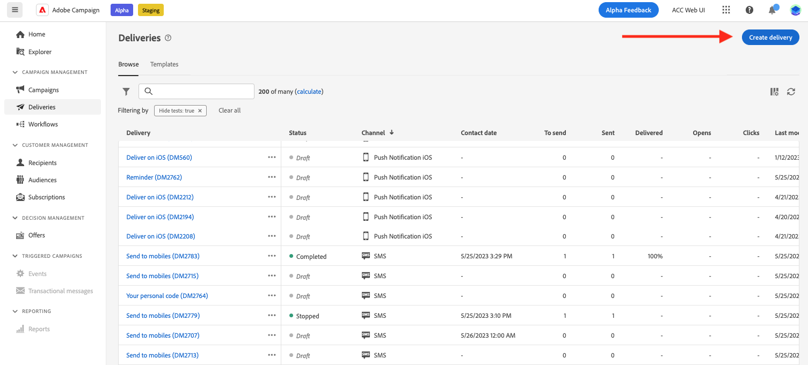

# Introduzione ai messaggi{#gs-messages}

Con Adobe Campaign, puoi inviare campagne cross-channel tra cui e-mail, SMS e notifiche push e misurarne l’efficacia utilizzando vari rapporti dedicati. Questi messaggi sono progettati e inviati tramite consegna e possono essere personalizzati per ogni destinatario. Queste consegne possono essere autonome o incluse nel contesto di una campagna di marketing.

Adobe Campaign v8 è dotato dei canali di consegna seguenti:

* **Canale e-mail**: le consegne e-mail ti consentono di inviare e-mail personalizzate alla popolazione target. Scopri come creare e inviare un’e-mail in [questa pagina](../email/create-email.md).

* **Canale SMS**: le consegne sui canali mobili ti consentono di inviare SMS personalizzati alla popolazione target.  Scopri come creare e inviare SMS in [questa pagina](../sms/create-sms.md).

* **Canale dell’app mobile**: le consegne tramite app mobile ti consentono di inviare notifiche ai sistemi iOS e Android.  Scopri come creare e inviare notifiche push in [questa pagina](../push/gs-push.md).

## Creare una consegna {#create-delivery}

Puoi creare consegne autonome dalla **[!UICONTROL Consegne]** menu a sinistra, o creare consegne nel contesto di una campagna di marketing, dal menu **[!UICONTROL Campagne]** menu a sinistra.

>[!BEGINTABS]

>[!TAB Creare una consegna autonoma]

Per creare una consegna autonoma, segui questi passaggi:

1. Accedi a **[!UICONTROL Consegne]** nel menu di navigazione a sinistra, quindi fai clic su **[!UICONTROL Creare una consegna]** pulsante.

   

1. Scegli un canale per la consegna. Per ulteriori informazioni sui canali di consegna e su come definirne il contenuto, consulta queste sezioni:

   * [Canale e-mail](../email/create-email.md)
   * [Canale di notifica push](../push/gs-push.md)
   * [Canale SMS](../sms/create-sms.md)

1. Definisci il pubblico della consegna per il target principale e il gruppo di controllo. Ulteriori informazioni sui tipi di pubblico in [questa sezione](../audience/about-audiences.md).
1. Definisci il contenuto del messaggio.
1. (facoltativo) definisci la pianificazione della consegna. Se non è definita alcuna pianificazione, i messaggi vengono inviati immediatamente dopo aver fatto clic sul pulsante **[!UICONTROL Invia]** pulsante.
1. Fai clic su  **[!UICONTROL Rivedi e invia]** per controllare le impostazioni.
1. Utilizza il  **[!UICONTROL Simula contenuto]** per testare la consegna e le impostazioni di personalizzazione. Ulteriori informazioni sulla simulazione dei messaggi in [questa sezione](../preview-test/preview-test.md).
1. Fai clic su  **[!UICONTROL Prepara]** per calcolare la popolazione target e generare i messaggi. Il passaggio di preparazione può richiedere alcuni minuti. Una volta completata la preparazione, i messaggi sono pronti per l’invio. In caso di errore, passa a **Registri** per controllare avvisi e avvisi.
1. Controllare i risultati e fare clic su  **[!UICONTROL Invia]** per iniziare a inviare messaggi.
1. Una volta inviati i messaggi, passa a **Rapporti** per accedere alle metriche chiave. Ulteriori informazioni sui rapporti di consegna in [questa sezione](../reporting/delivery-reports.md).

>[!TAB Creare una consegna in una campagna]

Per creare una consegna in una campagna, effettua le seguenti operazioni:

1. Crea una campagna o aprila. Ulteriori informazioni su [campagne di marketing](../campaigns/gs-campaigns.md).
1. Crea un flusso di lavoro o aprilo esistente.
1. Aggiungere e configurare un **[!UICONTROL Creare un pubblico]** e fai clic sul pulsante `+`pulsante.

   

   Il **[!UICONTROL Creare un pubblico]** l’attività è descritta in [questa sezione](../workflows/workflow-activities.md#targeting).

1. Seleziona un’attività di consegna: **[!UICONTROL E-mail]**, **[!UICONTROL SMS]**, **[!UICONTROL Notifica push (Android)]** o **[!UICONTROL Notifica push (iOS)]**. Scopri le attività dei canali di consegna in un flusso di lavoro e come definirne il contenuto [sezione](../workflows/workflow-activities.md#channel).
1. Avvia il flusso di lavoro e controlla i registri.

Puoi anche aggiungere consegne in una campagna senza creare un flusso di lavoro. Per ottenere questo risultato, vai al **[!UICONTROL Consegne]** della campagna e fai clic sulla scheda **[!UICONTROL Creare una consegna]** pulsante.

I passaggi di configurazione sono simili a quelli per le consegne autonome.

Per ulteriori informazioni su come configurare una campagna e gestire le consegne che appartengono a una campagna, consulta [questa sezione](../campaigns/gs-campaigns.md).

>[!ENDTABS]

## Aggiungere personalizzazione{#personalization}

I messaggi consegnati da Adobe Campaign possono essere personalizzati in vari modi. [Ulteriori informazioni sulle funzionalità di personalizzazione](../personalization/personalize.md).

Utilizza Campaign per creare contenuti dinamici e inviare messaggi personalizzati. Le funzionalità di personalizzazione possono essere combinate per migliorare i messaggi e creare un’esperienza utente personalizzata.

Puoi personalizzare il contenuto del messaggio in diversi modi:

* Inserendo **campi di personalizzazione** dinamici

   I campi di personalizzazione vengono utilizzati per la personalizzazione di primo livello dei messaggi. Puoi selezionare qualsiasi campo disponibile nel database dall’editor di personalizzazione. Per una consegna, puoi selezionare qualsiasi campo correlato al destinatario, al messaggio o alla consegna. Questi attributi di personalizzazione possono essere inseriti nella riga dell’oggetto o nel corpo dei messaggi. [Ulteriori informazioni](../personalization/personalize.md)

* Inserimento di **blocchi di contenuto** predefiniti

   Campaign viene fornito con un set di blocchi di personalizzazione contenenti un rendering specifico da inserire nelle consegne. Ad esempio, puoi aggiungere un logo, un messaggio di auguri o un collegamento alla pagina mirror del messaggio. I blocchi di contenuto sono disponibili da una voce dedicata nell’editor per la personalizzazione. [Ulteriori informazioni](../personalization/personalize.md#ootb-content-blocks)

* Crea **contenuto condizionale**

   Configura il contenuto condizionale per aggiungere la personalizzazione dinamica in base, ad esempio, al profilo del destinatario. I blocchi di testo e/o le immagini vengono inseriti quando una particolare condizione è vera. [Ulteriori informazioni](../personalization/conditions.md)

* Aggiungi **offerte personalizzate**

   Inserisci offerte personalizzate nel contenuto del messaggio, a seconda della posizione del destinatario, del meteo corrente o dell’ultimo ordine di acquisto.

## Anteprima e test delle consegne

Una volta definito il contenuto del messaggio, puoi visualizzarne l’anteprima per controllare il rendering dei messaggi e verificare le impostazioni di personalizzazione con i profili di test. [Ulteriori informazioni](../preview-test/preview-test.md)

## Registri di consegna e di tracciamento{#gs-tracking-logs}

Il monitoraggio delle consegne dopo l’invio è un passaggio fondamentale per garantire l’efficienza delle campagne di marketing e l’effettivo raggiungimento dei clienti. Puoi monitorare una consegna, oltre a capire come vengono gestiti errori e quarantene.

## Duplicare una consegna{#delivery-duplicate}

Puoi creare una copia di una consegna esistente dall’elenco delle consegne o dal dashboard di consegna.

Per duplicare una consegna dall’elenco delle consegne, effettua le seguenti operazioni:

1. Fai clic sul pulsante dei tre punti a destra, accanto al nome della consegna da duplicare.
1. Seleziona  **[!UICONTROL Duplica]**.
1. Conferma duplicazione: la nuova dashboard di consegna si apre nella schermata centrale.

Per duplicare una consegna dal dashboard, effettua le seguenti operazioni:

1. Apri la consegna e fai clic su  **[!UICONTROL ...Altro]** nella sezione superiore dello schermo.
1. Seleziona  **[!UICONTROL Duplica]**.
1. Conferma duplicazione: la nuova consegna sostituisce la consegna corrente nella schermata centrale.

