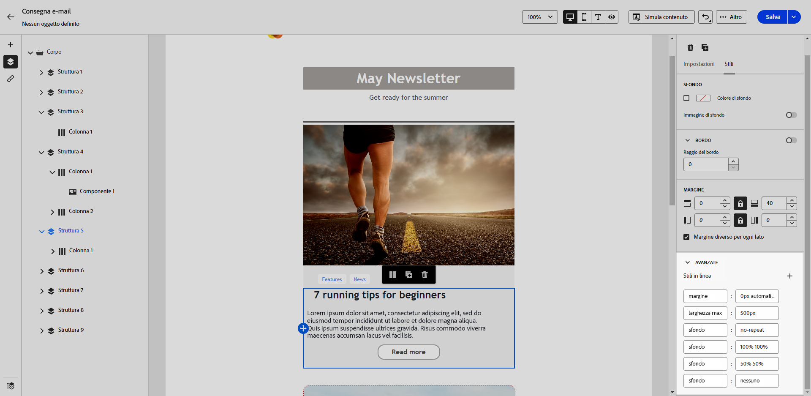
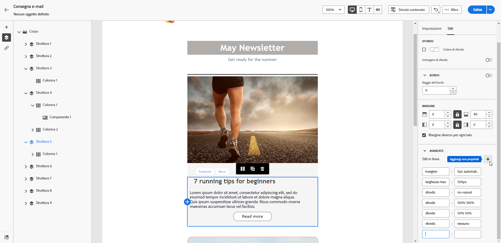

# Aggiungere attributi di stile in linea {#adding-inline-styling-attributes}

Nell’interfaccia di E-mail Designer, quando selezioni un elemento e visualizzi le relative impostazioni nel riquadro a destra, personalizzi gli attributi in linea e i relativi valori per quell’elemento specifico.

1. Seleziona un componente direttamente nel contenuto o utilizza la **[!UICONTROL struttura di navigazione]** disponibile nel riquadro a sinistra.

1. Dalla scheda **[!UICONTROL Stili]**, fai clic sul menu a discesa **[!UICONTROL Avanzate]**.

   {zoomable="yes"}

1. Modifica i valori degli attributi esistenti.

1. Aggiungere nuove proprietà utilizzando il pulsante **+**. Aggiungi qualsiasi attributo e valore conforme agli stili CSS.

   {zoomable="yes"}

Lo stile viene applicato all’elemento selezionato.

>[!NOTE]
>
>Se per gli elementi secondari non sono definiti attributi di stile specifici, viene ereditato lo stile dell’elemento principale.