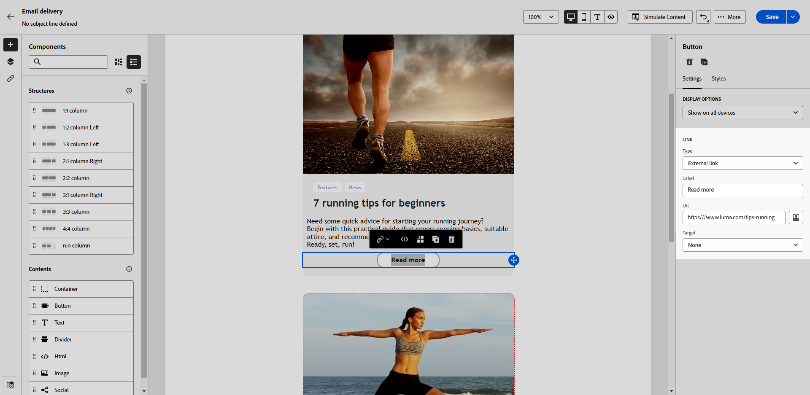

# Aggiungere collegamenti e tenere traccia dei messaggi {#tracking}

Utilizza E-mail Designer per aggiungere collegamenti al contenuto e tenere traccia dei messaggi inviati, consentendo di monitorare il comportamento dei destinatari.

## Inserire i collegamenti {#insert-links}

Durante la progettazione di un messaggio, puoi aggiungere collegamenti al contenuto.

>[!NOTE]
>
>Quando il tracciamento è abilitato, vengono tracciati tutti i collegamenti inclusi nel contenuto del messaggio.

Per inserire collegamenti nel contenuto dell’e-mail, effettua le seguenti operazioni:

1. Selezionare un elemento e fare clic su **[!UICONTROL Inserisci collegamento]** nella barra degli strumenti contestuale.

1. Scegli il tipo di collegamento da creare:

   {zoomable="yes"}

   * **[!UICONTROL Collegamento esterno]**: inserire un collegamento a un URL esterno.

     >[!AVAILABILITY]
     >
     >Le seguenti funzionalità (collegamento a **[!UICONTROL Pagina di destinazione]**, **[!UICONTROL Collegamento abbonamento]** e **[!UICONTROL Collegamento annullamento abbonamento]**) sono in disponibilità limitata (LA). Ciò significa che sono limitate a chi esegue la migrazione **da Adobe Campaign Standard ad Adobe Campaign v8** e non possono essere distribuite in nessun altro ambiente.

   * **[!UICONTROL Pagina di destinazione]**: inserisci un collegamento a una pagina di destinazione. Se selezioni una pagina di destinazione dinamica (con l&#39;opzione **[!UICONTROL Servizio dall&#39;URL]** selezionata), puoi selezionare qualsiasi servizio dall&#39;elenco. [Ulteriori informazioni](../landing-pages/create-lp.md#define-actions-on-form-submission)

     {zoomable="yes"}

   * **[!UICONTROL Collegamento sottoscrizione]**: inserire un collegamento a un servizio di sottoscrizione. Quando gli utenti fanno clic sul collegamento, vengono indirizzati alla pagina di destinazione dell’abbonamento a cui si fa riferimento nel servizio selezionato. [Ulteriori informazioni](../audience/manage-services.md#create-service)

     {zoomable="yes"}

   * **[!UICONTROL Collegamento per l&#39;annullamento dell&#39;abbonamento]**: inserire un collegamento a un servizio di annullamento dell&#39;abbonamento. Quando gli abbonati fanno clic sul collegamento, vengono indirizzati alla pagina di destinazione per l’annullamento dell’abbonamento a cui si fa riferimento nel servizio selezionato. [Ulteriori informazioni](../audience/manage-services.md#create-service)

   <!--* **[!UICONTROL Mirror page]**: Add a link to display the email content in a web browser. [Learn more]-->

1. Inserisci l’URL desiderato nel campo corrispondente, oppure seleziona una pagina di destinazione o un servizio, e definisci le impostazioni e gli stili del collegamento.

1. Aggiungi un’**[!UICONTROL Etichetta]** e un **[!UICONTROL Collegamento]**.

1. Salva le modifiche.

1. Dopo aver creato il collegamento, modificalo dalla scheda **[!UICONTROL Impostazioni]**, se necessario.

   * Modifica il collegamento e modifica la relativa **[!UICONTROL destinazione]**.
   * Scegli se sottolineare il collegamento selezionando l’opzione corrispondente.

   {zoomable="yes"}

>[!NOTE]
>
>I messaggi e-mail di tipo marketing devono includere un collegamento di rinuncia, che non è invece necessario per i messaggi transazionali. La categoria del messaggio (**[!UICONTROL Marketing]** o **[!UICONTROL Transazionale]**) è definita a livello della superficie di canale e durante la creazione del messaggio.

Includi un collegamento specifico alla pagina speculare in tutti i messaggi e-mail. Ulteriori informazioni sulla pagina mirror in [questa sezione](mirror-page.md).

## Gestire il tracciamento {#manage-tracking}

L&#39;[E-mail Designer](create-email-content.md) ti consente di gestire gli URL tracciati, ad esempio modificando il tipo di tracciamento per ogni collegamento.

1. Fai clic sull&#39;icona **[!UICONTROL Collegamenti]** nel riquadro a sinistra per visualizzare l&#39;elenco di tutti gli URL nel contenuto da tracciare.

   Questo elenco fornisce una vista centralizzata e aiuta a individuare ogni URL nel contenuto dell’e-mail.

1. Per modificare un collegamento, fai clic sull’icona a forma di matita corrispondente.

   {zoomable="yes"}

1. Se necessario, modificare il **[!UICONTROL Tipo di tracciamento]**:

   {zoomable="yes"}

   Per ogni URL tracciato, imposta la modalità di tracciamento su uno dei seguenti valori:

   * **[!UICONTROL Tracciato]**: attiva il tracciamento per questo URL.
   * **[!UICONTROL Rinuncia]**: contrassegna questo URL come URL di rinuncia o di annullamento dell&#39;abbonamento.
   * **[!UICONTROL Pagina mirror]**: contrassegna l&#39;URL come URL della pagina mirror.
   * **[!UICONTROL Mai]**: impedisce il tracciamento di questo URL. <!--This information is saved: if the URL appears again in a future message, its tracking is automatically deactivated.-->

1. Aggiungi una **[!UICONTROL Categoria]** al collegamento per raggruppare i collegamenti tracciati e fai clic su **[!UICONTROL Salva]**.

   {zoomable="yes"}

1. Dopo aver inviato la consegna, accedi al rapporto di consegna. Nel menu **[!UICONTROL Tracciamento]**, il rapporto di **[!UICONTROL URL e flussi di clic]** mostra gli URL di consegna più visitati. [Ulteriori informazioni](../reporting/gs-reports.md)