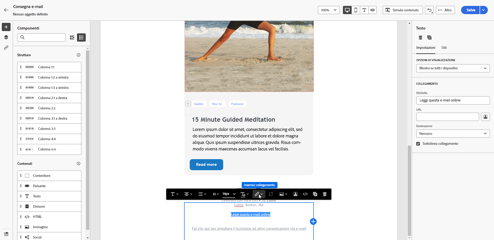
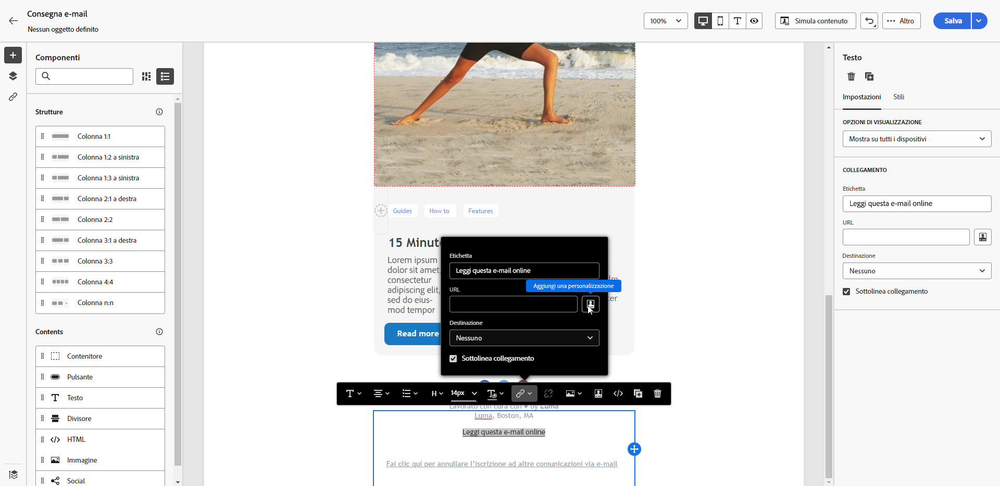
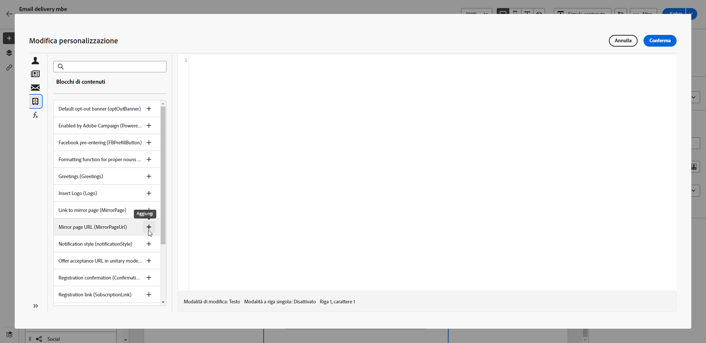

# Pagina mirror {#mirror-page}

La pagina speculare è una versione online dell’e-mail. L’aggiunta di un collegamento alla pagina speculare è una buona pratica nel marketing via e-mail. Gli utenti possono accedere alla pagina speculare di un’e-mail, ad esempio, se riscontrano problemi di rendering o immagini interrotte quando la visualizzano nella casella in entrata. La disponibilità di una versione online è consigliata anche per motivi di accessibilità o per incoraggiare la condivisione tramite social network.

La pagina speculare generata da Adobe Campaign include tutti i dati di personalizzazione.

{width="600" align="left"}

## Aggiungere un collegamento alla pagina mirror {#link-to-mirror-page}

In Adobe Campaign, inserisci un collegamento alla pagina speculare nel contenuto dell&#39;e-mail utilizzando il **blocco di personalizzazione** dedicato. Il blocco di personalizzazione incorporato **Collegamento a una pagina mirror** inserisce il seguente codice nel contenuto dell’e-mail: `<%@ include view='MirrorPage' %>`.

Per aggiungere un collegamento a una pagina speculare nell’e-mail, effettua le seguenti operazioni:

1. Selezionare un elemento (testo o immagine) e fare clic su **[!UICONTROL Inserisci collegamento]** nella barra degli strumenti contestuale.

   {zoomable="yes"}

1. Seleziona l’icona **[!UICONTROL Aggiungi personalizzazione]** per accedere al menu di personalizzazione.

   {zoomable="yes"}

1. Dal menu **[!UICONTROL Frammenti]**, seleziona **[!UICONTROL URL pagina mirror]**, quindi fai clic su **[!UICONTROL Aggiungi]**. [Scopri come utilizzare i frammenti di espressione](../content/use-expression-fragments.md)

   {zoomable="yes"}

La pagina mirror viene creata automaticamente.

Quando l’e-mail viene inviata, i destinatari che fanno clic sul collegamento alla pagina speculare visualizzano il contenuto dell’e-mail nel browser web predefinito.

Per impostazione predefinita, il periodo di conservazione per una pagina mirror è di **60 giorni**. Dopo questo periodo, la pagina speculare non è più disponibile.

>[!CAUTION]
>
>* I collegamenti alle pagine mirror sono generati automaticamente e non possono essere modificati. Includono tutti i dati personalizzati crittografati necessari per eseguire il rendering dell’e-mail originale. L’utilizzo di attributi personalizzati con valori elevati può generare lunghi URL di pagine mirror, impedendo al collegamento di funzionare nei browser web con una lunghezza massima dell’URL.
>
>* Nella bozza inviata ai profili di test, il collegamento alla pagina speculare non è attivo. È attivo solo nei messaggi finali.

## Generazione di pagine mirror {#mirror-page-generation}

Per impostazione predefinita, Adobe Campaign genera automaticamente la pagina speculare se il contenuto dell’e-mail non è vuoto e contiene un collegamento alla pagina speculare (noto anche come collegamento speculare).

Controlla la modalità di generazione della pagina mirror e-mail tramite le opzioni disponibili nelle proprietà di consegna. [Ulteriori informazioni](../advanced-settings/delivery-settings.md#mirror)