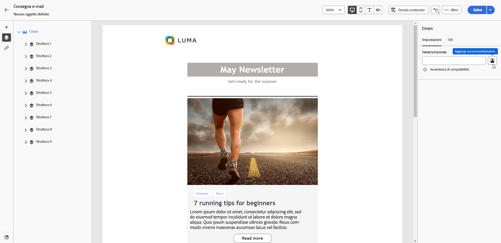

# Aggiungere una preintestazione a un’e-mail {#preheader}

>[!CONTEXTUALHELP]
>id="ac_edition_preheader"
>title="Aggiungere una preintestazione"
>abstract="Una preintestazione è un breve testo di riepilogo che segue l’oggetto quando un’e-mail viene visualizzata dal client e-mail. In molti casi, fornisce un breve riepilogo dell’e-mail e in genere consiste in una sola frase."

Una preintestazione è un breve testo che segue l’oggetto quando un’e-mail viene visualizzata da qualsiasi client e-mail principale.

In molti casi, fornisce un breve riepilogo del contenuto e in genere consiste in una sola frase.

>[!NOTE]
>
>Le preintestazioni non sono supportate da tutti i client e-mail. Se non è supportata, la preintestazione non viene visualizzata.

Per definire la preintestazione dell’e-mail, segui i passaggi indicati di seguito.

1. In [E-mail designer](create-email-content.md), aggiungi almeno un componente **[!UICONTROL Struttura]** per iniziare a progettare l’e-mail.

1. Fai clic sull&#39;icona **[!UICONTROL Struttura di navigazione]** nel riquadro a sinistra e seleziona **[!UICONTROL Corpo]**.

   {zoomable="yes"}

1. Nella scheda **[!UICONTROL Impostazioni]**, immetti del testo per la preintestazione.

1. Per personalizzarlo ulteriormente, fai clic sull’icona **[!UICONTROL Aggiungi personalizzazione]** a sinistra del campo **[!UICONTROL preintestazione]**.

   {zoomable="yes"}

1. Dalla finestra **[!UICONTROL Modifica Personalization]**, aggiungi [campi di personalizzazione](../personalization/personalize.md), [frammenti di espressione](../content/use-expression-fragments.md) e [contenuto condizionale](../personalization/conditions.md) utilizzando le voci dedicate a sinistra.

   {zoomable="yes"}

1. Fai clic su **[!UICONTROL Conferma]**.

La preintestazione è ora configurata per l’e-mail.