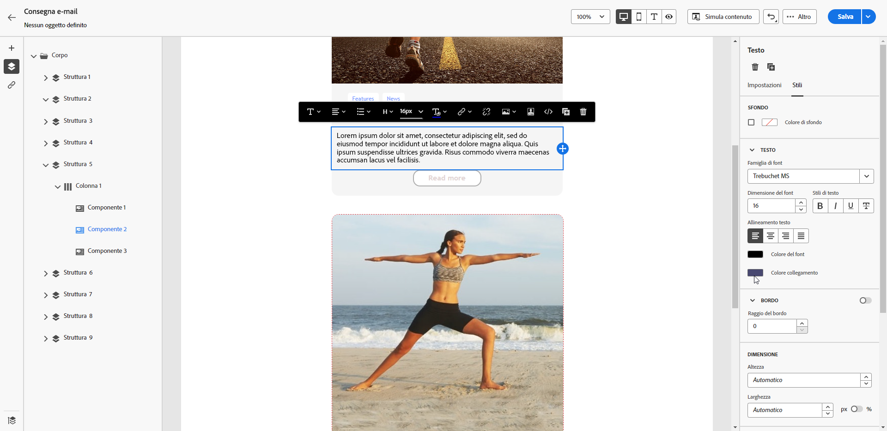

# Definire uno stile per i collegamenti {#styling-links}

In E-mail Designer è possibile sottolineare un collegamento e selezionarne il colore e la destinazione.

1. In un componente **[!UICONTROL Testo]** in cui è stato inserito un collegamento, seleziona il collegamento.

1. Nella scheda **[!UICONTROL Impostazioni]**, seleziona **[!UICONTROL Sottolinea collegamento]** per sottolineare l&#39;etichetta.

   {zoomable="yes"}

1. Per scegliere in che modo il pubblico verrà reindirizzato, usa il menu a discesa **[!UICONTROL Destinazione]**:

   * **[!UICONTROL Nessuno]**: apre il collegamento nello stesso frame in cui è stato fatto clic (impostazione predefinita).
   * **[!UICONTROL Vuoto]**: apre il collegamento in una nuova finestra o scheda.
   * **[!UICONTROL Autonomo]**: apre il collegamento nello stesso frame in cui è stato fatto clic.
   * **[!UICONTROL Elemento padre]**: apre il collegamento nel frame principale.
   * **[!UICONTROL Top]**: apre il collegamento nel corpo completo della finestra.

   {zoomable="yes"}

1. Per cambiare il colore del collegamento, fai clic su **[!UICONTROL Colore collegamento]** dalla scheda **[!UICONTROL Stili]**.

   {zoomable="yes"}

1. Salva le modifiche.