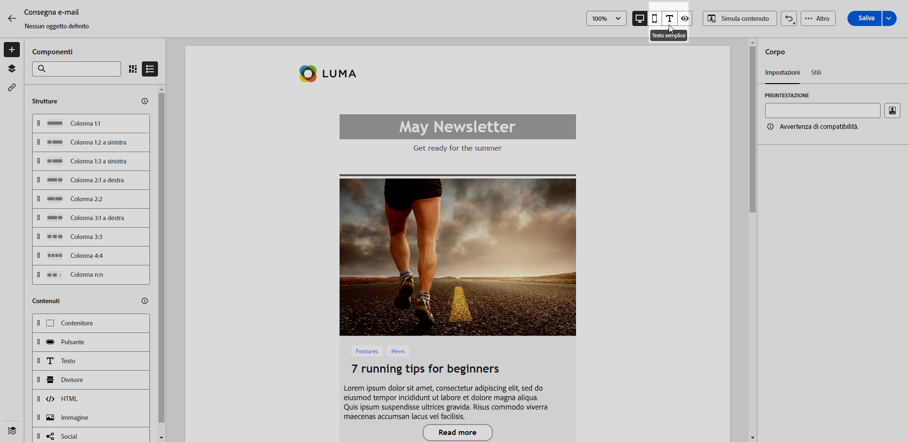
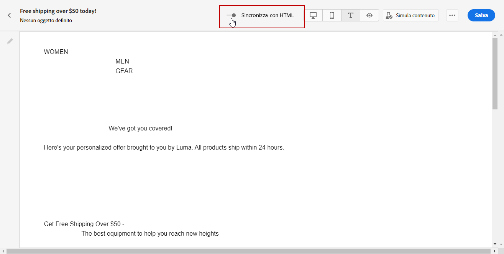
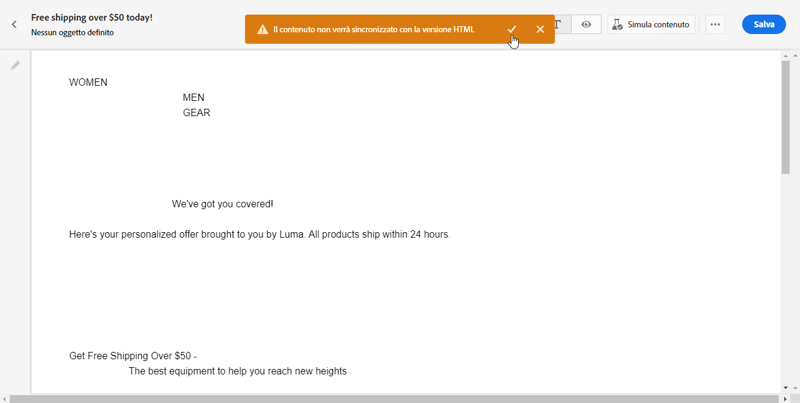

# Creare la versione testuale di un’e-mail {#text-version-email}

Si consiglia di creare una versione testuale del corpo dell’e-mail, che viene utilizzata quando non è possibile visualizzare il contenuto HTML.

Per impostazione predefinita, E-mail Designer crea una versione **[!UICONTROL Testo normale]** del messaggio e-mail, compresi i campi di personalizzazione. Questa versione viene generata e sincronizzata automaticamente con la versione HTML del contenuto.

Se preferisci utilizzare contenuti diversi per la versione in testo normale, procedi come segue:

1. Dal messaggio e-mail, seleziona la scheda **[!UICONTROL Testo normale]**.

   {zoomable="yes"}

1. Utilizza il pulsante di attivazione **[!UICONTROL Sincronizza con HTML]** per disabilitare la sincronizzazione.

   {zoomable="yes"}

1. Fai clic sul segno di spunta per confermare la scelta.

   {zoomable="yes"}

1. Modifica la versione di testo normale come desiderato.

>[!CAUTION]
>
>* Le modifiche apportate nella visualizzazione **[!UICONTROL Testo normale]** non vengono applicate alla visualizzazione HTML.
>
>* Se riattivi l&#39;opzione **[!UICONTROL Sincronizza con HTML]** dopo aver aggiornato il contenuto di testo normale, le modifiche andranno perse e verranno sostituite con il contenuto di testo generato dalla versione di HTML.