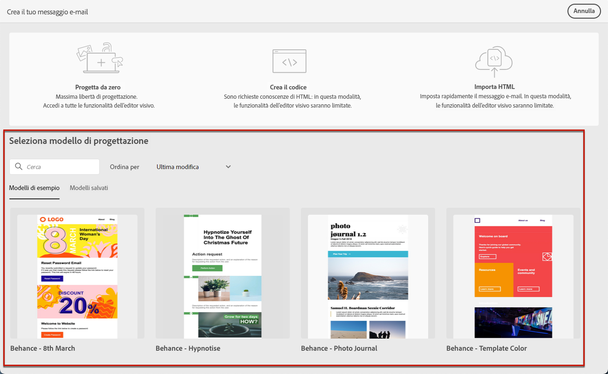
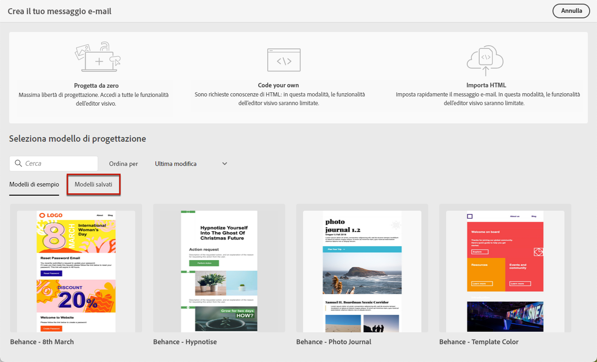
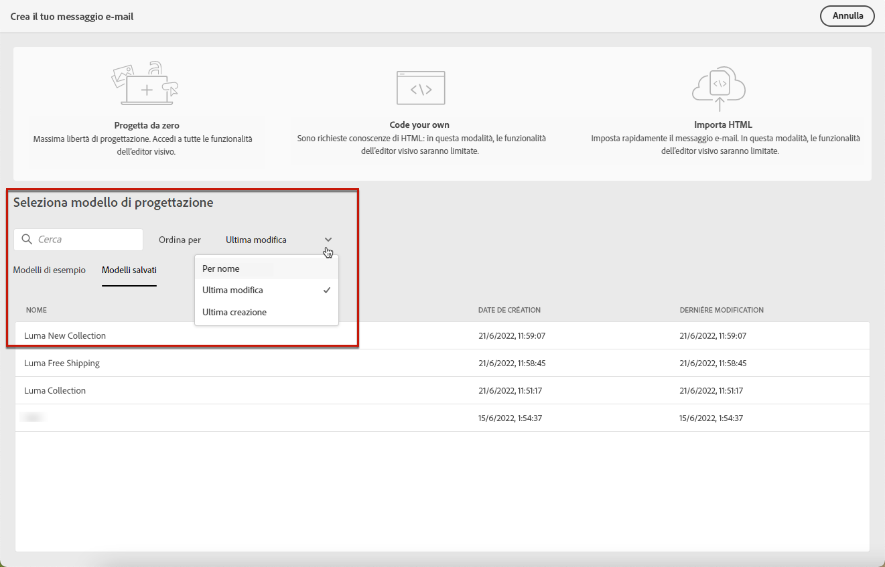
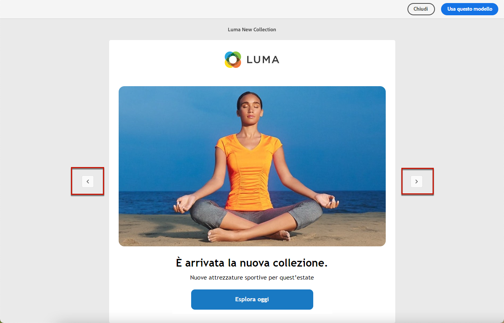

# Utilizzare modelli di e-mail {#use-email-templates}

Durante la [creazione di un’e-mail](../email/create-email.md), utilizza la sezione **[!UICONTROL Seleziona modello di progettazione]** dell’interfaccia **[!UICONTROL Crea e-mail]** per iniziare a creare i contenuti da un modello.

Puoi scegliere tra:

* **Modelli di esempio**. Campaign viene fornito con un set di modelli incorporati tra cui puoi scegliere.

* **Modelli salvati**. Puoi anche utilizzare un modello personalizzato salvato come modello da un contenuto esistente.

Nelle sezioni seguenti, scopri come utilizzare i modelli e come salvare un contenuto e-mail come modello.

>[!NOTE]
>
>I modelli di contenuto e-mail sono diversi dai [modelli di consegna](../msg/delivery-template.md). Questi consentono di riutilizzare solo il contenuto delle e-mail, mentre i modelli di consegna consentono di riutilizzare il contenuto ma anche tutte le impostazioni e le proprietà di consegna come tipologie, indirizzo del mittente, tipi di pubblico e così via.

Per iniziare a creare i contenuti con uno dei modelli di esempio o salvati, segui questi passaggi.

1. Apri [E-mail designer](create-email-content.md).

1. Nella schermata **[!UICONTROL Crea l’e-mail]**, la scheda **[!UICONTROL Modelli di esempio]** è selezionata per impostazione predefinita.

1. Per utilizzare un modello personalizzato esistente, passa alla scheda **[!UICONTROL Modelli salvati]**.

   

1. Viene visualizzato l’elenco di tutti i [modelli salvati](#save-as-template). Puoi ordinarli **[!UICONTROL Per nome]**, **[!UICONTROL Ultima modifica]** e **[!UICONTROL Ultima creazione]**.

   

1. Seleziona un modello dall’elenco per visualizzarne il contenuto.

1. Utilizza le frecce destra e sinistra per spostarti tra i modelli (di esempio o salvati, a seconda della selezione).

   

1. Fai clic su **[!UICONTROL Utilizza questo modello]** in alto a destra della schermata.

1. Modifica il contenuto in base alle tue esigenze utilizzando E-mail designer. [Ulteriori informazioni](create-email-content.md)

