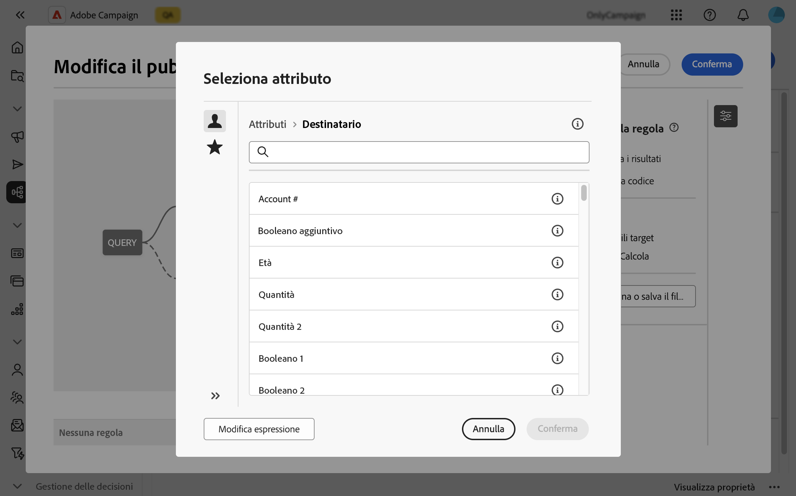
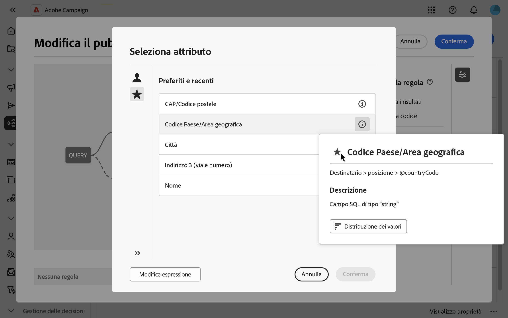
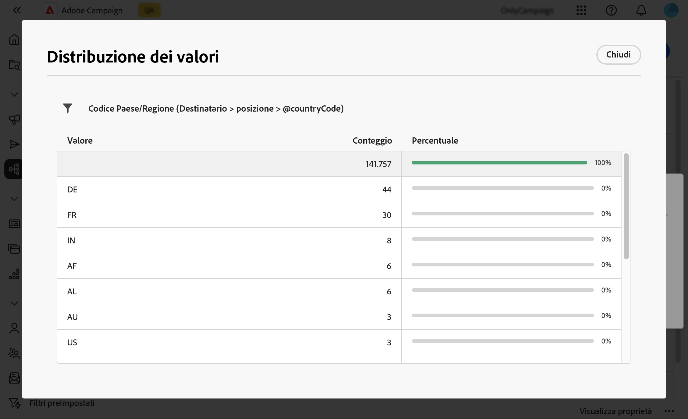

# Selezionare gli attributi e aggiungerli ai preferiti {#folders}

L’interfaccia utente di Campaign Web consente di agli utenti di selezionare gli attributi dal database in varie posizioni, a seconda dell’azione in esecuzione. Ad esempio, gli attributi possono selezionati durante la definizione delle colonne di output per una consegna direct mail o per un file da estrarre. Analogamente, gli attributi possono essere selezionati quando utilizzi il query modeler per creare regole, filtri o tipi di pubblico.

Per riutilizzare rapidamente gli attributi usati di frequente, è possibile aggiungerli ai preferiti. In questo modo, sono facilmente accessibili per le attività future. Oltre ai preferiti, gli utenti possono anche visualizzare e utilizzare gli attributi selezionati più di recente.

L’interfaccia fornisce inoltre uno strumento di distribuzione dei valori, che consente di visualizzare la distribuzione dei valori di un attributo all’interno di una tabella. Questo strumento consente di identificare l’intervallo e la frequenza dei valori, per maggiore coerenza nei dati durante la creazione di query o espressioni.

## Attributi preferiti e recenti {#favorites}

>[!CONTEXTUALHELP]
>id="acw_attribute_picker_favorites_recents"
>title="Preferiti e recenti"
>abstract="Il menu **[!UICONTROL Preferiti e recenti]** nel selettore degli attributi fornisce presenta in modo organizzato gli attributi che hai aggiunto ai preferiti, insieme a un elenco degli attributi utilizzati di recente. Per aiutarti a trovare più facilmente gli attributi che ti servono, gli attributi preferiti sono elencati per primi, seguiti da quelli utilizzati di recente."

Il menu **[!UICONTROL Preferiti e recenti]** nel selettore degli attributi offre una visualizzazione organizzata degli attributi aggiunti ai preferiti, insieme a un elenco degli attributi utilizzati di recente. Per trovare più facilmente gli attributi necessari, sono elencati per primi gli attributi preferiti, seguiti da quelli utilizzati di recente.

Per aggiungere un attributo ai preferiti, passare il puntatore sul relativo pulsante delle informazioni e selezionare l’icona a forma di stella. L’attributo viene quindi aggiunto automaticamente all’elenco dei preferiti. Per rimuovere un attributo dai preferiti, selezionare di nuovo l’icona a forma di stella.

Gli utenti possono aggiungere fino a 20 attributi preferiti. Gli attributi preferiti e recenti sono associati a ogni utente all’interno di un’organizzazione, garantendo l’accessibilità tra computer diversi e fornendo un’esperienza fluida tra i dispositivi.

## Identificare la distribuzione dei valori all’interno di una tabella {#distribution}

Il pulsante **Distribuzione dei valori**, disponibile nel riquadro delle informazioni di un attributo, consente di analizzare la distribuzione dei valori per tale attributo all’interno della tabella. Questa funzione è utile per comprendere i valori disponibili, i relativi conteggi e le percentuali. Consente inoltre di evitare problemi come l’utilizzo incoerente delle maiuscole o ortografia errata durante la creazione di query o di espressioni.

Per gli attributi con un numero elevato di valori, lo strumento mostra solo i primi venti. In questi casi, viene visualizzata la notifica **[!UICONTROL Caricamento parziale]** per indicare questa limitazione. Applicare i filtri avanzati per perfezionare i risultati visualizzati e concentrarsi su valori o sottoinsiemi di dati specifici. Indicazioni dettagliate sull’utilizzo dei filtri sono disponibili [qui](../get-started/work-with-folders.md#filter-the-values).

Per ulteriori informazioni sull’utilizzo dello strumento per la distribuzione dei valori in contesti diversi, consulta le sezioni seguenti:

* [Distribuzione dei valori in una cartella](../get-started/work-with-folders.md##distribution-values-folder)
* [Distribuzione dei valori in una query](../query/build-query.md#distribution-values-query)