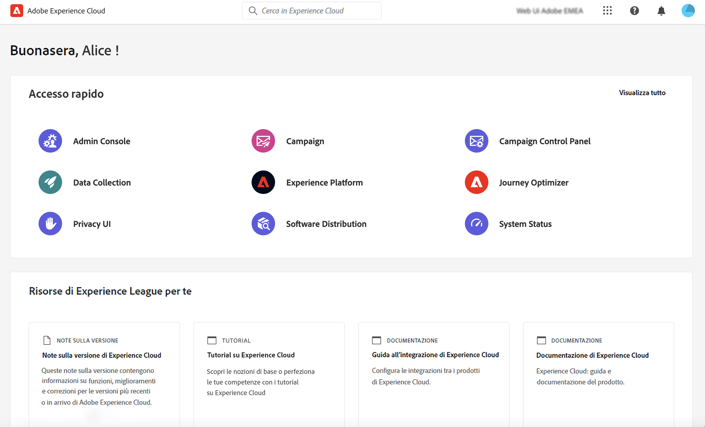
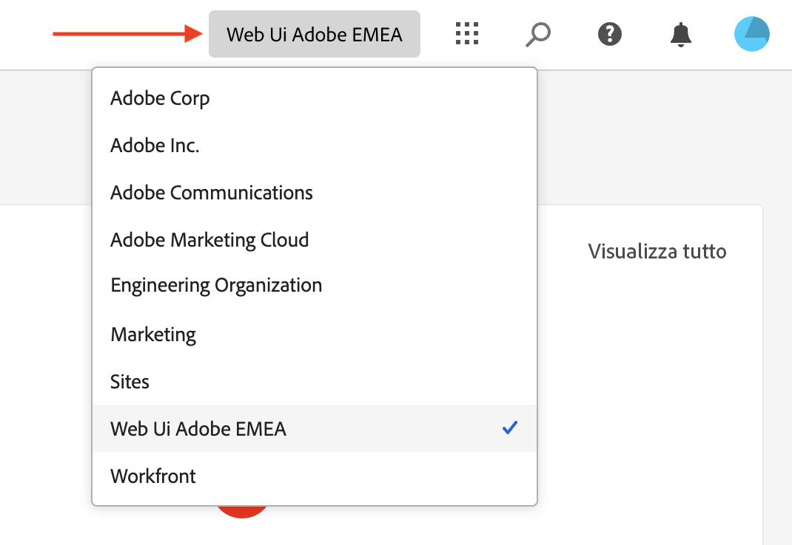
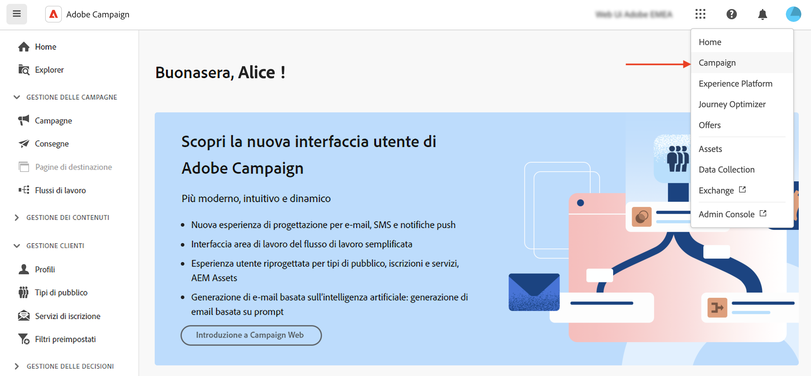

# Connettersi ad Adobe Campaign {#connect-to-campaign}

Experience Cloud è un insieme integrato di applicazioni, prodotti e servizi per il marketing digitale di Adobe. Grazie alla sua interfaccia intuitiva, puoi accedere rapidamente alle applicazioni cloud, alle funzionalità dei prodotti e ai servizi. Scopri come connettersi a Adobe Experience Cloud e accedere all’interfaccia web di Adobe Campaign v8 in questa pagina.

## Accedere a Adobe Experience Cloud {#sign-in-to-exc}

In genere, gli amministratori di Experience Cloud concedono l’accesso ad applicazioni e servizi. Segui i passaggi contenuti nell’invito e-mail all’Experience Cloud.

Per accedere a Adobe Experience Cloud, segui questi passaggi:

1. Passa ad [Adobe Experience Cloud](https://experience.adobe.com/){target="_blank"}.

1. Accedi utilizzando l’Adobe ID o l’Enterprise ID. Per ulteriori informazioni sui tipi di identità, consulta l’Adobe in [questo articolo](https://helpx.adobe.com/enterprise/using/identity.html){target="_blank"}.

   Dopo aver effettuato l’accesso a Experience Cloud, puoi accedere rapidamente a tutte le soluzioni e le app.

   

1. Verifica di essere nell’organizzazione corretta.

   {width="50%" align="left"}

   Ulteriori informazioni sulle organizzazioni in Adobe Experience Cloud in [questo articolo](https://experienceleague.adobe.com/docs/core-services/interface/administration/organizations.html?lang=it){target="_blank"}.

## Accesso ad Adobe Campaign {#access-to-campaign}

Per accedere al tuo ambiente Campaign, seleziona **Campagna** dal **Accesso rapido** nella home page di Adobe Experience Cloud.

Se sei già connesso a un’altra soluzione Adobe Experience Cloud, puoi anche passare all’ambiente Campaign dal selettore della soluzione in alto a destra dello schermo.

Se hai accesso a più ambienti, incluso Campaign Pannello di controllo Campaign, fai clic sul pulsante **Launch** per l&#39;istanza corretta.

Viene così impostata la connessione a Campaign. Per informazioni su come iniziare a utilizzare l’interfaccia utente, visita [questa pagina](user-interface.md).

## Navigazione superiore Adobe Experience Cloud {#top-bar}

Utilizza la barra superiore dell’interfaccia per:

* condividi il tuo feedback come utente beta
* passare da un’organizzazione all’altra
* passare da una soluzione Adobe Experience Cloud all&#39;altra e viceversa

{width="50%" align="left"}

## Browser supportati {#browsers}

Campaign v8 Web è progettato per funzionare in modo ottimale nell’ultima versione di Google Chrome, Safari e Microsoft Edge. Potresti riscontrare problemi nell’utilizzo di alcune funzioni nelle versioni precedenti o in altri browser.

## Preferenze della lingua {#language-pref}

Al momento, Campaign v8 Web è disponibile nelle seguenti lingue:

* Inglese (US) - EN-US
* Francese - FR
* Tedesco - DE
* Italiano - IT
* Spagnolo - ES
* Portoghese (brasiliano) - PTBR
* Giapponese - JP
* Coreano - KR
* Cinese semplificato - CHS
* Cinese tradizionale - CHT

La lingua predefinita di Campaign Web è determinata dalla lingua preferita specificata nel profilo utente. Non si riferisce alla lingua del server Campaign e né della console client.

Per cambiare la lingua:

1. Fai clic sull’icona del tuo profilo, in alto a destra, quindi seleziona **Preferenze**.
1. Quindi fai clic sul collegamento alla lingua visualizzato sotto il tuo indirizzo e-mail.
1. Seleziona la lingua preferita e fai clic su **Salva**. Se il componente che utilizzi non è localizzato nella tua lingua, puoi selezionare una seconda lingua.

## Tema scuro {#dark-theme}

Puoi passare al tema scuro dall’icona del tuo profilo. Utilizza l’opzione **Tema scuro** per attivarlo o disattivarlo.

Le impostazioni del profilo utente e le preferenze dell’account sono descritte in dettaglio [questa sezione](https://experienceleague.adobe.com/docs/core-services/interface/experience-cloud.html#preferences){target="_blank"}.

Ulteriori informazioni su Experience Cloud Central Interface Components sono disponibili in [questa documentazione](https://experienceleague.adobe.com/docs/core-services/interface/experience-cloud.html){target="_blank"}.

