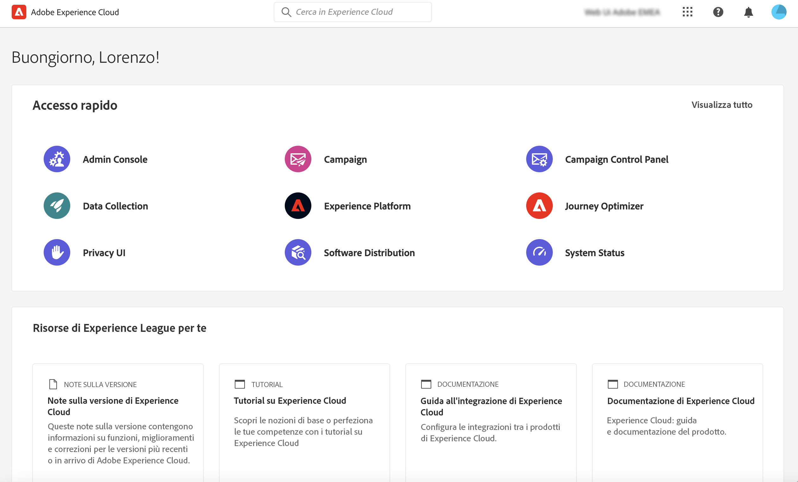

# Connessione ad Adobe Campaign {#connect-to-campaign}

Experience Cloud è un insieme integrato di applicazioni, prodotti e servizi per il marketing digitale di Adobe. Grazie alla sua interfaccia intuitiva, puoi accedere rapidamente alle applicazioni cloud, alle funzionalità dei prodotti e ai servizi. Scopri come connetterti a Adobe Experience Cloud e accedere all’interfaccia web di Adobe Campaign, in questa pagina.

## Accesso ad Adobe Experience Cloud {#sign-in-to-exc}

Puoi anche utilizzare il Single Sign-On (SSO) per connetterti a Campaign. In genere, sono gli amministratori di Experience Cloud a concedere l’accesso alle applicazioni e ai servizi. Segui i passaggi contenuti nell’e-mail di invito ad Experience Cloud.

Per accedere a Adobe Experience Cloud, segui questi passaggi di base:

1. Passa ad [Adobe Experience Cloud](https://experience.adobe.com/){target="_blank"}.

1. Accedi utilizzando l’Adobe ID o l’Enterprise ID. Ulteriori informazioni sui tipi di identità in Adobe in [questo articolo](https://helpx.adobe.com/it/enterprise/using/users.html){target="_blank"}.

   Dopo aver effettuato l’accesso ad Experience Cloud, puoi accedere rapidamente a tutte le soluzioni e le app.

   {zoomable="yes"}

1. Verifica di essere nell’organizzazione corretta.

   {zoomable="yes"}{width="50%" align="left"}

   Ulteriori informazioni sulle organizzazioni in Adobe Experience Cloud in [questo articolo](https://experienceleague.adobe.com/docs/core-services/interface/administration/organizations.html?lang=it){target="_blank"}.

## Accesso ad Adobe Campaign {#access-to-campaign}

Per accedere all’ambiente Campaign, seleziona **Campaign** dalla sezione **Accesso rapido** nella pagina Home di Adobe Experience Cloud.

Se sei già connesso a un’altra soluzione Adobe Experience Cloud, passa all’ambiente Campaign dallo switcher della soluzione in alto a destra dello schermo.

{zoomable="yes"}

Se hai accesso a più ambienti, incluso il Pannello di controllo di Campaign, fai clic sul pulsante **Avvia** per l’istanza corretta.

{zoomable="yes"}

Viene così impostata la connessione a Campaign. Per informazioni su come iniziare a utilizzare l’interfaccia utente, visita [questa pagina](user-interface.md).

### Controllo degli accessi {#access-control}

>[!CONTEXTUALHELP]
>id="acw_explorer_permissions_create"
>title="Autorizzazione necessaria"
>abstract="Prima di poter creare questo oggetto, l’amministratore deve concederti l’autorizzazione."

>[!CONTEXTUALHELP]
>id="acw_audiences_read_only"
>title="Il pubblico è di sola lettura"
>abstract="Non disponi delle autorizzazioni necessarie per modificare questo pubblico. Se necessario, contatta l’amministratore per farti autorizzare l’accesso."

>[!CONTEXTUALHELP]
>id="acw_subscription_services_read_only"
>title="Questo servizio è di sola lettura"
>abstract="Non disponi delle autorizzazioni necessarie per modificare questo servizio. Se necessario, contatta l’amministratore per farti autorizzare l’accesso."

>[!CONTEXTUALHELP]
>id="acw_recipients_readonlyprofile"
>title="Profilo di sola lettura dei destinatari"
>abstract="Non disponi delle autorizzazioni necessarie per modificare questo profilo. Se necessario, contatta l’amministratore per farti autorizzare l’accesso."

>[!CONTEXTUALHELP]
>id="acw_campaign_read_only"
>title="Questa campagna è di sola lettura"
>abstract="Non disponi delle autorizzazioni necessarie per modificare questa campagna. Se necessario, contatta l’amministratore per farti autorizzare l’accesso."

>[!CONTEXTUALHELP]
>id="acw_deliveries_read_only"
>title="Questa consegna è di sola lettura"
>abstract="Non disponi delle autorizzazioni necessarie per modificare questa consegna. Se necessario, contatta l’amministratore per farti autorizzare l’accesso."

>[!CONTEXTUALHELP]
>id="acw_wf_read_only"
>title="Questo flusso di lavoro è di sola lettura"
>abstract="Non disponi delle autorizzazioni necessarie per modificare questo flusso di lavoro. Se necessario, contatta l’amministratore per farti autorizzare l’accesso."

Il controllo di accesso limita l’accesso a oggetti e dati dagli elenchi principali, come consegne, destinatari o flussi di lavoro. Queste restrizioni si applicano anche nella struttura di navigazione di Explorer. È inoltre necessario disporre delle autorizzazioni per creare, eliminare, duplicare e modificare oggetti dall’interfaccia utente.

Tutte le autorizzazioni in Campaign Web vengono sincronizzate con le autorizzazioni della console client di Campaign. Solo gli amministratori di Campaign possono definire e modificare le autorizzazioni utente.

Durante l’esplorazione dell’interfaccia utente di Campaign Web, puoi accedere a dati, oggetti e funzionalità in base alle autorizzazioni. Ad esempio, se non disponi delle autorizzazioni di accesso per una cartella, non puoi visualizzarla. Le autorizzazioni influiscono anche sulla gestione di oggetti e dati. Senza le autorizzazioni di scrittura per una cartella specifica, non puoi creare una consegna in tale cartella, anche se è possibile visualizzarla nell’interfaccia utente.

Scopri come [visualizzare e gestire le autorizzazioni qui](permissions.md).

## Navigazione superiore in Adobe Experience Cloud {#top-bar}

Sfoglia la barra superiore dell’interfaccia per:

* Condividi feedback sull’interfaccia utente di Campaign Web.
* Passa da un’organizzazione all’altra.
* Passa da una soluzione Adobe Experience Cloud all&#39;altra e viceversa.
* Cerca aiuto in [Adobe Experience League](https://experienceleague.adobe.com/docs/?lang=it){target="_blank"}.
* Controlla le notifiche del prodotto.
* Modifica il tuo profilo Adobe e gestisci le impostazioni, ad esempio [aggiorna la tua lingua preferita](#language-pref) o [passa al tema chiaro/scuro](#dark-theme).

{zoomable="yes"}{width="50%" align="left"}

## Browser supportati {#browsers}

Adobe Campaign Web è progettato per funzionare in modo ottimale nell’ultima versione di Google Chrome, Safari e Microsoft Edge. È possibile che si verifichino problemi durante l’utilizzo di alcune funzioni nelle versioni precedenti o in altri browser.

## Preferenze della lingua {#language-pref}

Adobe Campaign Web è attualmente disponibile nelle seguenti lingue:

* Inglese (US) - EN-US
* Francese - FR
* Tedesco - DE
* Italiano - IT
* Spagnolo - ES
* Portoghese (brasiliano) - PTBR
* Giapponese - JP
* Coreano - KR
* Cinese semplificato - CHS
* Cinese tradizionale - CHT

La lingua predefinita di Campaign Web è determinata dalla lingua preferita specificata nel profilo utente. Non si riferisce alla lingua del server Campaign e né della console client.

Per cambiare la lingua:

1. Fai clic sull’icona del tuo profilo, in alto a destra, quindi seleziona **Preferenze**.
1. Fai clic sul collegamento della lingua visualizzato sotto il tuo indirizzo e-mail.
1. Seleziona la lingua preferita e fai clic su **Salva**. È possibile selezionare una seconda lingua nel caso in cui il componente utilizzato non sia localizzato nella prima lingua.

## Temi scuri e chiari {#dark-theme}

Adobe Campaign è disponibile nei temi chiaro e scuro. Per impostazione predefinita, l’interfaccia utente è abilitata nel tema chiaro. Per passare al tema scuro, fai clic sull&#39;icona del tuo profilo e utilizza l&#39;interruttore **Tema scuro** per attivarlo o disattivarlo.

Le impostazioni del profilo utente e le preferenze di account sono descritte nei dettagli in [questa sezione](https://experienceleague.adobe.com/docs/core-services/interface/experience-cloud.html?lang=it#preferences){target="_blank"}.

Ulteriori informazioni sui componenti di interfaccia principali di Experience Cloud sono disponibili in [questa documentazione](https://experienceleague.adobe.com/docs/core-services/interface/experience-cloud.html?lang=it){target="_blank"}.