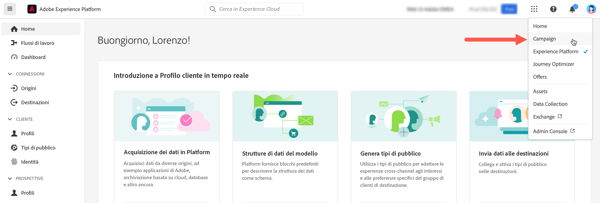

# Connessione ad Adobe Campaign {#connect-to-campaign}

Experience Cloud è un insieme integrato di applicazioni, prodotti e servizi per il marketing digitale di Adobe. Grazie alla sua interfaccia intuitiva, puoi accedere rapidamente alle applicazioni cloud, alle funzionalità dei prodotti e ai servizi. Scopri come connetterti ad Adobe Experience Cloud e accedere all’interfaccia di Adobe Campaign v8 Web in questa pagina.

## Accesso ad Adobe Experience Cloud {#sign-in-to-exc}

In genere, sono gli amministratori di Experience Cloud a concedere l’accesso alle applicazioni e ai servizi. Segui i passaggi contenuti nell’e-mail di invito ad Experience Cloud.

Per accedere ad Adobe Experience Cloud, i passaggi di base sono:

1. Passa ad [Adobe Experience Cloud](https://experience.adobe.com/){target="_blank"}.

1. Accedi utilizzando l’Adobe ID o l’Enterprise ID. Per ulteriori informazioni sui tipi di identità in Adobe consulta [questo articolo](https://helpx.adobe.com/it/enterprise/using/users.html){target="_blank"}.

   Dopo aver effettuato l’accesso ad Experience Cloud, puoi accedere rapidamente a tutte le soluzioni e le app.

   

1. Verifica di essere nell’organizzazione corretta.

   {width="50%" align="left"}

   Trovi ulteriori informazioni sulle organizzazioni in Adobe Experience Cloud in [questo articolo](https://experienceleague.adobe.com/docs/core-services/interface/administration/organizations.html?lang=it){target="_blank"}.

## Accesso ad Adobe Campaign {#access-to-campaign}

Per accedere all’ambiente Campaign, seleziona **Campaign** dalla sezione **Accesso rapido** nella pagina Home di Adobe Experience Cloud.

Se sei già connesso a un’altra soluzione Adobe Experience Cloud, puoi anche passare all’ambiente Campaign dal selettore della soluzione in alto a destra dello schermo.

Se hai accesso a più ambienti, incluso il Pannello di controllo di Campaign, fai clic sul pulsante **Avvia** per l&#39;istanza corretta.

Viene così impostata la connessione a Campaign. Per informazioni su come iniziare a utilizzare l’interfaccia utente, visita [questa pagina](user-interface.md).

## Navigazione principale in Adobe Experience Cloud {#top-bar}

Utilizza la barra superiore dell’interfaccia per:

* condividere il tuo feedback come utente della versione Beta
* passare da un’organizzazione all’altra
* passare a un’altra soluzione e alle app di Adobe Experience Cloud

{width="50%" align="left"}

## Browser supportati {#browsers}

Campaign v8 Web è progettato per funzionare in modo ottimale nell’ultima versione di Google Chrome, Safari e Microsoft Edge. È possibile che si verifichino problemi durante l’utilizzo di alcune funzioni nelle versioni precedenti o in altri browser.

## Preferenze della lingua {#language-pref}

Al momento, Campaign v8 Web è disponibile nelle seguenti lingue:

* Inglese (US) - EN-US
* Francese - FR
* Tedesco - DE
* Italiano - IT
* Spagnolo - ES
* Portoghese (brasiliano) - PTBR
* Giapponese - JP
* Coreano - KR
* Cinese semplificato - CHS
* Cinese tradizionale - CHT

La lingua predefinita di Campaign Web è determinata dalla lingua preferita specificata nel profilo utente. Non si riferisce alla lingua del server Campaign e né della console client.

Per cambiare la lingua:

1. Fai clic sull’icona del tuo profilo, in alto a destra, quindi seleziona **Preferenze**.
1. Quindi fai clic sul collegamento alla lingua visualizzato sotto il tuo indirizzo e-mail.
1. Seleziona la lingua preferita e fai clic su **Salva**. È possibile selezionare una seconda lingua nel caso in cui il componente utilizzato non sia localizzato nella prima lingua.

## Tema scuro {#dark-theme}

Puoi passare al tema scuro dall’icona del tuo profilo. Utilizza l’opzione **Tema scuro** per attivarlo o disattivarlo.

Le impostazioni del profilo utente e le preferenze di account sono descritte nei dettagli in [questa sezione](https://experienceleague.adobe.com/docs/core-services/interface/experience-cloud.html?lang=it#preferences){target="_blank"}.

Ulteriori informazioni sui componenti di interfaccia principali di Experience Cloud sono disponibili in [questa documentazione](https://experienceleague.adobe.com/docs/core-services/interface/experience-cloud.html?lang=it){target="_blank"}.
