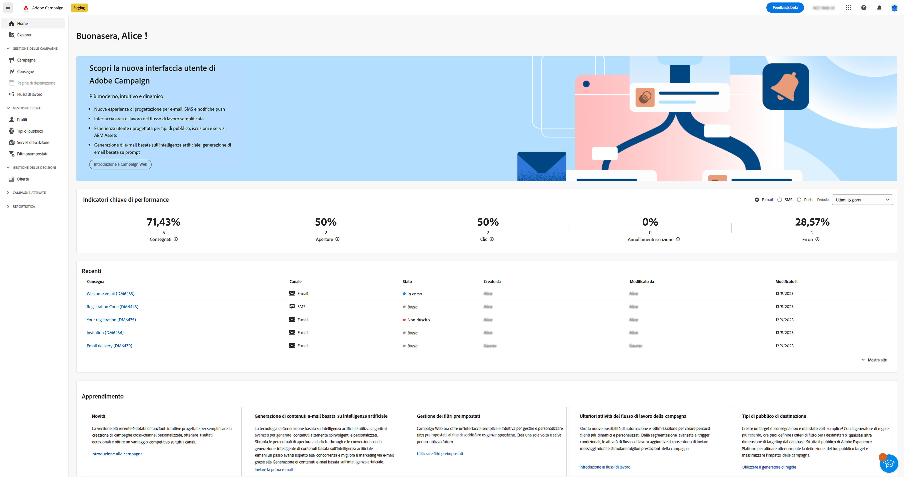

# Introduzione a Campaign Web {#get-started}

>[!CONTEXTUALHELP]
>id="acw_homepage_learnmore"
>title="Introduzione"
>abstract="La nuova interfaccia di Campaign Web v8 offre un’esperienza utente integrata, intuitiva e coerente."

Adobe Campaign fornisce una piattaforma per la progettazione di esperienze cliente cross-channel e un ambiente per l’orchestrazione visiva delle campagne, la gestione delle interazioni in tempo reale e l’esecuzione su più canali.

Inizialmente disponibile solo tramite una ricca [Console client](#ac-client), Campaign offre ora una nuova interfaccia utente web con funzionalità migliorate, accessibilità e un nuovo design per migliorare significativamente l’esperienza utente. Questa nuova interfaccia utente moderna semplifica la progettazione e la consegna delle campagne di marketing e garantisce coerenza, insieme ad altre soluzioni di Adobe, tra cui Adobe Experience Platform.

Questa nuova interfaccia utente soddisfa innanzitutto le esigenze del **professionista**; in questa prima versione non sono disponibili tutte le tipiche attività di amministrazione, ma verranno affrontate nelle versioni successive. Per il momento, nella nuova interfaccia utente non sono disponibili tutte le funzionalità o opzioni disponibili nella console client. Nelle versioni future saranno disponibili nuovi casi d’uso, opzioni e funzionalità.

Se devi accedere a funzionalità di Campaign v8 che non sono disponibili nell’interfaccia web, puoi utilizzare la [console client](#ac-client).

>[!NOTE]
>
>Campaign v8 Web è attualmente in versione A disponibilità limitata (LA). L’accesso è limitato a un piccolo gruppo di clienti LA. Tieni presente che l’interfaccia, le funzionalità e i flussi di utilizzo dei prodotti possono cambiare senza preavviso.

Scopri come connetterti ad Adobe Campaign Web in [questa pagina](connect-to-campaign.md).

## Informazioni sulla console client di Campaign {#ac-client}

La console client di Campaign è un’applicazione basata su browser installata sul sistema. Utilizza l’API dei servizi web per collegarsi al server dell’applicazione Campaign.

I dati di Campaign vengono memorizzati nel server dell’applicazione. I dati sono disponibili sia dalla console client sia dall’interfaccia web. Ad esempio, se crei un modello di consegna utilizzando la console client, questo sarà disponibile anche nell’interfaccia web. E se crei una consegna e-mail nell’interfaccia web, questa è accessibile anche dalla console client.

Alcuni oggetti possono essere creati e gestiti solo nella console client. Possono essere visibili e utilizzati nell’interfaccia utente di Campaign Web, ma non possono essere creati né modificati da questo ambiente. Tutti gli oggetti e i componenti di Campaign sono disponibili nella vista Explorer, accessibile dal menu di navigazione a sinistra.

Per ulteriori informazioni su come utilizzare Campaign v8, consulta la [documentazione di Campaign v8 (console client)](https://experienceleague.adobe.com/docs/campaign/campaign-v8/campaign-home.html?lang=it){target="_blank"}.
